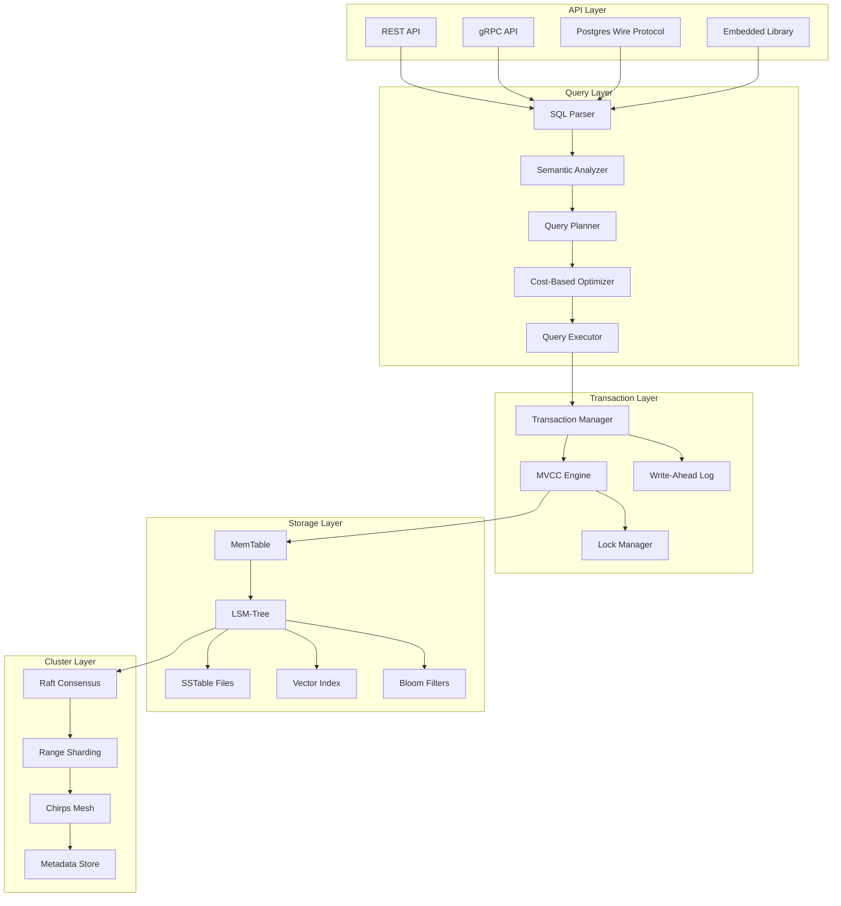
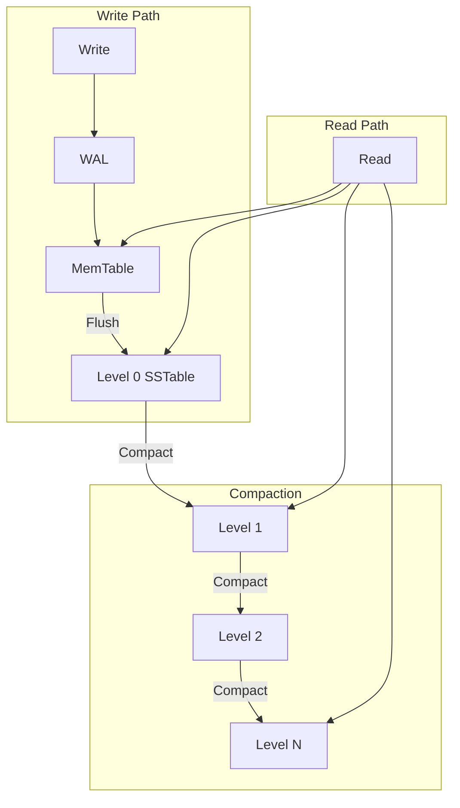
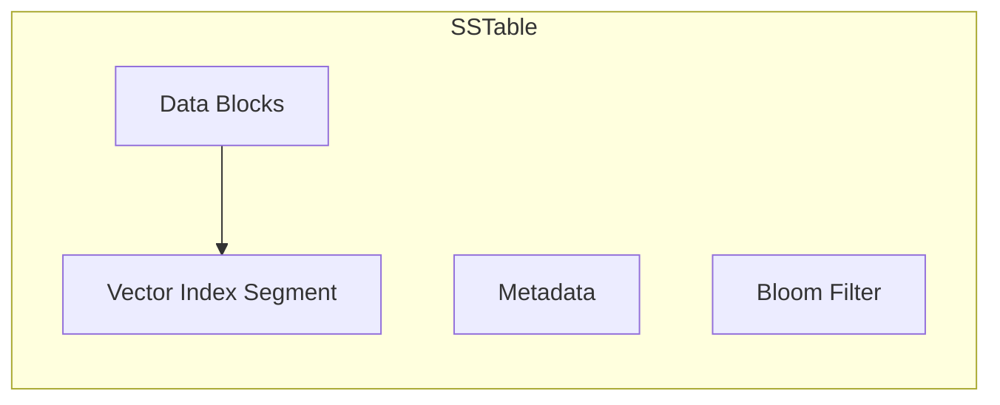
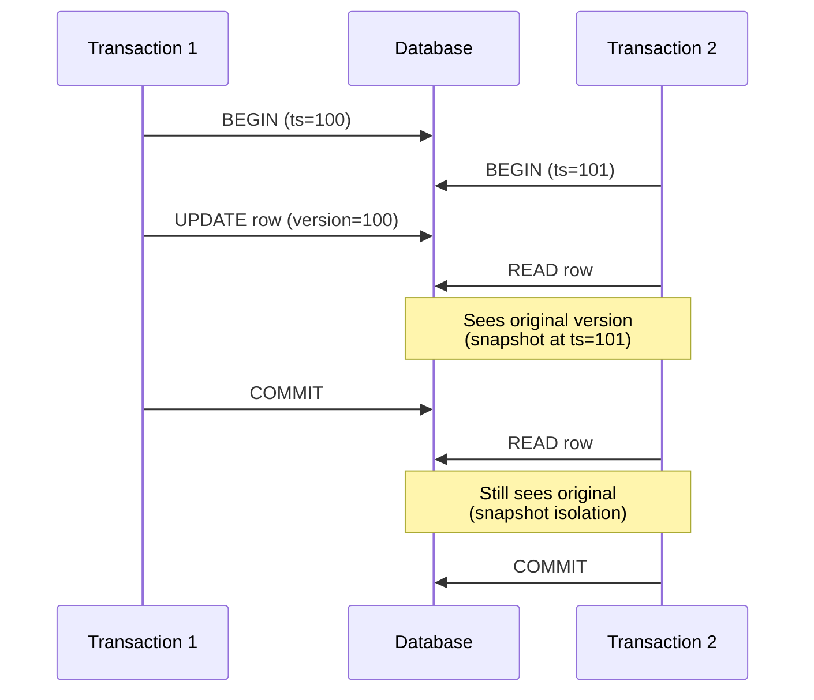
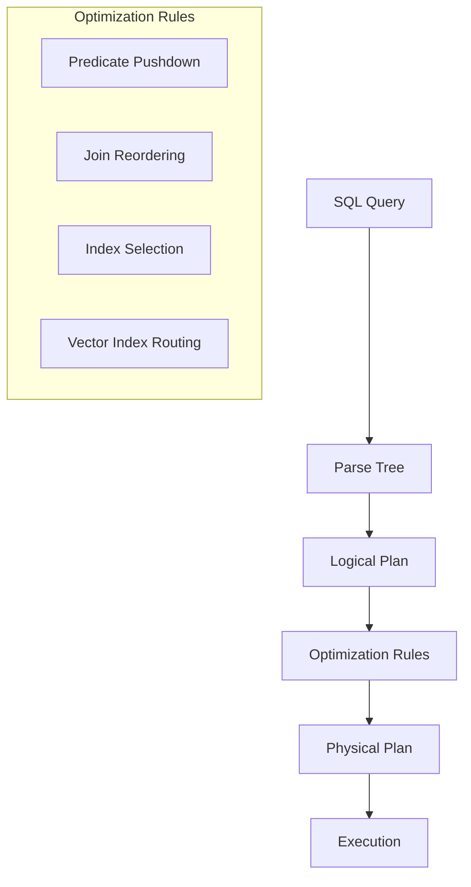
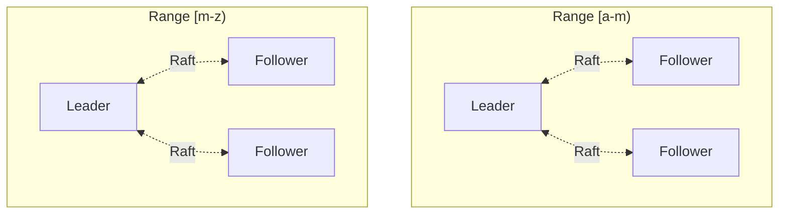
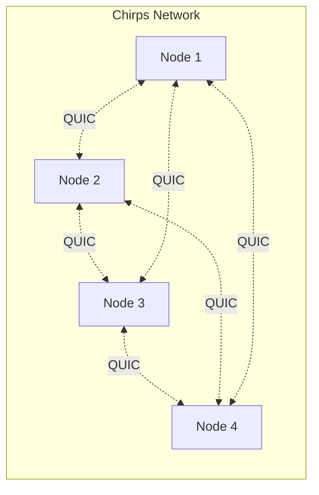

# Architecture

Alopex DB is built in **Rust** for safety, performance, and reliability. This page covers the technical architecture and design decisions.

## System Overview



## Storage Engine

### LSM-Tree Design

Alopex uses a Log-Structured Merge-Tree (LSM-Tree) optimized for both key-value and vector workloads.



#### Key Components

| Component | Description |
|:----------|:------------|
| **MemTable** | In-memory sorted map (skip list) for recent writes |
| **WAL** | Write-ahead log for durability |
| **SSTable** | Sorted String Table, immutable on-disk files |
| **Bloom Filter** | Probabilistic structure for fast key lookups |
| **Block Cache** | LRU cache for frequently accessed blocks |

#### Write Path

1. **WAL Append**: Write logged for durability
2. **MemTable Insert**: Data added to in-memory structure
3. **MemTable Flush**: When full, written as L0 SSTable
4. **Compaction**: Background merge of SSTables

#### Read Path

1. **MemTable Check**: Search recent writes
2. **Block Cache**: Check cached data blocks
3. **Bloom Filter**: Probabilistic key existence check
4. **SSTable Search**: Binary search within files

### Vector Index Integration

Vector indexes are co-located with data for locality:



#### HNSW Implementation

```
Layer 3: [sparse connections for long-range jumps]
    ↓
Layer 2: [more connections]
    ↓
Layer 1: [dense connections]
    ↓
Layer 0: [all nodes, maximum connectivity]
```

Search algorithm:
1. Enter at top layer
2. Greedily traverse to nearest neighbor
3. Descend to next layer
4. Repeat until layer 0
5. Return top-k neighbors

## Transaction Layer

### MVCC (Multi-Version Concurrency Control)

Alopex uses MVCC for snapshot isolation:



### Transaction States

| State | Description |
|:------|:------------|
| `Active` | Transaction in progress |
| `Committed` | Successfully committed |
| `Aborted` | Rolled back |
| `Prepared` | 2PC prepared state |

### Isolation Levels

| Level | Dirty Read | Non-Repeatable | Phantom |
|:------|:-----------|:---------------|:--------|
| Read Uncommitted | :white_check_mark: | :white_check_mark: | :white_check_mark: |
| Read Committed | :x: | :white_check_mark: | :white_check_mark: |
| Repeatable Read | :x: | :x: | :white_check_mark: |
| **Snapshot** (default) | :x: | :x: | :x: |
| Serializable | :x: | :x: | :x: |

## Query Layer

### SQL Parser

Built on `sqlparser-rs` with extensions for vectors:

```sql
-- Extended grammar
vector_type ::= VECTOR '(' dimension ')'
vector_literal ::= '[' number (',' number)* ']'
vector_function ::= cosine_similarity | l2_distance | inner_product
```

### Query Planner

Cost-based optimizer with vector-aware planning:



### Execution Engine

Volcano-style iterator model:

```rust
trait Executor {
    fn open(&mut self) -> Result<()>;
    fn next(&mut self) -> Result<Option<Row>>;
    fn close(&mut self) -> Result<()>;
}
```

## Cluster Layer

### Raft Consensus

Each data range forms a Raft group:



#### Raft Operations

| Operation | Description |
|:----------|:------------|
| Leader Election | Automatic failover on leader failure |
| Log Replication | Synchronous replication to followers |
| Snapshot | Periodic state snapshots for recovery |
| Membership Change | Dynamic cluster reconfiguration |

### Range Sharding

Data partitioned by key range:

```
Key Space: [0000...FFFF]
├── Range 1: [0000...3FFF] → Node 1 (Leader), Node 2, Node 3
├── Range 2: [4000...7FFF] → Node 2 (Leader), Node 3, Node 1
├── Range 3: [8000...BFFF] → Node 3 (Leader), Node 1, Node 2
└── Range 4: [C000...FFFF] → Node 1 (Leader), Node 3, Node 2
```

### Chirps Mesh

QUIC-based gossip protocol for cluster communication:



Features:
- **SWIM protocol** for failure detection
- **QUIC transport** for low-latency, encrypted communication
- **Gossip-based** metadata propagation

## Memory Management

### Buffer Pool

```
┌─────────────────────────────────────┐
│           Buffer Pool               │
├─────────┬─────────┬─────────┬───────┤
│ Block 1 │ Block 2 │ Block 3 │ ...   │
└─────────┴─────────┴─────────┴───────┘
     ↑         ↑         ↑
     │         │         │
   Page      Page      Page
   Table     Table     Table
```

### Memory Budget

| Component | Default | Configurable |
|:----------|:--------|:-------------|
| Buffer Pool | 25% of RAM | `buffer_pool_size` |
| MemTable | 64 MB | `memtable_size` |
| Block Cache | 512 MB | `block_cache_size` |
| Vector Index | 1 GB | `vector_index_memory` |

## File Format

### SSTable Structure

```
┌──────────────────────────────────┐
│         Data Blocks              │
├──────────────────────────────────┤
│         Meta Blocks              │
├──────────────────────────────────┤
│         Index Block              │
├──────────────────────────────────┤
│         Bloom Filter             │
├──────────────────────────────────┤
│      Vector Index Segment        │
├──────────────────────────────────┤
│           Footer                 │
└──────────────────────────────────┘
```

### WAL Format

```
┌─────────┬──────────┬─────────┬──────────┐
│ Length  │ Checksum │  Type   │  Data    │
│ (4 bytes)│ (4 bytes)│ (1 byte)│ (var)    │
└─────────┴──────────┴─────────┴──────────┘
```

## Performance Characteristics

| Operation | Complexity | Notes |
|:----------|:-----------|:------|
| Point Read | O(log N) | With bloom filter: O(1) expected |
| Range Scan | O(log N + K) | K = result count |
| Write | O(1) amortized | Plus WAL sync |
| Vector Search (HNSW) | O(log N) | Approximate |
| Vector Search (Flat) | O(N × D) | Exact, D = dimensions |

## Next Steps

- [:octicons-arrow-right-24: SQL + Vector Guide](../guides/sql-vector.md)
- [:octicons-arrow-right-24: Contributing](../contributing.md)
