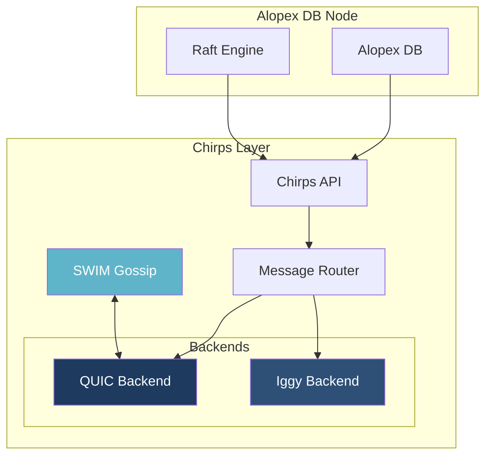
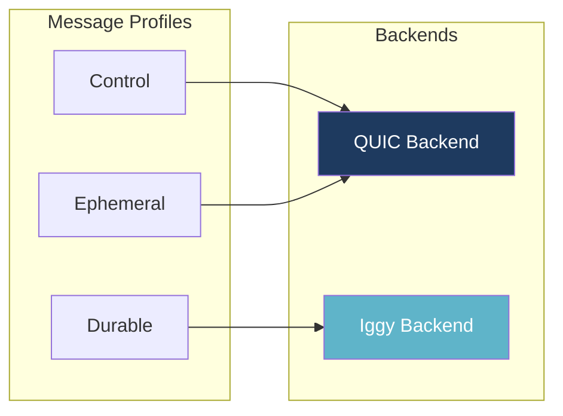
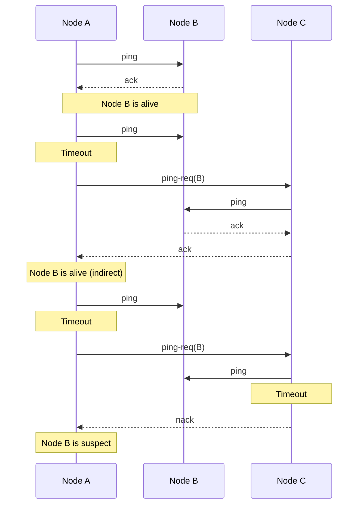
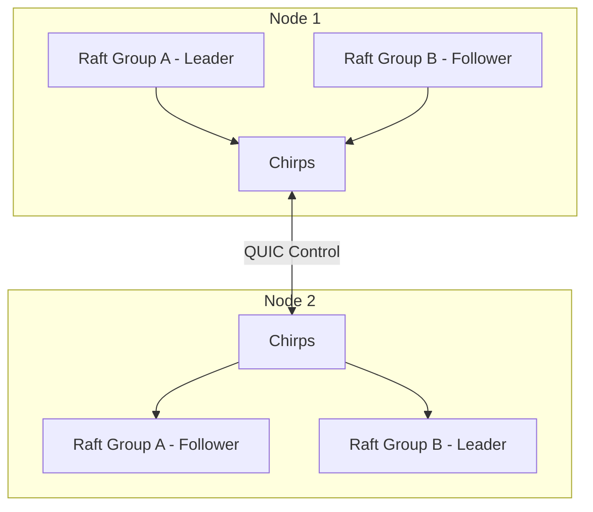

# Chirps - Cluster Messaging Layer

[](https://crates.io/crates/alopex-chirps)
[](https://docs.rs/alopex-chirps)

Alopex Chirps is the backbone of Alopex DB's distributed architecture. It provides gossip-based membership management and flexible messaging capabilities that power all cluster operations.

## Overview

Chirps serves as the **control plane foundation** for Alopex DB clusters:

- **Node Discovery**: Automatic detection of cluster members via SWIM protocol
- **Membership Management**: Tracks node states (alive, suspect, dead)
- **Message Transport**: Reliable delivery with protocol flexibility
- **Raft Integration**: Priority streams for consensus messages



---

## Three-Layer Architecture

Chirps employs a layered design that separates concerns and enables protocol flexibility.

### Layer 1: API Layer

The interface that Alopex DB uses. Simple, high-level operations:

```rust
use alopex_chirps::{Mesh, MessageProfile};

// Send to specific node
mesh.send_to(target_node, &payload, MessageProfile::Control).await?;

// Broadcast to all nodes
mesh.broadcast(&payload, MessageProfile::Ephemeral).await?;

// Subscribe to incoming messages
mesh.subscribe(|from_node, payload| async move {
    handle_message(from_node, payload).await
}).await;
```

### Layer 2: Routing Layer

Selects the optimal backend based on message profile:

| Profile | Purpose | Backend | Characteristics |
|:--------|:--------|:--------|:----------------|
| **Control** | Raft messages, cluster control | QUIC | Low latency, priority streams |
| **Ephemeral** | Gossip, transient data | QUIC | Best effort, no persistence |
| **Durable** | Event streams, audit logs | Iggy | Persistent, replayable |

### Layer 3: Backend Layer

Actual protocol implementations:



---

## SWIM Protocol

Chirps uses the SWIM (Scalable Weakly-consistent Infection-style Membership) protocol for cluster membership.

### Health Check Mechanism



### Node States

| State | Description | Action |
|:------|:------------|:-------|
| **Alive** | Node is healthy and responsive | Normal operation |
| **Suspect** | Failed direct and indirect ping | Grace period before marking dead |
| **Dead** | Confirmed unreachable | Remove from membership, trigger rebalancing |

### Membership Events

Alopex DB subscribes to membership events for cluster coordination:

```rust
mesh.on_node_join(|node_id, addr| {
    // Update routing table
    // Trigger range rebalancing
});

mesh.on_node_leave(|node_id| {
    // Mark node ranges as needing reassignment
    // Initiate Raft leader election if needed
});

mesh.on_status_change(|node_id, old_status, new_status| {
    // Handle alive → suspect → dead transitions
});
```

---

## QUIC Transport

All Chirps communication uses QUIC over UDP for:

- **Encryption**: TLS 1.3 built-in
- **Multiplexing**: Multiple streams over single connection
- **Low Latency**: 0-RTT connection resumption
- **Congestion Control**: Modern algorithms (BBR)

### Priority Streams

Raft messages use dedicated high-priority streams:

```
QUIC Connection
├── Stream 0: Control (Raft AppendEntries, RequestVote)
├── Stream 1: Control (Raft InstallSnapshot)
├── Stream 2-N: Data (User messages, Anti-entropy)
```

### Security

- **Mutual TLS**: Both sides verify certificates
- **Node Identity**: Persistent `node_id` survives restarts
- **Certificate Rotation**: Seamless rotation without disrupting membership

---

## Message Profiles

### Control Profile

For time-critical cluster control messages:

```rust
// Raft consensus messages
let raft_msg = RaftMessage::AppendEntries { ... };
let payload = bincode::serialize(&raft_msg)?;
mesh.send_to(leader, &payload, MessageProfile::Control).await?;
```

**Characteristics**:
- Highest priority QUIC streams
- Backpressure and retransmission handling
- Sub-millisecond delivery target

### Ephemeral Profile

For transient data that can be lost:

```rust
// Gossip protocol messages
let gossip = GossipMessage::Heartbeat { timestamp: now() };
mesh.broadcast(&gossip, MessageProfile::Ephemeral).await?;
```

**Characteristics**:
- Best-effort delivery
- No persistence
- Suitable for frequently-updated state

### Durable Profile

For messages requiring persistence (available in v0.9+):

```rust
// Change data capture events
let event = ChangeEvent::Insert { table: "users", row: data };
mesh.broadcast(&event, MessageProfile::Durable).await?;
```

**Characteristics**:
- Persisted to Iggy streams
- Replayable from any point
- Suitable for audit logs, CDC, event sourcing

---

## Configuration

### Basic Configuration

```toml
[mesh]
listen_addr = "0.0.0.0:7000"
node_id = "node-1"  # Auto-generated if omitted

[mesh.seeds]
nodes = ["seed1:7000", "seed2:7000"]

[mesh.backends.quic]
type = "quic"
listen_addr = "0.0.0.0:42000"

[mesh.backends.iggy]
type = "iggy"
url = "quic://iggy-cluster:8090"
stream = "alopex-events"

[[mesh.routes]]
profile = "Control"
backend = "quic"

[[mesh.routes]]
profile = "Ephemeral"
backend = "quic"

[[mesh.routes]]
profile = "Durable"
backend = "iggy"
```

### TLS Configuration

```toml
[mesh.tls]
cert_path = "/etc/alopex/certs/node.crt"
key_path = "/etc/alopex/certs/node.key"
ca_path = "/etc/alopex/certs/ca.crt"
```

---

## Integration with Raft

Chirps provides the transport layer for Alopex DB's Multi-Raft implementation:



### Raft Transport Implementation

```rust
pub struct ChirpsRaftTransport {
    mesh: Arc<Mesh>,
    node_id: NodeID,
}

impl RaftTransport for ChirpsRaftTransport {
    async fn send_message(&self, to: NodeID, msg: RaftMessage) -> Result<()> {
        let payload = bincode::serialize(&msg)?;

        // Control profile for priority delivery
        self.mesh.send_to(to, &payload, MessageProfile::Control).await?;
        Ok(())
    }
}
```

---

## Observability

### Prometheus Metrics

| Metric | Description |
|:-------|:------------|
| `chirps_membership_alive` | Number of alive nodes |
| `chirps_membership_suspect` | Number of suspect nodes |
| `chirps_ping_duration_seconds` | Ping round-trip time |
| `chirps_messages_sent_total` | Total messages sent by profile |
| `chirps_messages_received_total` | Total messages received |
| `chirps_message_drops_total` | Dropped messages (backpressure) |
| `chirps_retransmits_total` | Message retransmissions |

### Structured Logging

```json
{
  "level": "INFO",
  "timestamp": "2025-01-15T10:30:00Z",
  "component": "chirps",
  "event": "node_status_change",
  "node_id": "node-3",
  "old_status": "alive",
  "new_status": "suspect",
  "last_ping_ms": 1250
}
```

---

## Version Compatibility

Chirps versions align with Alopex DB releases:

| Alopex Version | Chirps Version | Available Profiles |
|:---------------|:---------------|:-------------------|
| v0.7 | v0.3 | Control, Ephemeral |
| v0.8 | v0.4 | Control, Ephemeral + Priority Streams |
| v0.9+ | v0.7+ | Control, Ephemeral, **Durable** |

!!! note "Durable Profile"

    The Durable profile (Iggy backend) is available starting from Alopex v0.9.
    Earlier versions should use Control or Ephemeral profiles only.

---

## Scale Targets

| Metric | Target |
|:-------|:-------|
| **Cluster Size** | 10-20 nodes (v0.x), 100+ nodes (v1.0) |
| **Failure Detection** | < 3 seconds |
| **Message Latency (Control)** | < 1ms (same datacenter) |
| **Membership Propagation** | O(log N) rounds |

## Next Steps

- [:octicons-arrow-right-24: Architecture](architecture.md) - System architecture overview
- [:octicons-arrow-right-24: Any Scale](modes.md) - Deployment topologies
