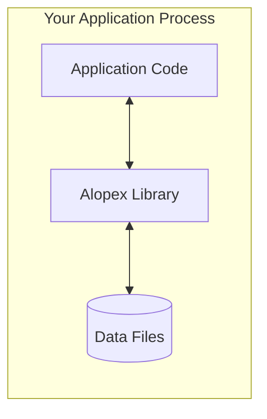
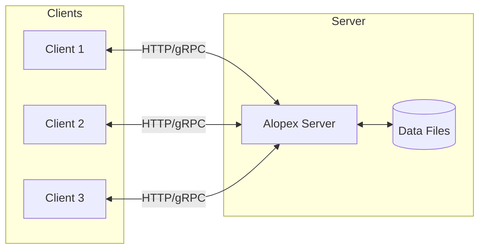
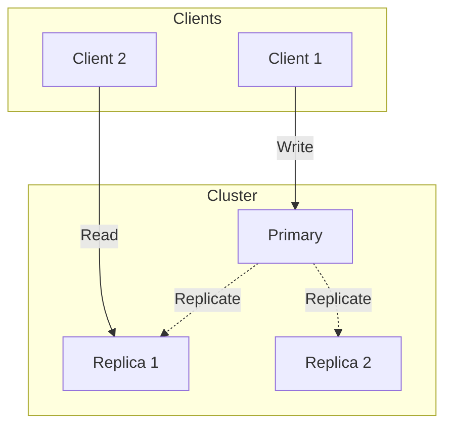
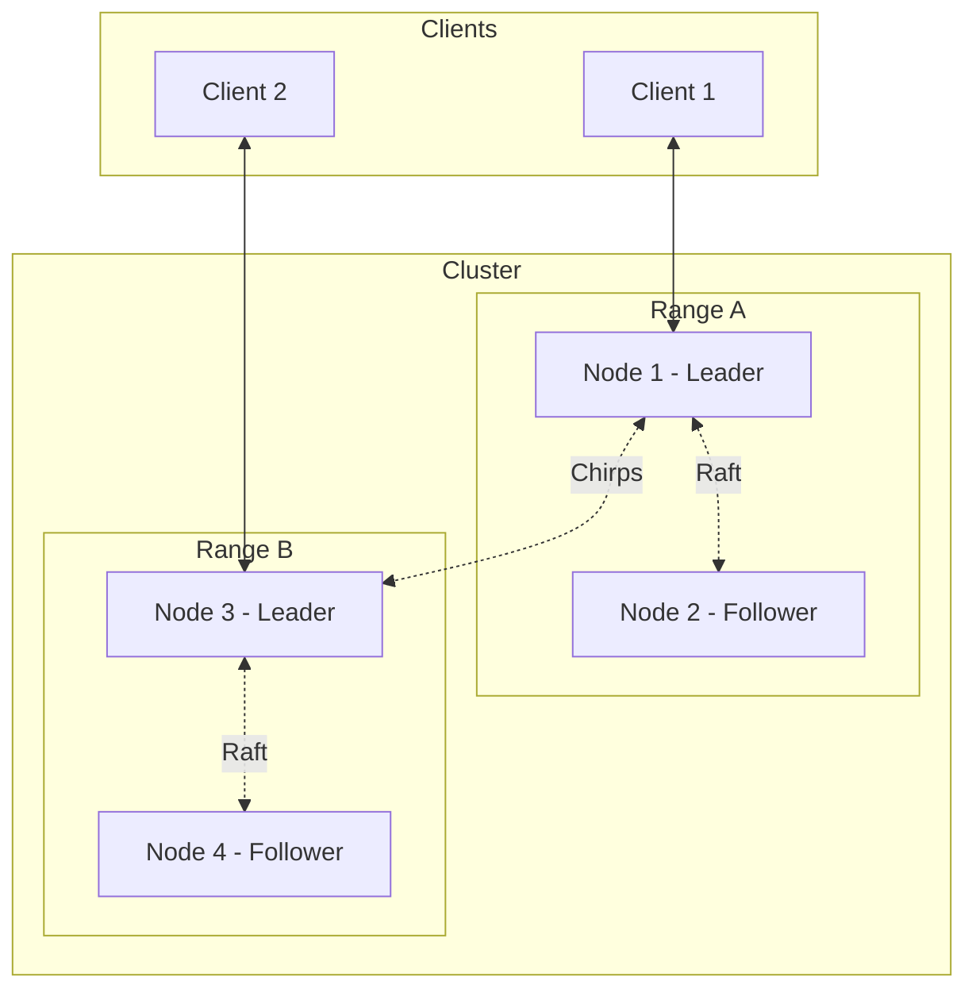
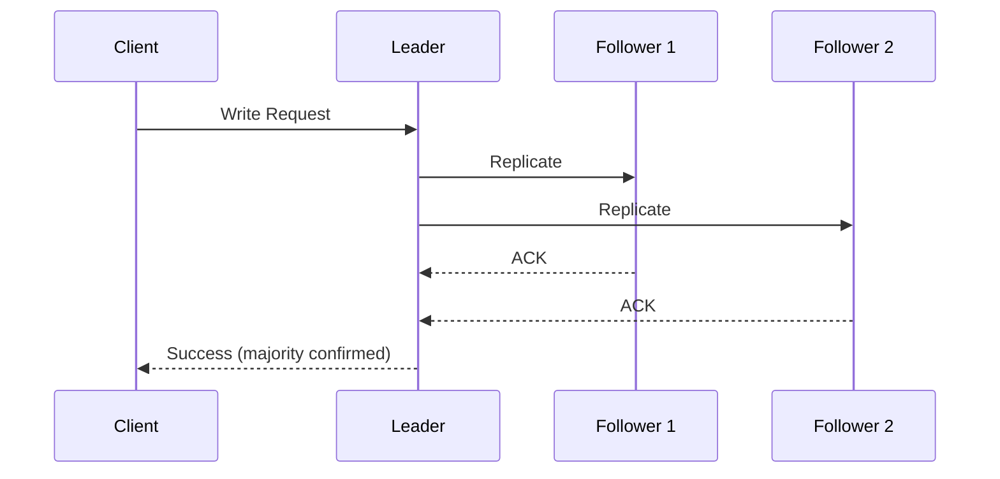
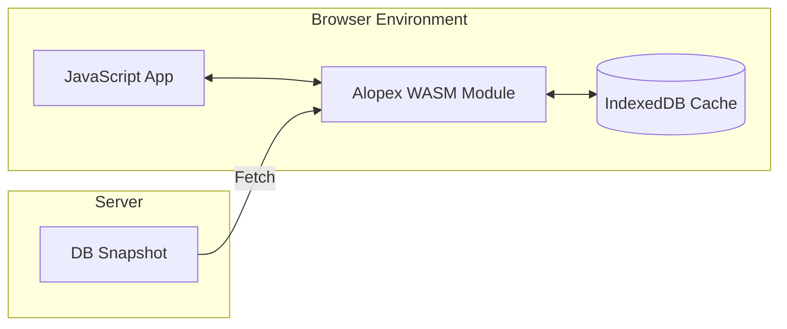
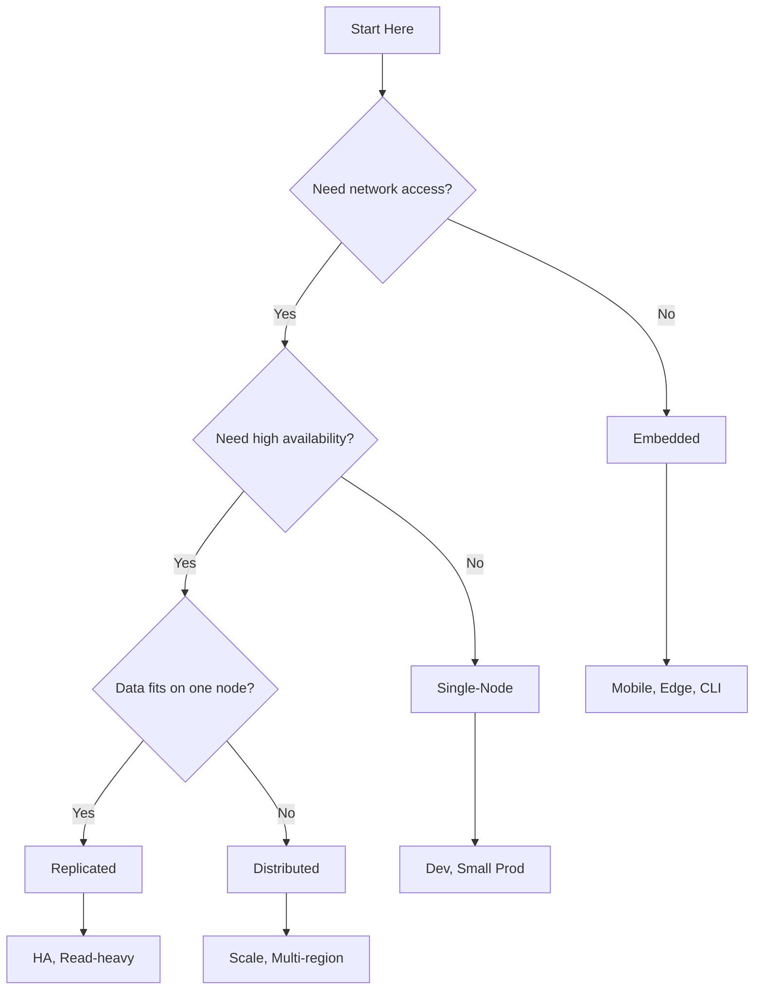

# Any Scale, One Engine

Alopex DB provides a spectrum of deployment topologies—from a single embedded library to a globally distributed cluster. Start small and scale infinitely without changing your data model or application code.

## Deployment Spectrum


| Topology | Scaling | HA | Write | Use Case |
|:---------|:--------|:---|:------|:---------|
| **WASM Viewer** | - | No | No | Browser data exploration |
| **Embedded** | Vertical | No | Yes | Edge, Mobile, CLI |
| **Single-Node** | Vertical | No | Yes | Dev, Small workloads |
| **Replicated** | Vertical | Yes | Yes | HA without sharding |
| **Distributed** | Horizontal | Yes | Yes | Large-scale production |

---

## :package: Embedded Mode

The simplest deployment—Alopex runs as a library within your application process.



### Characteristics

- **Zero network overhead**: Direct function calls
- **Single file storage**: All data in one directory
- **No separate process**: Embedded in your application
- **ACID transactions**: Full durability guarantees

### Use Cases

- :iphone: **Mobile Applications**: Local-first data storage
- :robot: **Local RAG Systems**: Embeddings on-device
- :satellite: **Edge Devices**: IoT and edge computing
- :terminal: **CLI Tools**: Self-contained utilities

### Example

```rust
use alopex_embedded::{Database, Config};

let db = Database::open(Config::default().path("./data"))?;

// Use like SQLite, but with vectors!
db.execute("CREATE TABLE docs (id TEXT, vec VECTOR(384))")?;
```

---

## :desktop_computer: Single-Node Mode

A standalone server that accepts connections from multiple clients.



### Characteristics

- **Network protocol**: HTTP REST and gRPC
- **Multi-client**: Concurrent connections
- **Postgres wire protocol**: Compatible with existing tools*
- **Connection pooling**: Efficient resource usage

### Use Cases

- :gear: **Microservices**: Backend data store
- :wrench: **Development**: Local development environment
- :test_tube: **Testing**: Integration test databases
- :chart_with_upwards_trend: **Small Production**: Single-server workloads

### Example

```bash
# Start the server
alopex-server --port 5432 --data ./data

# Connect with any Postgres client
psql -h localhost -p 5432 -d alopex
```

```sql
-- Works with standard SQL clients
CREATE TABLE products (
    id SERIAL PRIMARY KEY,
    name TEXT,
    embedding VECTOR(1536)
);
```

---

## :arrows_counterclockwise: Replicated Mode

Primary-replica topology for high availability without horizontal sharding.



### Characteristics

- **Primary-replica**: Single writer, multiple readers
- **Automatic failover**: Replica promotion on primary failure
- **Read scaling**: Distribute read load across replicas
- **Simpler operations**: No sharding complexity

### Use Cases

- :shield: **High Availability**: Fault tolerance without sharding
- :book: **Read-heavy workloads**: Scale reads horizontally
- :zap: **Low-latency reads**: Local replicas near users
- :building_construction: **Stepping stone**: Before full distribution

### Replication Modes

| Mode | Durability | Latency |
|:-----|:-----------|:--------|
| **Sync** | Strong (no data loss) | Higher |
| **Semi-sync** | At least 1 replica | Balanced |
| **Async** | Eventual | Lowest |

### Example

```bash
# Start primary
alopex-server --mode primary --port 5432 --data ./primary

# Start replicas
alopex-server --mode replica --primary localhost:5432 --port 5433
alopex-server --mode replica --primary localhost:5432 --port 5434

# Check replication status
alopex-cli replication status
```

```sql
-- Route reads to replicas
SET alopex.read_from = 'replica';
SELECT * FROM products WHERE id = 123;

-- Writes always go to primary
INSERT INTO products (name) VALUES ('New Product');
```

---

## :earth_americas: Distributed Mode

A horizontally scalable cluster with range sharding and Raft consensus.



### Characteristics

- **Horizontal scaling**: Add nodes for more capacity
- **High availability**: Automatic failover with Raft
- **Range sharding**: Data distributed across nodes
- **Chirps mesh**: QUIC-based cluster communication

### Use Cases

- :factory: **High-Availability Production**: Mission-critical workloads
- :globe_with_meridians: **Global Distribution**: Multi-region deployments
- :chart_with_upwards_trend: **Massive Scale**: Petabyte-scale data

### Architecture

#### Range Sharding

Data is partitioned into ranges and distributed:

```
Range A: [a-m) → Node 1 (Leader), Node 2 (Follower)
Range B: [m-z) → Node 3 (Leader), Node 4 (Follower)
```

#### Raft Consensus

Each range has a Raft group for replication:



### Example

```bash
# Start a 3-node cluster
alopex-cluster init --nodes 3 --data ./cluster

# Join nodes
alopex-cluster join --seed node1:7000

# Check cluster status
alopex-cluster status
```

---

## Migration Between Topologies

One of Alopex's key features is seamless migration between deployment topologies.

### Embedded → Single-Node

```bash
# Export embedded data
alopex-cli export --from ./embedded_data --to ./export.parquet

# Import into server
alopex-server import --from ./export.parquet
```

### Single-Node → Replicated

```bash
# Add replicas to existing server
alopex-server --mode replica --primary localhost:5432 --port 5433

# Promote to HA mode
alopex-cli replication enable --replicas 2
```

### Replicated → Distributed

```bash
# Initialize sharding on existing replicated cluster
alopex-cluster init --from primary:5432 --shards 4

# Enable range distribution
alopex-cli sharding enable
```

!!! tip "Zero Downtime Migration"

    For production migrations, use the `--live` flag to replicate data while serving traffic:

    ```bash
    alopex-cluster migrate --from single-node:5432 --live
    ```

---

## :globe_with_meridians: WASM Mode (Read-Only Viewer)

A browser-based read-only viewer for exploring pre-built database snapshots.



### Characteristics

- **Read-only**: SELECT queries only, no writes
- **Pre-built snapshots**: Loads server-generated SSTable files
- **Offline capable**: IndexedDB caching for offline access
- **Lightweight**: < 1MB WASM binary (gzipped)

### Use Cases

- :bar_chart: **Data Exploration**: Browse datasets in the browser
- :notebook: **Documentation**: Interactive examples
- :iphone: **Offline Viewing**: Cached snapshots work offline
- :mag: **Vector Search Demo**: Client-side similarity search

### Example

```javascript
import { AlopexViewer } from '@alopex-db/wasm';

// Load snapshot from URL
const viewer = await AlopexViewer.loadSnapshot(
  'https://example.com/data/snapshot.alopex'
);

// SQL SELECT only
const results = await viewer.query(
  'SELECT * FROM products WHERE category = ?',
  ['electronics']
);

// Vector search (Flat algorithm)
const similar = await viewer.vectorSearch({
  table: 'documents',
  queryVector: embedding,
  similarity: 'cosine',
  limit: 10
});
```

### Limitations

| Feature | Supported |
|:--------|:---------:|
| SELECT queries | :white_check_mark: |
| INSERT/UPDATE/DELETE | :x: |
| Transactions | :x: |
| Vector Search (Flat) | :white_check_mark: |
| Vector Search (HNSW) | :x: |
| IndexedDB caching | :white_check_mark: |

---

## Choosing the Right Topology



### Decision Matrix

| Requirement | WASM | Embedded | Single | Replicated | Distributed |
|:------------|:----:|:--------:|:------:|:----------:|:-----------:|
| Browser runtime | :white_check_mark: | :x: | :x: | :x: | :x: |
| Write operations | :x: | :white_check_mark: | :white_check_mark: | :white_check_mark: | :white_check_mark: |
| No network | :white_check_mark: | :white_check_mark: | :x: | :x: | :x: |
| Multi-client | :x: | :x: | :white_check_mark: | :white_check_mark: | :white_check_mark: |
| High availability | :x: | :x: | :x: | :white_check_mark: | :white_check_mark: |
| Read scaling | :x: | :x: | :x: | :white_check_mark: | :white_check_mark: |
| Write scaling | :x: | :x: | :x: | :x: | :white_check_mark: |
| Data > 1 node | :x: | :x: | :x: | :x: | :white_check_mark: |

## Next Steps

- [:octicons-arrow-right-24: Chirps](chirps.md) - Cluster messaging layer
- [:octicons-arrow-right-24: Vector Search](vector-search.md) - Learn about vector operations
- [:octicons-arrow-right-24: Architecture](architecture.md) - Deep dive into internals
