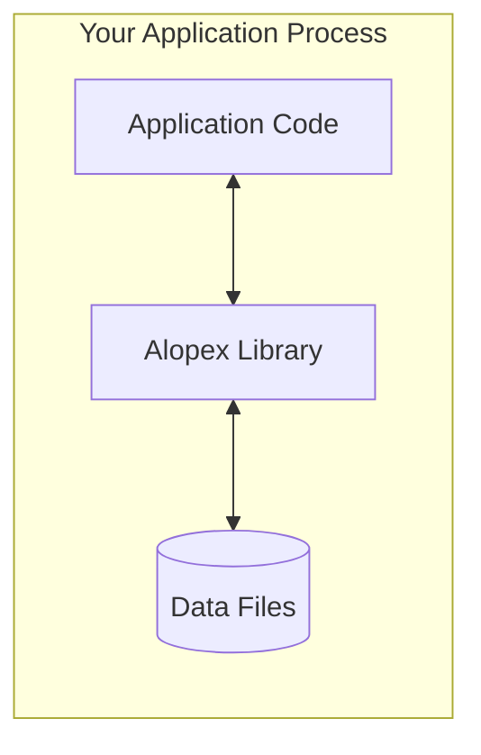
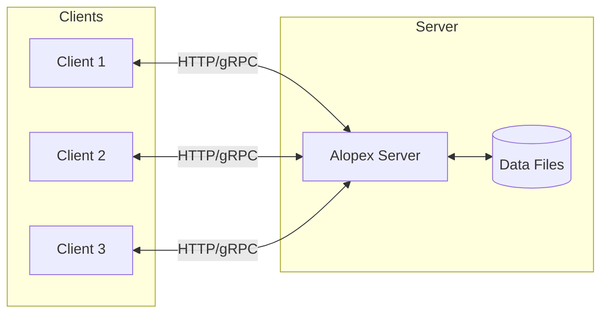
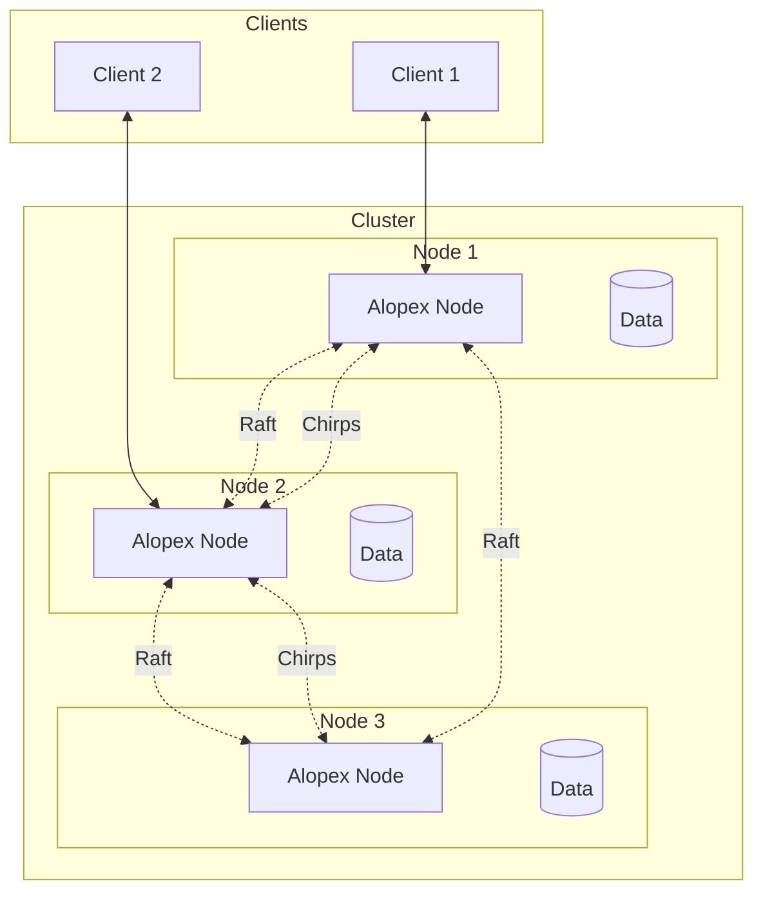
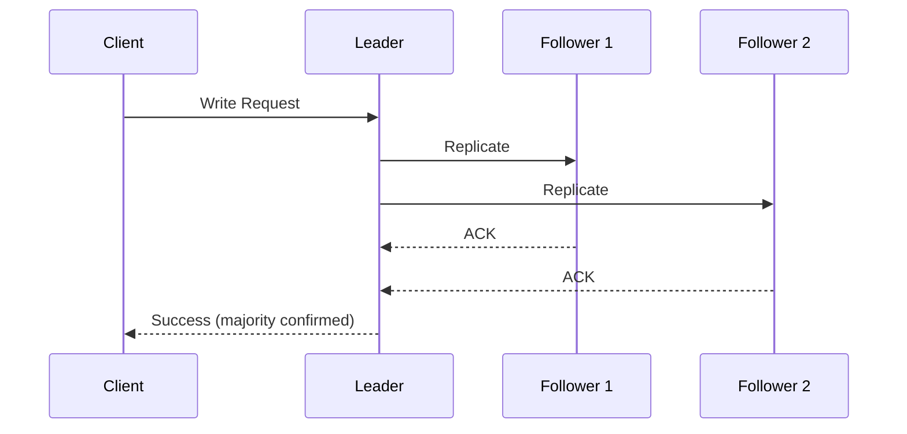
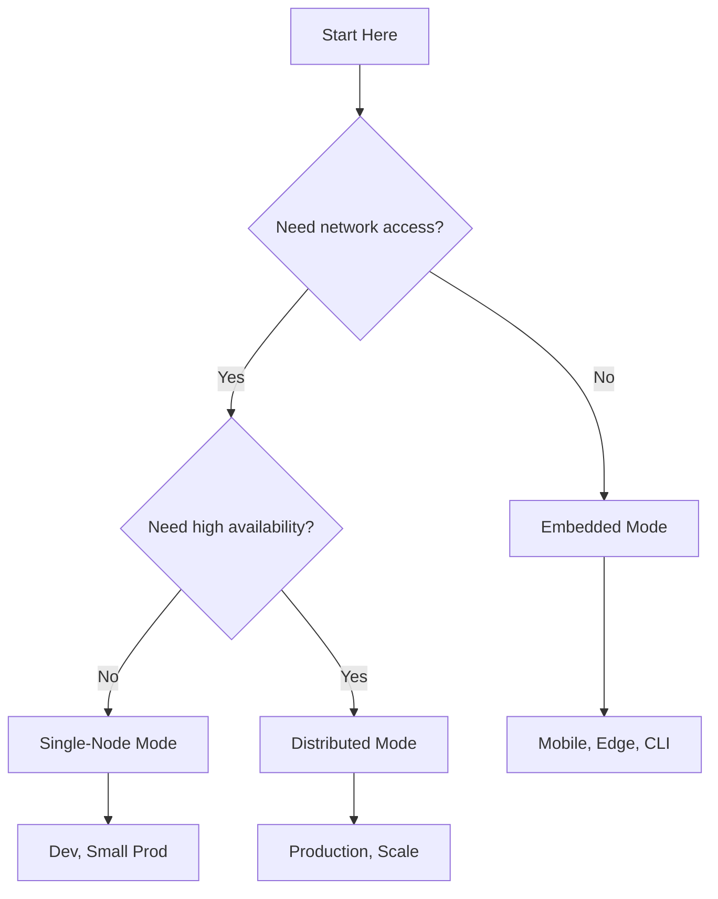

# Three Modes, One Engine

Alopex DB provides three deployment modes that share the same core engine, allowing you to start small and scale infinitely without changing your data model or application code.

## Mode Comparison

| Feature | Embedded | Single-Node | Distributed |
|:--------|:---------|:------------|:------------|
| **Deployment** | Library | Standalone Server | Cluster |
| **Architecture** | In-process | Client-Server | Shared-nothing |
| **Scaling** | Vertical | Vertical | Horizontal |
| **High Availability** | No | No | Yes (Raft) |
| **Use Case** | Edge, Mobile, CLI | Microservices, Dev | Production |

## :package: Embedded Mode

The simplest deployment—Alopex runs as a library within your application process.



### Characteristics

- **Zero network overhead**: Direct function calls
- **Single file storage**: All data in one directory
- **No separate process**: Embedded in your application
- **ACID transactions**: Full durability guarantees

### Use Cases

- :iphone: **Mobile Applications**: Local-first data storage
- :robot: **Local RAG Systems**: Embeddings on-device
- :satellite: **Edge Devices**: IoT and edge computing
- :terminal: **CLI Tools**: Self-contained utilities

### Example

```rust
use alopex_embedded::{Database, Config};

let db = Database::open(Config::default().path("./data"))?;

// Use like SQLite, but with vectors!
db.execute("CREATE TABLE docs (id TEXT, vec VECTOR(384))")?;
```

---

## :desktop_computer: Single-Node Mode

A standalone server that accepts connections from multiple clients.



### Characteristics

- **Network protocol**: HTTP REST and gRPC
- **Multi-client**: Concurrent connections
- **Postgres wire protocol**: Compatible with existing tools*
- **Connection pooling**: Efficient resource usage

### Use Cases

- :gear: **Microservices**: Backend data store
- :wrench: **Development**: Local development environment
- :test_tube: **Testing**: Integration test databases
- :chart_with_upwards_trend: **Small Production**: Single-server workloads

### Example

```bash
# Start the server
alopex-server --port 5432 --data ./data

# Connect with any Postgres client
psql -h localhost -p 5432 -d alopex
```

```sql
-- Works with standard SQL clients
CREATE TABLE products (
    id SERIAL PRIMARY KEY,
    name TEXT,
    embedding VECTOR(1536)
);
```

---

## :earth_americas: Distributed Mode

A horizontally scalable cluster for production workloads.



### Characteristics

- **Horizontal scaling**: Add nodes for more capacity
- **High availability**: Automatic failover with Raft
- **Range sharding**: Data distributed across nodes
- **Chirps mesh**: QUIC-based cluster communication

### Use Cases

- :factory: **High-Availability Production**: Mission-critical workloads
- :globe_with_meridians: **Global Distribution**: Multi-region deployments
- :chart_with_upwards_trend: **Massive Scale**: Petabyte-scale data

### Architecture

#### Range Sharding

Data is partitioned into ranges and distributed:

```
Range 1: [a-m) → Node 1, Node 2 (replica)
Range 2: [m-z) → Node 2, Node 3 (replica)
```

#### Raft Consensus

Each range has a Raft group for replication:



### Example

```bash
# Start a 3-node cluster
alopex-cluster init --nodes 3 --data ./cluster

# Join nodes
alopex-cluster join --seed node1:7000

# Check cluster status
alopex-cluster status
```

---

## Migration Between Modes

One of Alopex's key features is seamless migration between modes.

### Embedded → Single-Node

```bash
# Export embedded data
alopex-cli export --from ./embedded_data --to ./export.parquet

# Import into server
alopex-server import --from ./export.parquet
```

### Single-Node → Distributed

```bash
# Initialize cluster from existing data
alopex-cluster init --from ./single_node_data --nodes 3
```

!!! tip "Zero Downtime Migration"

    For production migrations, use the `--live` flag to replicate data while serving traffic:

    ```bash
    alopex-cluster migrate --from single-node:5432 --live
    ```

## Choosing the Right Mode



## Next Steps

- [:octicons-arrow-right-24: Vector Search](vector-search.md) - Learn about vector operations
- [:octicons-arrow-right-24: Architecture](architecture.md) - Deep dive into internals
