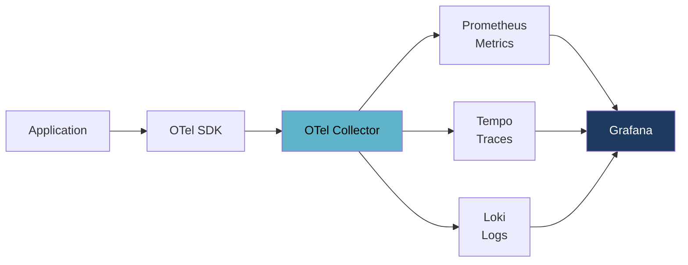
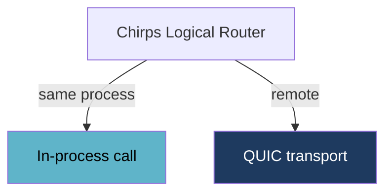

# Alopex OTel — Storage and Dashboards, One Product

**OpenTelemetry from embedded to cluster.**

Most observability tools stop at storage and hand you off to something else to
look at the data. Alopex OTel doesn't. **Ingestion, storage, and the dashboard
are one product** — and that whole thing runs anywhere from a single embedded
process to a distributed cluster, with the same screen either way.

No Collector to deploy. No Prometheus to size. No Tempo, no Loki, no Grafana to
wire together and keep in sync.

[:octicons-arrow-right-24: Read the concept](https://github.com/alopex-db/docs/blob/main/concepts/alopex-otel-concept.md){ .md-button .md-button--primary }
[Shape the design :fontawesome-brands-github:](https://github.com/alopex-db/alopex/discussions){ .md-button }

## The Stack You Don't Want to Assemble

OpenTelemetry standardised how telemetry is **produced**. It deliberately says
nothing about where it goes.



Five systems, three storage engines, three query languages, three retention
policies — to observe one application. Scaling means scaling each of them
separately. Shrinking means unwinding each of them separately.

Alopex OTel is one system.

---

## The Dashboard Ships With the Storage

Splitting storage from visualisation has a running cost, and you pay it every
day.

<div class="grid cards" markdown>

-   :material-server-off:{ .lg .middle } **Nothing to stand up**

    ---

    No second server to deploy, secure, and upgrade. The dashboard is the same
    process and the same binary as the storage.

-   :material-link-off:{ .lg .middle } **Nothing to point at anything**

    ---

    No data source URLs to configure, no credentials to keep in sync. It reads
    its own storage.

-   :material-laptop:{ .lg .middle } **Nothing to give up in development**

    ---

    Embedded means the UI comes with it. You don't fall back to reading raw
    logs because standing up a viewer wasn't worth it.

-   :material-arrow-decision:{ .lg .middle } **Nothing to re-enter between signals**

    ---

    Metric spike → exemplar → trace → the logs from that same trace. Each
    arrow is a link, not a new tab and a retyped filter.

</div>

### The same screen at every size

```text
Embedded (in your process)   →  localhost. No extra process.
Local Server                 →  Same screen. More data.
Compact Cluster (2–3 nodes)  →  Same screen. Connect to any node, see it all.
Scale-out Cluster (N nodes)  →  Same screen. Queries fan out transparently.
```

**The screen, the API, the query language, and the dashboard definitions do not
change with scale.** A dashboard built on your laptop works on a twenty-node
cluster, and one from the cluster works on a single edge node.

That is what makes "start small, grow later" more than a slogan — there is no
migration between the small thing and the big thing, because they are the same
thing.

### And it isn't a walled garden

Bundling a dashboard doesn't mean locking you into it — Grafana connects to the
same data. See [Two ways to query it](#two-ways-to-query-it).

---

## Time Series or Events

The design point is not "one database for everything." It is **the right
storage per signal, presented as one** — and the line between them is simple.

> **Time series** arrive on a schedule. You know roughly when the next point
> comes, give or take.
>
> **Events** arrive when something happens. There is no next.

That distinction decides everything else. Fixed-interval partitioning,
downsampling, and gap-filling are meaningful for the first and meaningless for
the second.

<div class="grid cards" markdown>

-   :material-chart-line:{ .lg .middle } **Metrics → [Skulk](skulk.md)**

    ---

    **Time series.** A scrape interval defines when the next point arrives.
    Columnar compression, hourly partitions, TTL, and downsampling all apply.

-   :material-sitemap:{ .lg .middle } **Traces → [Trail](trail.md)**

    ---

    **Events.** A span happens when a request arrives — there is no interval
    to partition by. Attributes are arbitrary; events and links nest.

-   :material-text-box:{ .lg .middle } **Logs → [Trail](trail.md)**

    ---

    **Events.** Something happened, so a line was written. Arbitrary body,
    arbitrary attributes, unreliable timestamps.

-   :material-database-search:{ .lg .middle } **Index & Metadata → [Alopex DB](../index.md)**

    ---

    Services, resources, trace indexes, service graphs, dashboards, alert
    rules, RBAC — anything needing high-selectivity search or SQL.

</div>

RED metrics derived from spans land back in Skulk: once you aggregate over a
window, the result has an interval again.

### Why this matters at 3am

OpenTelemetry attributes are typed `AnyValue`. Across SDK versions and
libraries, **the same key changes type routinely**.

```jsonl
{"service":"payment","http.status_code":500}
{"service":"payment","http.status_code":"upstream_timeout"}
```

Put that into a store with a strict schema and ingestion stops — your
observability platform goes down because a service was deployed.

Trail shadows the conflict into `http.status_code@i64` and
`http.status_code@str`, coalescing them on read. **Ingestion does not stop.**

### One query, regardless

```sql
SELECT t.trace_id, t.duration, l.body, m.cpu_usage
FROM otel.traces t
LEFT JOIN otel.logs l ON t.trace_id = l.trace_id
LEFT JOIN otel.metrics m
    ON t.service_instance_id = m.service_instance_id
   AND m.time BETWEEN t.start_time AND t.end_time
WHERE t.status = 'ERROR';
```

Splitting the storage doesn't split the query. Traces and Logs both live in
Trail, so most of that join never crosses a storage boundary anyway.

This is the internal language — the one Observe uses, unconstrained by
anyone else's format. [Grafana gets its own](#two-ways-to-query-it).

---

## One Architecture, Any Size

There is no embedded edition and no cluster edition. There is one architecture
with different placements.

```text
1 process → 2 nodes → many nodes → 2 nodes → 1 node
```

Embedded deployments still route through [Chirps](chirps.md) — but when the
destination is the same process, the call never touches the network.



Move from a laptop to a cluster and the data model, the query API, and the
storage format stay identical. Add a node to scale out:

```bash
alopex-otel node join --cluster observe-prod --seed node-1:7443
```

Drain one to shrink — **all the way down to a single node**:

```bash
alopex-otel node leave --drain
```

---

## Deployment Profiles

| Profile | For |
|:--------|:----|
| **Embedded** | Desktop apps, CLIs, edge devices, local AI, development, self-observability |
| **Local Server** | One server observing several applications |
| **Sidecar** | Buffering, redaction, and first-stage sampling next to the app |
| **Compact Cluster** | 2–3 converged nodes |
| **Scale-out Cluster** | As many converged nodes as needed |
| **Role-separated** | The same binary constrained to gateway / storage / query / observe |

Role separation is a placement constraint, not a different architecture.

---

## From Python, Too

Embedded means embedded in *your* process — and for a lot of people that
process is Python.

```python
import alopex_otel

otel = alopex_otel.embed(data_dir="./telemetry", observe_port=7777)
# Receiver, pipeline, storage, and dashboard — all in this process.
# http://localhost:7777 is now your observability stack.
```

Existing instrumentation keeps working. `opentelemetry-python` isn't replaced;
only the export destination changes — from a network endpoint to storage in
the same process.

```python
from opentelemetry import trace
trace.set_tracer_provider(otel.tracer_provider())
```

And what you collected is queryable where you already do analysis:

```python
df = otel.query("""
    SELECT service, percentile(duration_ms, 0.99) AS p99
    FROM traces WHERE _time > now() - 1h GROUP BY service
""").to_polars()
```

Storage is Arrow internally, so results reach pandas or Polars without a
conversion step — cross-signal joins included.

---

## Self-Observability, Included

Run Alopex DB, Skulk, Trail, or Chirps and their internals are visible without
deploying anything else — query latency, WAL, compaction, cache, Raft state,
replication lag, membership, shard placement, rebalance progress.

The observability platform observes the database it is built on.

---

## Two Ways to Query It

Observe reads the storage directly. Grafana connects from outside. Those want
different things from a query language, so Alopex OTel serves both rather than
forcing one to compromise.

<div class="grid cards" markdown>

-   :material-view-dashboard:{ .lg .middle } **Observe — the internal language**

    ---

    An aggregation DSL with **joins across signals**, so a trace, the logs from
    that trace, and the metrics around it come back from one query.

    Nothing constrains it, so it is built for what the storage can do.

-   :material-connection:{ .lg .middle } **Grafana — compatible APIs**

    ---

    **Prometheus query API** for metrics, **TraceQL** and **LogQL** for traces
    and logs. Grafana's built-in data sources connect with no plugin.

    Everything constrains it, so it matches what Grafana expects.

</div>

Speaking Grafana's APIs matters because dashboards name the data source by
type:

```json
"datasource": { "type": "prometheus", "uid": "$ds" }
```

Existing Prometheus dashboards keep working. And the cross-signal join stays
available on the inside, where nothing has to be compatible with anything.

[:octicons-arrow-right-24: How the two layers fit together](trail.md#two-query-surfaces-not-one)
·
[:octicons-arrow-right-24: When each piece arrives](../roadmap.md)

---

## Open Questions

These are undecided, and input changes the outcome.

- **RED metrics from spans** — derive them into Skulk as they arrive, or
  aggregate from Trail at query time?
- **Retention for events** — you cannot downsample what has no interval. How
  should trace and log retention be expressed?

[Weigh in on GitHub :fontawesome-brands-github:](https://github.com/alopex-db/alopex/discussions){ .md-button }

---

## Learn More

- [Full concept document](https://github.com/alopex-db/docs/blob/main/concepts/alopex-otel-concept.md)
- [Skulk](skulk.md) — the metrics storage core, available today
- [Trail](trail.md) — the traces and logs store, in design
- [Chirps](chirps.md) — the cluster foundation all of them share
