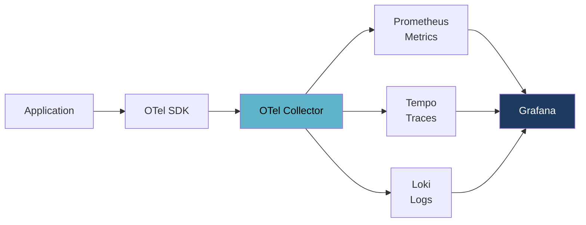
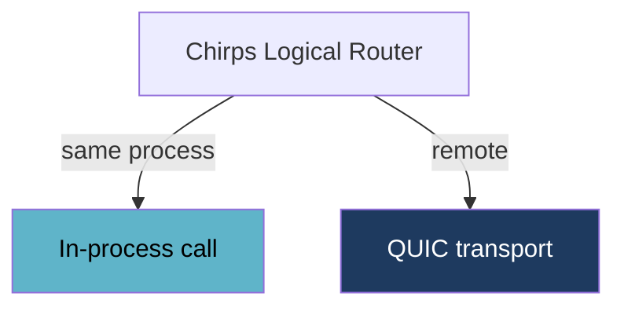

# Alopex OTel — Observability Without the Stack

**OpenTelemetry from embedded to cluster.**

Alopex OTel collects, stores, queries, and visualises Metrics, Traces, and Logs
as one product. No Collector to deploy, no Prometheus to size, no Tempo, no
Loki, no Grafana to wire together — and the same binary runs inside your
application process or across a cluster.

[:octicons-arrow-right-24: Read the concept](https://github.com/alopex-db/docs/blob/main/concepts/alopex-otel-concept.md){ .md-button .md-button--primary }
[Shape the design :fontawesome-brands-github:](https://github.com/alopex-db/alopex/discussions){ .md-button }

!!! info "Design stage"

    Alopex OTel is a published design. Metrics can be built on what ships
    today; Traces and Logs wait on [Trail](trail.md). The current state is
    laid out honestly in [Where this stands](#where-this-stands).

---

## The Stack You Don't Want to Assemble

OpenTelemetry standardised how telemetry is **produced**. It deliberately says
nothing about where it goes.



Five systems, three storage engines, three query languages, three retention
policies — to observe one application. Scaling means scaling each of them
separately. Shrinking means unwinding each of them separately.

Alopex OTel is one system.

---

## Time Series or Events

The design point is not "one database for everything." It is **the right
storage per signal, presented as one** — and the line between them is simple.

> **Time series** arrive on a schedule. You know roughly when the next point
> comes, give or take.
>
> **Events** arrive when something happens. There is no next.

That distinction decides everything else. Fixed-interval partitioning,
downsampling, and gap-filling are meaningful for the first and meaningless for
the second.

<div class="grid cards" markdown>

-   :material-chart-line:{ .lg .middle } **Metrics → [Skulk](skulk.md)**

    ---

    **Time series.** A scrape interval defines when the next point arrives.
    Columnar compression, hourly partitions, TTL, and downsampling all apply.

-   :material-sitemap:{ .lg .middle } **Traces → [Trail](trail.md)**

    ---

    **Events.** A span happens when a request arrives — there is no interval
    to partition by. Attributes are arbitrary; events and links nest.

-   :material-text-box:{ .lg .middle } **Logs → [Trail](trail.md)**

    ---

    **Events.** Something happened, so a line was written. Arbitrary body,
    arbitrary attributes, unreliable timestamps.

-   :material-database-search:{ .lg .middle } **Index & Metadata → [Alopex DB](../index.md)**

    ---

    Services, resources, trace indexes, service graphs, dashboards, alert
    rules, RBAC — anything needing high-selectivity search or SQL.

</div>

RED metrics derived from spans land back in Skulk: once you aggregate over a
window, the result has an interval again.

### Why this matters at 3am

OpenTelemetry attributes are typed `AnyValue`. Across SDK versions and
libraries, **the same key changes type routinely**.

```jsonl
{"service":"payment","http.status_code":500}
{"service":"payment","http.status_code":"upstream_timeout"}
```

Put that into a store with a strict schema and ingestion stops — your
observability platform goes down because a service was deployed.

Trail shadows the conflict into `http.status_code@i64` and
`http.status_code@str`, coalescing them on read. **Ingestion does not stop.**

### One query, regardless

```sql
SELECT t.trace_id, t.duration, l.body, m.cpu_usage
FROM otel.traces t
LEFT JOIN otel.logs l ON t.trace_id = l.trace_id
LEFT JOIN otel.metrics m
    ON t.service_instance_id = m.service_instance_id
   AND m.time BETWEEN t.start_time AND t.end_time
WHERE t.status = 'ERROR';
```

Traces and Logs both live in Trail, so most of that join never crosses a
storage boundary.

---

## One Architecture, Any Size

There is no embedded edition and no cluster edition. There is one architecture
with different placements.

```text
1 process → 2 nodes → many nodes → 2 nodes → 1 node
```

Embedded deployments still route through [Chirps](chirps.md) — but when the
destination is the same process, the call never touches the network.



Move from a laptop to a cluster and the data model, the query API, and the
storage format stay identical. Add a node to scale out:

```bash
alopex-otel node join --cluster observe-prod --seed node-1:7443
```

Drain one to shrink — **all the way down to a single node**:

```bash
alopex-otel node leave --drain
```

---

## Deployment Profiles

| Profile | For |
|:--------|:----|
| **Embedded** | Desktop apps, CLIs, edge devices, local AI, development, self-observability |
| **Local Server** | One server observing several applications |
| **Sidecar** | Buffering, redaction, and first-stage sampling next to the app |
| **Compact Cluster** | 2–3 converged nodes |
| **Scale-out Cluster** | As many converged nodes as needed |
| **Role-separated** | The same binary constrained to gateway / storage / query / observe |

Role separation is a placement constraint, not a different architecture.

---

## Self-Observability, Included

Run Alopex DB, Skulk, Trail, or Chirps and their internals are visible without
deploying anything else — query latency, WAL, compaction, cache, Raft state,
replication lag, membership, shard placement, rebalance progress.

The observability platform observes the database it is built on.

---

## Where This Stands

Alopex OTel depends on milestones across several products. Here is what is
actually available.

| Capability | State |
|:-----------|:------|
| Metrics storage | :white_check_mark: Skulk v0.3.0 |
| Prometheus Remote Write ingest | :white_check_mark: Skulk v0.3.0 |
| Skulk query engine | :material-calendar: Skulk v0.4 |
| Traces / Logs storage | :material-lightbulb-outline: Trail v0.1–v0.3 |
| Chirps-backed distribution | :material-calendar: Skulk v0.8 / v0.9 |
| Alopex DB distributed execution | :material-calendar: Alopex DB v0.8+ |

**The scale-out and shrink behaviour described above does not run today.** It
is the target, not a shipped feature.

What *is* buildable now is the Metrics path: Skulk v0.3.0 already ingests
Prometheus Remote Write, compresses columnar, and manages retention. The MVP
starts there.

---

## Open Questions

These are undecided, and input changes the outcome.

- **Does Trail need Chirps?** Its roadmap has no distribution story yet. This
  design would require one.
- **RED metrics from spans** — derive them into Skulk as they arrive, or
  aggregate from Trail at query time?
- **Retention for events** — you cannot downsample what has no interval. How
  should trace and log retention be expressed?

[Weigh in on GitHub :fontawesome-brands-github:](https://github.com/alopex-db/alopex/discussions){ .md-button }

---

## Learn More

- [Full concept document](https://github.com/alopex-db/docs/blob/main/concepts/alopex-otel-concept.md)
- [Skulk](skulk.md) — the metrics storage core, available today
- [Trail](trail.md) — the traces and logs store, in design
- [Chirps](chirps.md) — the cluster foundation all of them share
