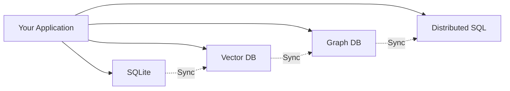
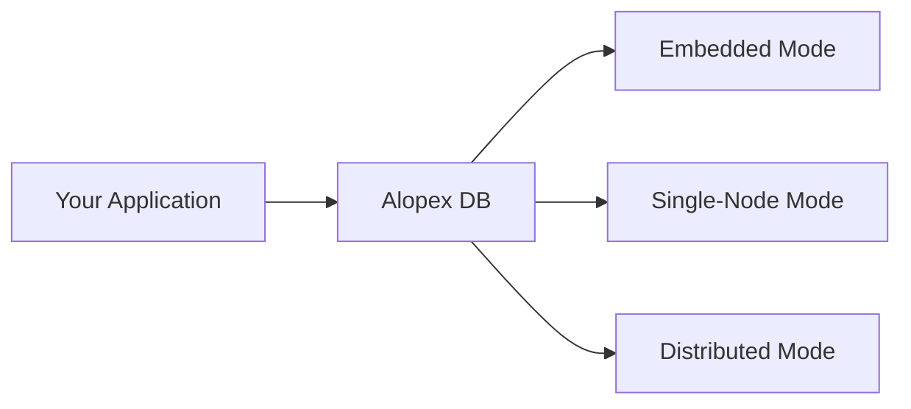
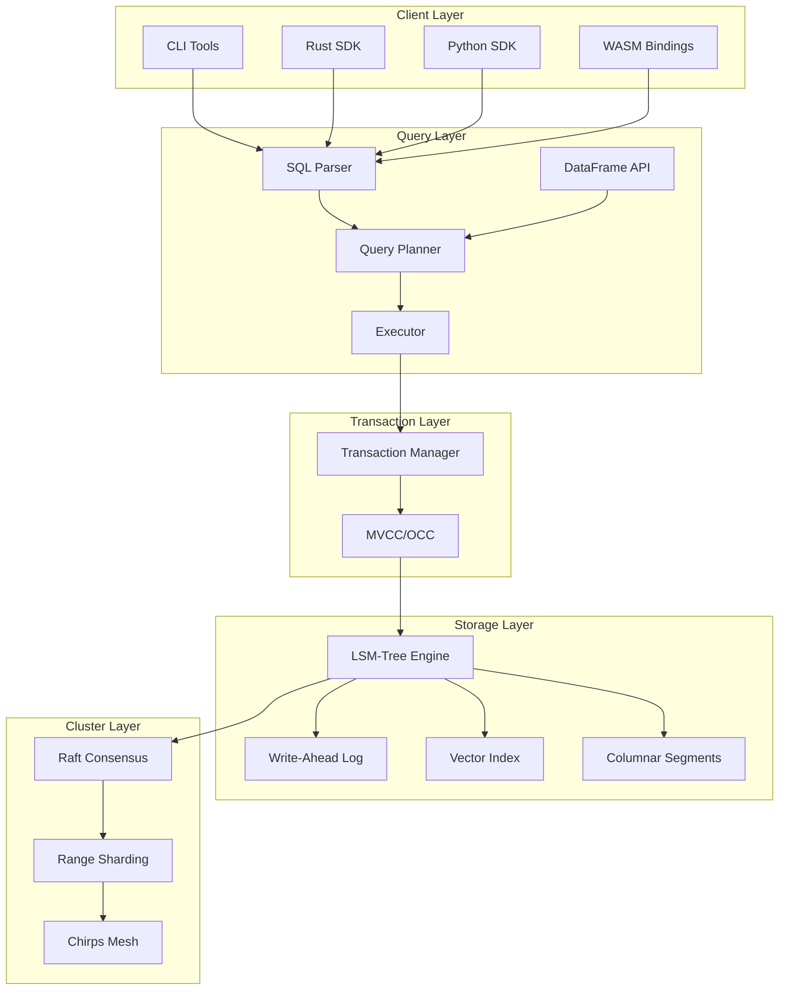

# Overview

Alopex DB is a unified database engine designed for the next generation of data-intensive applications—specifically those driving **Agentic AI**, **RAG (Retrieval-Augmented Generation)**, and **Edge Computing**.

## The Problem We Solve

Modern AI applications face a fragmentation problem:



Instead of gluing together multiple database systems, **Alopex provides a single engine that adapts to your workload**.



## Core Philosophy: The Arctic Fox Traits

The name "Alopex" comes from the Arctic Fox (*Vulpes lagopus*)—an animal known for its remarkable adaptability. Our database embodies these traits:

### :zap: Silent (Swift & Light)

- Written in **Rust** with zero-overhead abstractions
- Minimal memory footprint in embedded mode
- No garbage collection pauses
- Predictable latency

### :arrows_counterclockwise: Adaptive (Flexible)

- Seamlessly transitions from local library to multi-node cluster
- Same API across all deployment modes
- Progressive scaling without data migration
- Multi-model: SQL + Vector + HNSW

### :shield: Unbreakable (Resilient)

- **Raft consensus** for distributed mode
- ACID transactions across all operations
- Automatic failure recovery
- Data durability guarantees

## Architecture Layers



## Key Components

| Component | Description | Status |
|:----------|:------------|:-------|
| [**alopex-core**](https://crates.io/crates/alopex-core) | Core storage engine with LSM-Tree, Vector, Columnar | :white_check_mark: v0.3.1 |
| [**alopex-sql**](https://crates.io/crates/alopex-sql) | SQL parser, planner, and executor | :white_check_mark: v0.3.0 |
| [**alopex-embedded**](https://crates.io/crates/alopex-embedded) | Embedded mode library API | :white_check_mark: v0.3.1 |
| **alopex-dataframe** | Polars-compatible DataFrame API | :material-calendar: v0.1.0 (Planned) |
| **alopex-py** | Python bindings via PyO3 | :material-calendar: v0.1.0 (Planned) |
| **alopex-server** | Single-node server with HTTP/gRPC | :material-calendar: v0.4 (Planned) |
| **alopex-cluster** | Distributed mode with Raft | :material-calendar: v0.7 (Planned) |
| **alopex-cli** | Command-line tools | :material-calendar: v0.3.1 (Planned) |
| [**alopex-chirps**](https://crates.io/crates/alopex-chirps) | Gossip-based cluster messaging | :white_check_mark: v0.5.0 |

## Data Models

### Relational (SQL)

Standard SQL with extensions for modern workloads:

```sql
CREATE TABLE users (
    id INTEGER PRIMARY KEY,
    name TEXT NOT NULL,
    email TEXT,
    created_at TIMESTAMP
);

INSERT INTO users (id, name, email) VALUES (1, 'Alice', 'alice@example.com');
SELECT * FROM users WHERE id = 1;
```

### Vector with HNSW

First-class vector support with high-performance indexing:

```sql
-- Create table with vector column
CREATE TABLE documents (
    id INTEGER PRIMARY KEY,
    content TEXT,
    embedding VECTOR(1536)
);

-- Create HNSW index for fast similarity search
CREATE INDEX idx_embedding ON documents USING HNSW (embedding);

-- Hybrid search with vector similarity
SELECT id, content, vector_similarity(embedding, ?) AS score
FROM documents
ORDER BY score DESC
LIMIT 10;
```

### Columnar Storage

Optimized for analytical workloads:

```sql
-- Create columnar table for analytics
CREATE TABLE events (
    event_id INTEGER,
    user_id INTEGER,
    event_type TEXT,
    timestamp TIMESTAMP,
    payload TEXT
) WITH (storage = 'columnar');

-- Aggregate queries are fast
SELECT event_type, COUNT(*) as count
FROM events
WHERE timestamp > '2025-01-01'
GROUP BY event_type;
```

### DataFrame API (Coming in v0.4)

Polars-compatible API for data analysis:

```rust
use alopex_dataframe::{DataFrame, col, lit};

let df = DataFrame::read_parquet("data.parquet")?;

let result = df
    .lazy()
    .filter(col("score").gt(lit(0.5)))
    .group_by([col("category")])
    .agg([col("value").sum().alias("total")])
    .collect()?;
```

## Crate Dependency Structure

```
┌─────────────────────────────────────────────────────────────────┐
│                        alopex-core                               │
│  (KV, LSM, Columnar, Vector, HNSW)                               │
└─────────────────────┬───────────────────────────────────────────┘
                      │
        ┌─────────────┴─────────────┐
        │                           │
        ▼                           ▼
┌───────────────────┐       ┌───────────────────┐
│  alopex-dataframe │       │    alopex-sql     │
│  (DataFrame API)  │       │  (SQL Frontend)   │
│  - Eager/Lazy     │       │  - Parser         │
│  - Expression     │       │  - Planner        │
│  - Optimizer      │       │  - Executor       │
└─────────┬─────────┘       └─────────┬─────────┘
          │                           │
          └─────────────┬─────────────┘
                        │
                        ▼
              ┌───────────────────┐
              │  alopex-embedded  │
              │  (Embedded API)   │
              │  - Database       │
              │  - Transaction    │
              │  - SQL/Vector     │
              └─────────┬─────────┘
                        │
                        ▼
              ┌───────────────────┐
              │     alopex-py     │
              │  (Python Wrapper) │
              │  - PyO3 Bindings  │
              │  - NumPy 統合     │
              └───────────────────┘
```

## Next Steps

<div class="grid cards" markdown>

-   [:octicons-arrow-right-24: **Deployment Modes**](modes.md)

    Learn about embedded, single-node, and distributed deployments.

-   [:octicons-arrow-right-24: **Vector Search**](vector-search.md)

    Deep dive into vector operations and HNSW indexing.

-   [:octicons-arrow-right-24: **Architecture**](architecture.md)

    Technical details of the storage engine.

-   [:octicons-arrow-right-24: **Chirps**](chirps.md)

    Cluster messaging and Raft consensus.

</div>
