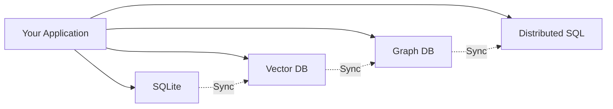
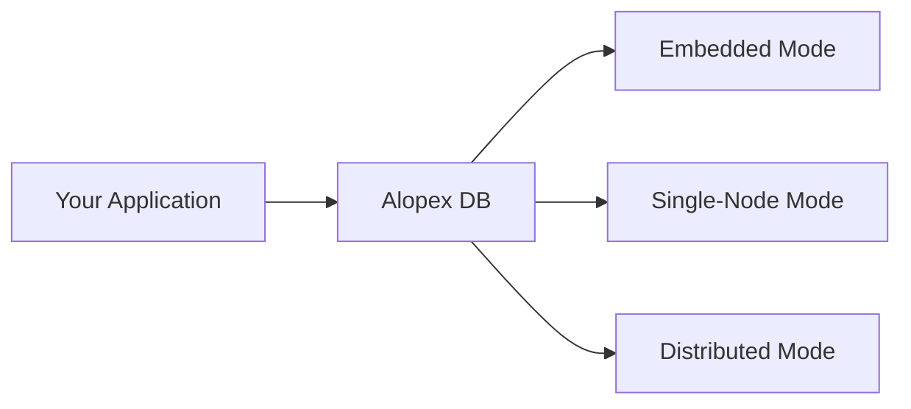
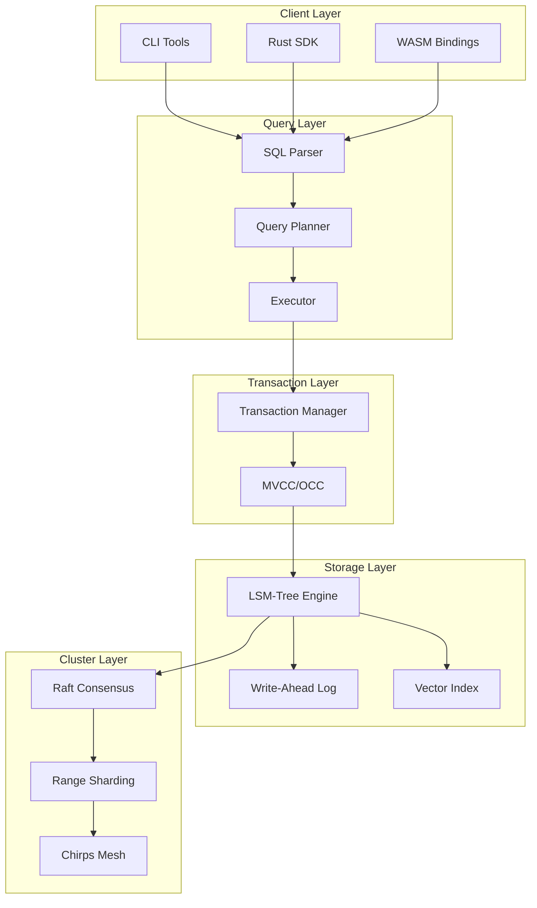

# Overview

Alopex DB is a unified database engine designed for the next generation of data-intensive applications—specifically those driving **Agentic AI**, **RAG (Retrieval-Augmented Generation)**, and **Edge Computing**.

## The Problem We Solve

Modern AI applications face a fragmentation problem:



Instead of gluing together multiple database systems, **Alopex provides a single engine that adapts to your workload**.



## Core Philosophy: The Arctic Fox Traits

The name "Alopex" comes from the Arctic Fox (*Vulpes lagopus*)—an animal known for its remarkable adaptability. Our database embodies these traits:

### :zap: Silent (Swift & Light)

- Written in **Rust** with zero-overhead abstractions
- Minimal memory footprint in embedded mode
- No garbage collection pauses
- Predictable latency

### :arrows_counterclockwise: Adaptive (Flexible)

- Seamlessly transitions from local library to multi-node cluster
- Same API across all deployment modes
- Progressive scaling without data migration
- Multi-model: SQL + Vector + Graph

### :shield: Unbreakable (Resilient)

- **Raft consensus** for distributed mode
- ACID transactions across all operations
- Automatic failure recovery
- Data durability guarantees

## Architecture Layers



## Key Components

| Component | Description |
|:----------|:------------|
| **alopex-core** | Core storage engine with LSM-Tree |
| **alopex-sql** | SQL parser, planner, and executor |
| **alopex-embedded** | Embedded mode library API |
| **alopex-server** | Single-node server with HTTP/gRPC |
| **alopex-cluster** | Distributed mode with Raft |
| **alopex-cli** | Command-line tools |
| **alopex-chirps** | Gossip-based cluster messaging |

## Data Models

### Relational (SQL)

Standard SQL with extensions for modern workloads:

```sql
CREATE TABLE users (
    id UUID PRIMARY KEY,
    name TEXT NOT NULL,
    created_at TIMESTAMP DEFAULT NOW()
);
```

### Vector

First-class vector support for AI applications:

```sql
CREATE TABLE documents (
    id UUID PRIMARY KEY,
    content TEXT,
    embedding VECTOR(1536)  -- Native vector type
);
```

### Graph

Optimized storage for knowledge graphs:

```sql
CREATE GRAPH knowledge (
    NODE document (id UUID, embedding VECTOR(384)),
    EDGE references (source UUID, target UUID, weight FLOAT)
);
```

## Next Steps

<div class="grid cards" markdown>

-   [:octicons-arrow-right-24: **Three Modes**](modes.md)

    Learn about embedded, single-node, and distributed deployments.

-   [:octicons-arrow-right-24: **Vector Search**](vector-search.md)

    Deep dive into vector operations and hybrid queries.

-   [:octicons-arrow-right-24: **Architecture**](architecture.md)

    Technical details of the storage engine.

</div>
