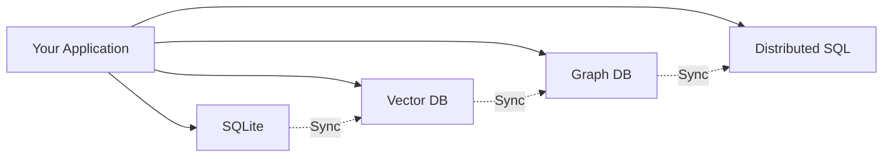
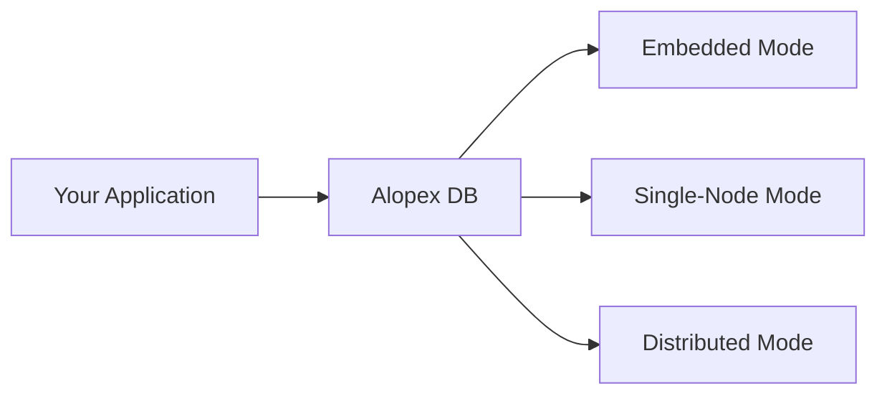
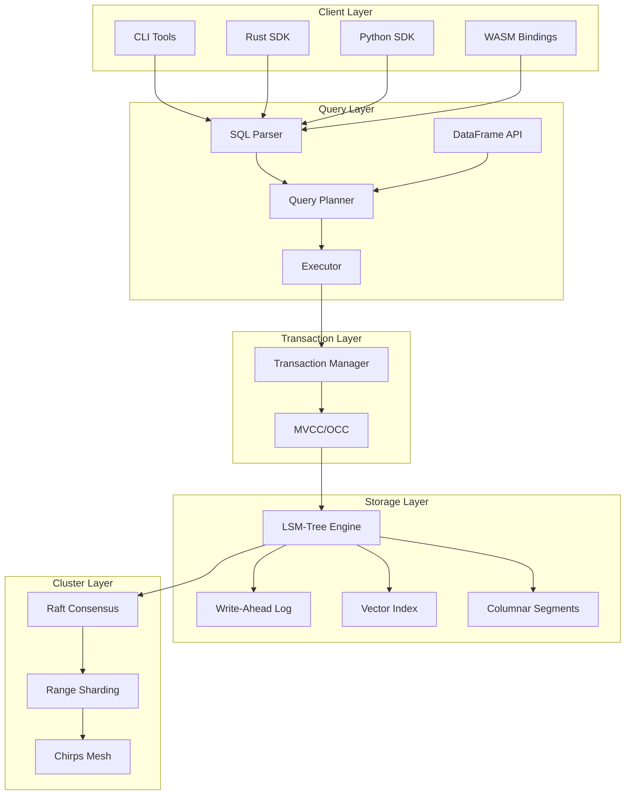

# Overview

Alopex DB is a unified database engine designed for the next generation of data-intensive applications—specifically those driving **Agentic AI**, **RAG (Retrieval-Augmented Generation)**, and **Edge Computing**.

## The Problem We Solve

Modern AI applications face a fragmentation problem:


```mermaid
graph LR
    A[Your Application] --> B[SQLite]
    A --> C[Vector DB]
    A --> D[Graph DB]
    A --> E[Distributed SQL]

    B -.->|Sync| C
    C -.->|Sync| D
    D -.->|Sync| E
```

Instead of gluing together multiple database systems, **Alopex provides a single engine that adapts to your workload**.


```mermaid
graph LR
    A[Your Application] --> B[Alopex DB]
    B --> C[Embedded Mode]
    B --> D[Single-Node Mode]
    B --> E[Distributed Mode]
```

## Core Philosophy: The Arctic Fox Traits

The name "Alopex" comes from the Arctic Fox (*Vulpes lagopus*)—an animal known for its remarkable adaptability. Our database embodies these traits:

### :zap: Silent (Swift & Light)

- Written in **Rust** with zero-overhead abstractions
- Minimal memory footprint in embedded mode
- No garbage collection pauses
- Predictable latency

### :arrows_counterclockwise: Adaptive (Flexible)

- Seamlessly transitions from local library to multi-node cluster
- Same API across all deployment modes
- Progressive scaling without data migration
- Multi-model: SQL + Vector + HNSW

### :shield: Unbreakable (Resilient)

- **Raft consensus** for distributed mode
- ACID transactions across all operations
- Automatic failure recovery
- Data durability guarantees

## Architecture Layers


```mermaid
graph TB
    subgraph "Client Layer"
        CLI[CLI Tools]
        SDK[Rust SDK]
        PY[Python SDK]
        WASM[WASM Bindings]
    end

    subgraph "Query Layer"
        SQL[SQL Parser]
        DF[DataFrame API]
        PLAN[Query Planner]
        EXEC[Executor]
    end

    subgraph "Transaction Layer"
        TX[Transaction Manager]
        MVCC[MVCC/OCC]
    end

    subgraph "Storage Layer"
        LSM[LSM-Tree Engine]
        WAL[Write-Ahead Log]
        VEC[Vector Index]
        COL[Columnar Segments]
    end

    subgraph "Cluster Layer"
        RAFT[Raft Consensus]
        SHARD[Range Sharding]
        CHIRPS[Chirps Mesh]
    end

    CLI --> SQL
    SDK --> SQL
    PY --> SQL
    WASM --> SQL
    SQL --> PLAN
    DF --> PLAN
    PLAN --> EXEC
    EXEC --> TX
    TX --> MVCC
    MVCC --> LSM
    LSM --> WAL
    LSM --> VEC
    LSM --> COL
    LSM --> RAFT
    RAFT --> SHARD
    SHARD --> CHIRPS
```

## Key Components

| Component | Description | Status |
|:----------|:------------|:-------|
| [**alopex-core**](https://crates.io/crates/alopex-core) | Core storage engine with LSM-Tree, Vector, Columnar | :white_check_mark: v0.7.6 |
| [**alopex-sql**](https://crates.io/crates/alopex-sql) | SQL parser (Nim FFI), planner, and executor | :white_check_mark: v0.7.6 |
| [**alopex-embedded**](https://crates.io/crates/alopex-embedded) | Embedded mode library API | :white_check_mark: v0.7.6 |
| [**alopex-dataframe**](https://crates.io/crates/alopex-dataframe) | Polars-compatible DataFrame API | :white_check_mark: v0.7.6 |
| [**alopex-py**](https://pypi.org/project/alopex/) | Python bindings via PyO3 | :white_check_mark: v0.7.6 (PyPI) |
| [**alopex-server**](https://crates.io/crates/alopex-server) | Single-node server with HTTP/gRPC | :white_check_mark: v0.7.6 |
| [**alopex-cluster**](https://crates.io/crates/alopex-cluster) | Distributed mode with Raft | :white_check_mark: v0.7.6 |
| [**alopex-cli**](https://crates.io/crates/alopex-cli) | Command-line tools (TUI / admin console) | :white_check_mark: v0.7.6 |
| [**alopex-chirps**](https://crates.io/crates/alopex-chirps) | Gossip-based cluster messaging | :white_check_mark: v0.5.1 |
| [**alopex-skulk**](https://crates.io/crates/alopex-skulk) | Time-series database built on Alopex Core | :white_check_mark: v0.2.0 |

## Data Models

### Relational (SQL)

Standard SQL with extensions for modern workloads:

```sql
CREATE TABLE users (
    id INTEGER PRIMARY KEY,
    name TEXT NOT NULL,
    email TEXT,
    created_at TIMESTAMP
);

INSERT INTO users (id, name, email) VALUES (1, 'Alice', 'alice@example.com');
SELECT * FROM users WHERE id = 1;
```

### Vector with HNSW

First-class vector support with high-performance indexing:

```sql
-- Create table with vector column
CREATE TABLE documents (
    id INTEGER PRIMARY KEY,
    content TEXT,
    embedding VECTOR(1536)
);

-- Create HNSW index for fast similarity search
CREATE INDEX idx_embedding ON documents USING HNSW (embedding);

-- Hybrid search with vector similarity
SELECT id, content, vector_similarity(embedding, ?) AS score
FROM documents
ORDER BY score DESC
LIMIT 10;
```

### Columnar Storage

Optimized for analytical workloads:

```sql
-- Create columnar table for analytics
CREATE TABLE events (
    event_id INTEGER,
    user_id INTEGER,
    event_type TEXT,
    timestamp TIMESTAMP,
    payload TEXT
) WITH (storage = 'columnar');

-- Aggregate queries are fast
SELECT event_type, COUNT(*) as count
FROM events
WHERE timestamp > '2025-01-01'
GROUP BY event_type;
```

### DataFrame API

Polars-compatible API for data analysis:

```rust
use alopex_dataframe::{DataFrame, col, lit};

let df = DataFrame::read_parquet("data.parquet")?;

let result = df
    .lazy()
    .filter(col("score").gt(lit(0.5)))
    .group_by([col("category")])
    .agg([col("value").sum().alias("total")])
    .collect()?;
```

## Crate Dependency Structure

```
┌─────────────────────────────────────────────────────────────────┐
│                        alopex-core                               │
│  (KV, LSM, Columnar, Vector, HNSW)                               │
└─────────────────────┬───────────────────────────────────────────┘
                      │
        ┌─────────────┴─────────────┐
        │                           │
        ▼                           ▼
┌───────────────────┐       ┌───────────────────┐
│  alopex-dataframe │       │    alopex-sql     │
│  (DataFrame API)  │       │  (SQL Frontend)   │
│  - Eager/Lazy     │       │  - Parser         │
│  - Expression     │       │  - Planner        │
│  - Optimizer      │       │  - Executor       │
└─────────┬─────────┘       └─────────┬─────────┘
          │                           │
          └─────────────┬─────────────┘
                        │
                        ▼
              ┌───────────────────┐
              │  alopex-embedded  │
              │  (Embedded API)   │
              │  - Database       │
              │  - Transaction    │
              │  - SQL/Vector     │
              └─────────┬─────────┘
                        │
                        ▼
              ┌───────────────────┐
              │     alopex-py     │
              │  (Python Wrapper) │
              │  - PyO3 Bindings  │
              │  - NumPy 統合     │
              └───────────────────┘
```

## Next Steps

<div class="grid cards" markdown>

-   [:octicons-arrow-right-24: **Deployment Modes**](modes.md)

    Learn about embedded, single-node, and distributed deployments.

-   [:octicons-arrow-right-24: **Vector Search**](vector-search.md)

    Deep dive into vector operations and HNSW indexing.

-   [:octicons-arrow-right-24: **Architecture**](architecture.md)

    Technical details of the storage engine.

-   [:octicons-arrow-right-24: **Chirps**](chirps.md)

    Cluster messaging and Raft consensus.

</div>
