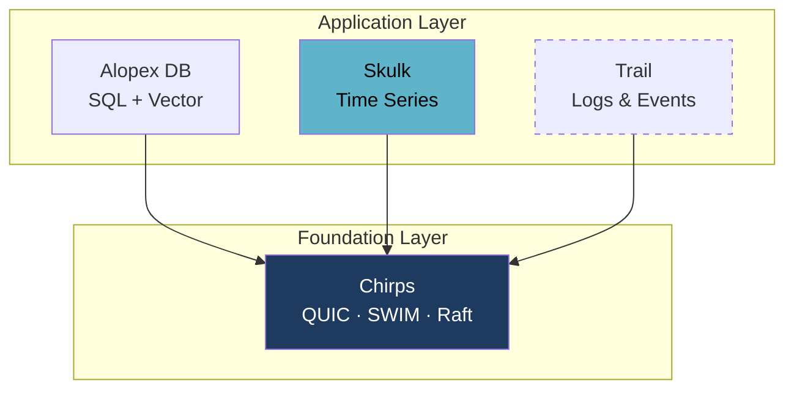

# Skulk - Time-Series Storage Core

[](https://crates.io/crates/alopex-skulk)
[](https://docs.rs/alopex-skulk)

**A time-series engine small enough to embed. 3.7 MB, pure Rust, no C toolchain.**

Alopex Skulk stores wide, multi-field rows in Arrow memory batches and Parquet
files, keeping acknowledged writes recoverable through a local WAL. It ships as
a library you link into your process — no server, no daemon, no sidecar.

```bash
cargo add alopex-skulk
```

Skulk is a standalone crate with its own version series. It does not depend on
`alopex-core` or `alopex-sql`, so you can adopt it without adopting Alopex DB —
and when you outgrow a single process, it scales onto the same cluster
foundation the rest of the family uses.

[Independent today, distributed on shared machinery](#one-foundation-many-engines){ .md-button }

## Current Scope (v0.3.0)

Skulk v0.3.0 is a **storage and ingest core**, not a server.

<div class="grid cards" markdown>

-   :material-table-column:{ .lg .middle } **Wide Columnar Storage**

    ---

    One measurement and tag set holds multiple fields. Arrow in memory,
    Parquet on disk, with pure-Rust BROTLI q5 compression.

    Series identity is `measurement + tags`. Field names are columns and do
    not create separate series.

-   :material-shield-check:{ .lg .middle } **Durability**

    ---

    Batch WAL sync before acknowledgement, manifest-fenced recovery, atomic
    file publication, torn-tail isolation, and single-writer data-root locking.

-   :material-clock-outline:{ .lg .middle } **Lifecycle**

    ---

    Hourly partitions, persisted retention policies, idempotent TTL expiry,
    and DataFusion-free compaction with last-ingest-wins deduplication.

-   :material-import:{ .lg .middle } **Three Ingest Protocols**

    ---

    HTTP-independent decoders for InfluxDB Line Protocol, Prometheus Remote
    Write v1 float samples, and structured JSON — all behind one bounded
    ingest service.

</div>

## Storage Design

Skulk v0.3 replaced the earlier self-built TSM/Gorilla format with an
Arrow + Parquet columnar stack.

| Aspect | v0.2 | v0.3 |
| --- | --- | --- |
| Data model | Single-value narrow | Wide / multi-field |
| In memory | Custom MemTable | Arrow `RecordBatch` |
| On disk | Custom TSM v3 | Parquet |
| Compression | Custom Gorilla | BROTLI q5 (pure Rust) |
| Durability | WAL + TSM | WAL + Parquet + manifest |

The decision to adopt Arrow and Parquet — and to **not** adopt DataFusion — was
made after measuring four proof-of-concept rounds. A full FDAP stack produced a
64 MB binary with 251 dependencies, which is unacceptable for embedded and edge
deployment. Arrow and Parquet alone deliver the compression benefit at
**3.7 MB with zero C dependencies**.

!!! example "Measured compression"

    Against the v0.2 Gorilla baseline, Parquet with BROTLI q5 produced
    **7.1× smaller** files on repeated-value workloads and **1.6× smaller**
    on volatile gauges.

## Ingest Protocols

| Protocol | Behavior |
| --- | --- |
| Line Protocol | Multi-field wide rows, all five field types, escaping, optional caller timestamp, line-local rejection |
| Remote Write | Snappy-compressed `prometheus.WriteRequest` v1 float samples. v2, metadata, exemplars, and histograms are explicitly rejected |
| JSON | Canonical `{"metrics":[...]}` batch plus `{"metric":...}` single-point form, with item-local schema rejection |

All decoders produce the same batch type, which a shared ingest service
validates, admits under bounded buffer and WAL pressure, and writes durably.
Row-level failures are reported as partial success with the position of each
rejected row.

## Embedded Example

```rust
use alopex_skulk::ingest::line_protocol::LineProtocolDecoder;
use alopex_skulk::ingest::{IngestLimits, Ingestor};
use alopex_skulk::store::recovery::{RecoveryConfig, RecoveryStore};

fn main() -> Result<(), Box<dyn std::error::Error>> {
    let limits = IngestLimits::default();
    let store = RecoveryStore::open("./skulk-data-v3", RecoveryConfig::default())?;
    let mut ingestor = Ingestor::new(store, limits);

    let batch = LineProtocolDecoder::new(limits).decode(
        b"cpu,host=edge usage=23.5 1609459200000000000",
        1609459200000000000,
    )?;
    let outcome = ingestor.ingest(batch, 1609459200000000000)?;
    assert_eq!(outcome.accepted_count(), 1);
    ingestor.sink_mut().flush_all()?;
    Ok(())
}
```

## One Foundation, Many Engines

Skulk embeds in a single process today. It is designed not to stay there.

[Chirps](chirps.md) is the shared cluster foundation across the Alopex family —
QUIC transport, SWIM membership, and Raft consensus, built once and used by
every product rather than reimplemented per engine. Skulk's distributed
milestones ride on it directly: **v0.8 brings sharding with Chirps membership,
v0.9 brings shard Raft groups for replication.**



That is what **Adaptive** means in this family: one storage engine that starts
as a linked library and grows into a cluster member, sharing machinery with the
relational, vector, and event engines beside it instead of forcing a separate
cluster for every data shape.

## What Comes Next

v0.3 is the storage and ingest foundation. Query, downsampling, and serving
build on top of it in later releases — they are not in the current crate.

| Capability | Milestone |
| --- | --- |
| Query execution (PromQL / SQL-TS) | v0.4 |
| Predicate pushdown, column projection | v0.4 |
| Downsampling, continuous queries | v0.5 |
| HTTP server, Prometheus-compatible endpoints | v0.6 |
| Alerts | v0.7 |
| Distribution, replication | v0.8+ |

The v0.3 reader is the minimum needed to verify writes. It is not a query engine.

## Breaking Change from v0.2

Skulk v0.3 does not read or migrate v0.2 TSM or WAL files; legacy magic is
rejected before the source is modified. There is no migration tool. Export data
with v0.2 and re-ingest it into a new v0.3 data root.

## What Is Measured

Compression, footprint, and durability meet their targets. Ingest throughput
and p99 latency do not yet — those targets were left unchanged rather than
relaxed, and the numbers are versioned in the repository next to the code so
you can see exactly where the engine stands before you adopt it.

## Learn More

- [Skulk on crates.io](https://crates.io/crates/alopex-skulk)
- [Repository](https://github.com/alopex-db/alopex-skulk)
- [Trail](trail.md) — a proposed sibling product for logs and events
