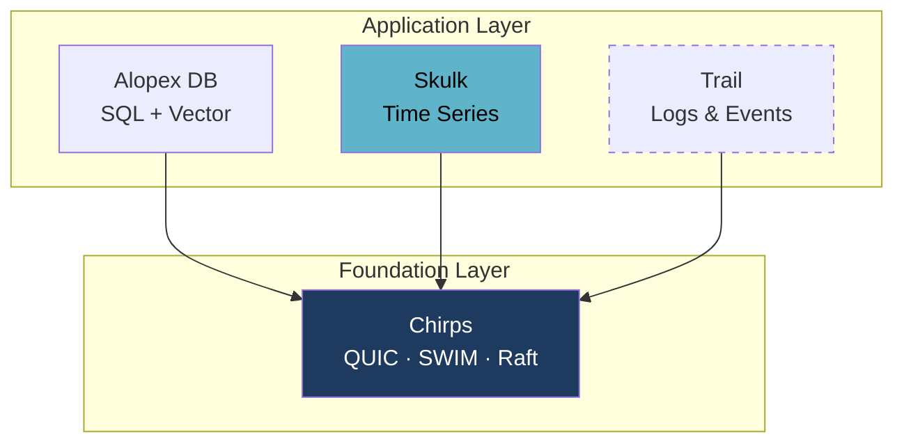

# Skulk - A Store for Metrics

[](https://crates.io/crates/alopex-skulk)
[](https://docs.rs/alopex-skulk)

**A time-series engine small enough to embed — and it builds anywhere `cargo` does.**

## What goes in here

Anything measured on a schedule. CPU and memory from a fleet of hosts. Request
rates and latencies from a service. Sensor readings from devices in the field.
Queue depths, cache hit ratios, disk usage.

```
cpu,host=edge-01,region=jp usage=23.5,idle=76.5  1609459200000000000
cpu,host=edge-02,region=jp usage=41.2,idle=58.8  1609459200000000000
cpu,host=edge-01,region=jp usage=24.1,idle=75.9  1609459210000000000
```

Two things define this data. **It arrives on a schedule** — you know the next
point comes in ten seconds. And **its shape is stable** — `usage` is a number
today and a number next year.

That predictability is what makes it compressible, partitionable by time, and
cheap to downsample. A store built for it can exploit all three.

## Why not the stores you already have

<div class="grid cards" markdown>

-   :material-database-edit:{ .lg .middle } **Alopex DB** — transactional

    ---

    ACID, MVCC, updates and deletes. Rows are state you change deliberately.

    Metrics are never updated — they accumulate. Paying for transactional
    consistency on a firehose of append-only points buys nothing.

-   :material-text-box:{ .lg .middle } **[Trail](trail.md)** — shape unknown

    ---

    Logs and events, where attributes are arbitrary and a field can change
    type between deploys.

    Metrics don't need that flexibility, and the machinery that provides it —
    per-type shadow columns, read-time resolution — is overhead here.

</div>

Metrics sit in the narrow, predictable case: append-only *and* fixed shape.
**Knowing that is what lets Skulk be small and fast.**

## What it is

A library, not a server. You link it into your process and it stores points to
local disk.

```bash
cargo add alopex-skulk
```

No daemon to run, no sidecar to deploy, no network hop between your process and
its metrics. It embeds in a CLI, a desktop app, an edge device, or a service
that would rather not operate a separate TSDB.

Skulk is a standalone crate with its own version series. It does not depend on
`alopex-core` or `alopex-sql`, so you can adopt it without adopting Alopex DB —
and when you outgrow a single process, it scales onto the same cluster
foundation the rest of the family uses.

[Independent today, distributed on shared machinery](#one-foundation-many-engines){ .md-button }

## How it stores them

<div class="grid cards" markdown>

-   :material-table-column:{ .lg .middle } **Wide columnar rows**

    ---

    One measurement and tag set holds multiple fields. Arrow in memory,
    Parquet on disk.

    Series identity is `measurement + tags`. Field names are columns and do
    not create separate series, so adding a field doesn't multiply cardinality.

-   :material-shield-check:{ .lg .middle } **Durable before acknowledged**

    ---

    Batch WAL sync before the write returns, manifest-fenced recovery, atomic
    file publication, torn-tail isolation, single-writer locking.

    A crash costs you nothing that was acknowledged.

-   :material-clock-outline:{ .lg .middle } **Data that ages out on its own**

    ---

    Hourly partitions, persisted retention policies, idempotent TTL expiry,
    and compaction with last-ingest-wins deduplication.

-   :material-import:{ .lg .middle } **Speaks what your agents already send**

    ---

    InfluxDB Line Protocol, Prometheus Remote Write, and structured JSON —
    decoders independent of any HTTP layer, behind one bounded ingest service.

</div>

Columnar Parquet is what makes the predictability pay off: repeated tag values
compress to almost nothing, and a time range can be skipped without reading it.
Files come out **7.1× smaller** than a Gorilla-encoded baseline on
repeated-value workloads, and **1.6× smaller** on volatile gauges.

The release binary is **3.7 MB** with no native dependencies in the build — so
cross-compiling to musl, Windows, or arm is `cargo build --target`, not an
afternoon of toolchain setup.

## Ingest Protocols

| Protocol | Behavior |
| --- | --- |
| Line Protocol | Multi-field wide rows, all five field types, escaping, optional caller timestamp, line-local rejection |
| Remote Write | Snappy-compressed `prometheus.WriteRequest` v1 float samples. v2, metadata, exemplars, and histograms are explicitly rejected |
| JSON | Canonical `{"metrics":[...]}` batch plus `{"metric":...}` single-point form, with item-local schema rejection |

All decoders produce the same batch type, which a shared ingest service
validates, admits under bounded buffer and WAL pressure, and writes durably.
Row-level failures are reported as partial success with the position of each
rejected row.

## Embedded Example

```rust
use alopex_skulk::ingest::line_protocol::LineProtocolDecoder;
use alopex_skulk::ingest::{IngestLimits, Ingestor};
use alopex_skulk::store::recovery::{RecoveryConfig, RecoveryStore};

fn main() -> Result<(), Box<dyn std::error::Error>> {
    let limits = IngestLimits::default();
    let store = RecoveryStore::open("./skulk-data-v3", RecoveryConfig::default())?;
    let mut ingestor = Ingestor::new(store, limits);

    let batch = LineProtocolDecoder::new(limits).decode(
        b"cpu,host=edge usage=23.5 1609459200000000000",
        1609459200000000000,
    )?;
    let outcome = ingestor.ingest(batch, 1609459200000000000)?;
    assert_eq!(outcome.accepted_count(), 1);
    ingestor.sink_mut().flush_all()?;
    Ok(())
}
```

## One Foundation, Many Engines

Skulk embeds in a single process today. It is designed not to stay there.

[Chirps](chirps.md) is the shared cluster foundation across the Alopex family —
QUIC transport, SWIM membership, and Raft consensus, built once and used by
every product rather than reimplemented per engine. Skulk's distributed
milestones ride on it directly: **v0.8 brings sharding with Chirps membership,
v0.9 brings shard Raft groups for replication.**



That is what **Adaptive** means in this family: one storage engine that starts
as a linked library and grows into a cluster member, sharing machinery with the
relational, vector, and event engines beside it instead of forcing a separate
cluster for every data shape.

## What Comes Next

v0.3 is the storage and ingest foundation. Query, downsampling, and serving
build on top of it in later releases — they are not in the current crate.

| Capability | Milestone |
| --- | --- |
| Query execution (PromQL / SQL-TS) | v0.4 |
| Predicate pushdown, column projection | v0.4 |
| Downsampling, continuous queries | v0.5 |
| HTTP server, Prometheus-compatible endpoints | v0.6 |
| Alerts | v0.7 |
| Distribution, replication | v0.8+ |

The v0.3 reader is the minimum needed to verify writes. It is not a query engine.

## Learn More

- [Skulk on crates.io](https://crates.io/crates/alopex-skulk)
- [Repository](https://github.com/alopex-db/alopex-skulk)
- [Trail](trail.md) — the sibling store for logs and events
