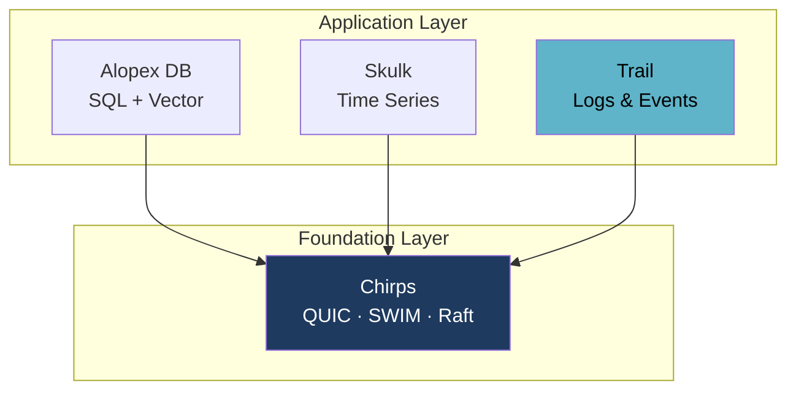

# Trail - A Store for Logs and Events

**Write first. The schema binds when you read.**

## What goes in here

Application logs. Audit trails. Request traces. Webhook payloads. Anything your
system emits when something happens.

```jsonl
{"stream":"api",   "level":"info",  "route":"/users",  "status":200, "ms":12}
{"stream":"api",   "level":"error", "route":"/orders", "status":500, "ms":840, "trace":"abc123"}
{"stream":"audit", "actor":"deploy-bot", "action":"rollout", "target":"payment-v2"}
{"stream":"api",   "level":"error", "route":"/orders", "status":"upstream_timeout", "retry":3}
```

Look at what those four lines do to a database.

- The second carries a `trace` field the first doesn't.
- The third comes from a different subsystem with an entirely different shape —
  and no timestamp the sender thought worth including.
- The fourth has `status` as a **string** where the others had an integer,
  because a proxy started reporting failures differently. Plus a `retry` field
  nobody declared.

None of that is malformed. That is just what production emits.

## Why not the stores you already have

Alopex already has two places to put data. The difference that matters is
**what you do to a row after you write it.**

<div class="grid cards" markdown>

-   :material-database-edit:{ .lg .middle } **Alopex DB** — transactional

    ---

    ACID transactions, MVCC, updates and deletes, SQL and vector search. Rows
    are **state**: you change them, and the engine keeps that consistent.

    Enforcing types is part of how it does that. Which is correct for a user
    record — and means a `CREATE TABLE` up front and an `ALTER` every time a
    log line grows a field.

-   :material-chart-line:{ .lg .middle } **[Skulk](skulk.md)** — append-only, fixed shape

    ---

    Also append-only, so no schema wrangling for updates. But it is built for
    **numeric series on a schedule**: a metric, its tags, its fields.

    Series identity has to stay stable, so `status` can't be an integer today
    and a string tomorrow. And every point needs a timestamp — the audit line
    above has none.

</div>

Logs are neither. Nobody updates a log line — it records what happened, and
what happened doesn't change. So the machinery a transactional store spends on
consistency buys you nothing here, while its schema discipline costs you a
migration per deployment.

And they aren't numeric series either: arbitrary attributes, arbitrary shapes,
unreliable timestamps.

**Append-only like Skulk, unconstrained in shape — that is the gap Trail
fills.**

## How Trail handles those four lines

| What arrived | What Trail does |
|:--|:--|
| A `trace` field the earlier rows lacked | A column appears. Earlier rows read back as null. No migration. |
| An `audit` event with a totally different shape | Its own columns, in the same store. Files don't have to agree on a schema. |
| No timestamp | Accepted and stamped on arrival, not rejected. |
| `status` as a string after being an integer | Both are kept. **Ingestion does not stop.** |

The last row is the one that matters at 3am. A store that rejects the type
change stops accepting data — so a routine deploy takes down the thing you use
to find out what broke.

## What "late-bound schema" means

Borrowed from *late binding* in programming languages: the binding happens as
late as possible. Here, what binds late is **the schema**.

| | Schema-on-write | **Late-bound (Trail)** |
|:--|:--|:--|
| Before writing | Declare the schema | Nothing to declare |
| At write time | Validate against the declaration; reject mismatches | Accept the shape that arrived |
| **At read time** | Read using the declared types | **Decide the types here** |

There is no schema to define up front and — this is the part that surprises
people — **no schema to define later either**. There is no `CREATE TABLE`, no
migration, no `ALTER`. A column exists because an event carrying that
attribute arrived.

What happens "late" is the *binding*: when you query `status`, that is when
Trail decides whether to hand you the integers, the strings, or both merged
into one column. Two people can query the same data and bind it differently.

You can also never think about it at all. The default read merges everything
into one logical column, so a schema is something you engage with only when you
want to.

[:material-file-document-outline: Read the design](https://github.com/alopex-db/docs/blob/main/design/alopex-trail-proposal.md){ .md-button .md-button--primary }
[Skulk, the storage core it builds on](skulk.md){ .md-button }

## The mechanisms behind that

Trail keeps the same storage foundation as Skulk — append-only, columnar,
Parquet — and changes only the data model above it. Four mechanisms do the
work described above.

<div class="grid cards" markdown>

-   :material-shape-plus:{ .lg .middle } **Columns Appear On Arrival**

    ---

    An unknown attribute creates a new column, and every prior row in the
    buffer is back-filled with null. Rows missing a column get null.

    No declaration, no migration, no `ALTER TABLE`.

-   :material-call-split:{ .lg .middle } **Type Conflicts Shadow, Never Reject**

    ---

    When `status` arrives as an integer and later as a string, Trail creates
    a second physical column rather than failing.

    Reads coalesce the shadows back into one logical column.
    **Ingestion never stops.**

-   :material-file-tree:{ .lg .middle } **Schema Lives in the Manifest**

    ---

    Each file records its column set and a schema fingerprint, so a catalog
    query is answered without opening any Parquet footer — and files lacking
    a queried column are skipped entirely.

-   :material-timer-outline:{ .lg .middle } **Time Is Optional**

    ---

    Events without a usable timestamp are accepted and stamped at ingestion,
    rather than rejected at the door.

</div>

### Type shadowing

```
attrs: { status: 200 }         →  physical column  status@i64
attrs: { status: "timeout" }   →  physical column  status@str   (new)
```

The Parquet physical schema never conflicts, because both columns exist side by
side. What you get back is decided when you query — this is the binding:

```sql
SELECT status      FROM ...  -- both, merged into one column
SELECT status@i64  FROM ...  -- only the rows that arrived as integers
SELECT status@str  FROM ...  -- only the rows that arrived as strings
```

Nothing was decided at write time, and nothing needs to be decided in advance
of the query. **A type mismatch is a read-time question, not an ingestion
error.**

Primitives get their own shadow column — `@str`, `@i64`, `@f64`, `@bool`,
`@bytes` — and anything that doesn't fit, such as a nested map, falls back to
`@json`.

## Relationship to Skulk

Trail is not a fork of Skulk's purpose — it is a reuse of Skulk's machinery.

The durability layer Skulk already proves in production is directly applicable:
single-writer locking, atomic Parquet publication, two-generation manifest
rotation with checksum fallback, WAL framing with torn-tail truncation, and
staged crash-recovery boundaries.

What changes is the row model, the sort order (time-first rather than tag-first),
and the treatment of type conflicts.

!!! success "The hard part already runs in production"

    Skulk builds its Arrow schema dynamically from arriving rows and back-fills
    nulls for columns that appear late. That mechanism is more general than a
    TSDB needs — and it is exactly what a late-bound schema store requires.
    Trail promotes it from an implementation detail to the central feature,
    on top of a durability layer that already survives crash-recovery testing.

## One Cluster, Three Data Shapes

Logs rarely live alone. You have metrics in one place, relational and vector
data in another, and events in a third — three clusters to size, three failure
domains to reason about, three things to scale when traffic moves.

Alopex is built so they do not have to be separate. [Chirps](chirps.md) is the
shared cluster foundation across the product family: QUIC transport, SWIM
membership, and Raft consensus, used by every product rather than reimplemented
in each. Trail is designed to sit on that same foundation.



The goal is that each product scales out and shrinks back **independently, on
shared cluster machinery** — add capacity where the load actually is, without
standing up a separate cluster for every data shape you happen to store.

## Its first consumer

[Alopex OTel](otel.md) stores traces and logs in Trail, with metrics in Skulk —
the same append-only-versus-fixed-shape split described above.

It is a demanding first user: OpenTelemetry attributes are typed `AnyValue`, so
the same key changes type across SDK versions routinely. Trail is not built
only for that case, but surviving it is a good test of the model.

## Keeping Data Without Keeping It Expensive

Time series get cheaper with age by downsampling. Events cannot — there is no
interval to downsample. So the question becomes: how do you keep everything
without paying full price for it?

<div class="grid cards" markdown>

-   :material-harddisk:{ .lg .middle } **Move it, don't rewrite it**

    ---

    Older data moves to cheaper storage in **the same format**. No
    recompression pass, no second write — the read path is identical, just
    a network hop further away.

-   :material-chart-box-multiple:{ .lg .middle } **Summaries sit beside data, not instead of it**

    ---

    Compaction builds mergeable sketches — exponential histograms, HLL — as
    an *additional* resolution. Generating a summary never becomes a reason
    to delete the original.

-   :material-percent:{ .lg .middle } **Sampling that still counts correctly**

    ---

    Sampled events carry the rate they represent, so counts and sums
    extrapolate back to the population — min and max deliberately don't.
    Follows OpenTelemetry's *adjusted count* rather than inventing a field.

</div>

These choices were revised after reading how Tempo and SigNoz actually do it.
The design document records what changed and why.

[:octicons-arrow-right-24: Retention, sampling, and statistics in full](https://github.com/alopex-db/docs/blob/main/design/alopex-trail-proposal.md)

## Two Query Surfaces, Not One

Trail is queried two ways: by whatever is built on top of it, and by tools that
already exist. Those pull in opposite directions, and conflating them would
compromise both.

<div class="grid cards" markdown>

-   :material-code-braces:{ .lg .middle } **Inside: an aggregation DSL**

    ---

    Built for what Trail can do — joins **across signals**, range
    aggregations, series arithmetic, and explicit type bindings like
    `status@str`.

    Chosen for expressiveness, because nothing constrains it.

-   :material-connection:{ .lg .middle } **Outside: Grafana-compatible**

    ---

    **TraceQL** for traces, **LogQL** for logs, **Prometheus query API** for
    metrics — so Grafana's built-in data sources connect with no plugin.

    Chosen for compatibility, because everything constrains it.

</div>

### The language Trail speaks

An aggregation DSL: range aggregations, grouping, series arithmetic, explicit
type bindings like `status@str` — and **joins across signals**, which is the
query the storage model exists to answer.

Correlating a trace with the logs and metrics around it is not something
TraceQL or LogQL can express; their structural operators never leave a single
trace.

TraceQL and LogQL sit alongside it as separate front ends, not as a subset —
they answer to Grafana's shape, while the internal language answers to Trail's.

## Milestones

Each version is scoped so the one before it is usable on its own. v0.1 already
gives you durable ingestion with columns that appear on arrival.

| Version | Scope |
| --- | --- |
| v0.1 | Event model, WAL, dynamic column union, Parquet publication, manifest with column summaries, crash recovery |
| v0.2 | Type shadowing with read-time coalesce, JSON Lines and OTLP log decoders, retention |
| v0.3 | Predicate pushdown, column projection, manifest-driven pruning, **the internal DSL** — filters, type bindings, basic aggregation |
| v0.4 | Compaction with sidecar indexes, **retention tiers**, full-text search evaluated, **Python bindings** |
| v0.5 | **Statistical summaries** and sampling with adjusted-count correction |
| v0.6 | **Cross-signal joins**, series arithmetic, **TraceQL / LogQL compatibility** |

The compatible layer comes last on purpose: it lowers into the shared logical
plan, which has to settle first.

## Decisions Still Open

We publish these rather than settle them quietly, because each one changes what
you get.

- **Code sharing with Skulk** — a shared crate propagates Skulk's improvements
  to Trail automatically; forking keeps each free to evolve. Current direction
  is to fork first and re-evaluate once Trail's requirements are proven.
- **Throughput target** — this determines whether rows borrow from the input
  buffer or own their data, so it is being set before the row model is fixed.
- **Query syntax details** — the shape is settled (see above); the operator
  spelling, how you write a type binding, and the join notation are not.
- **Full-text search** — if it is in scope, an inverted index belongs in the
  foundation rather than bolted on later.
- **Sketches at compaction time** — no existing system does this, so there is
  nothing to copy and nothing to validate against.

Have an opinion on any of these? The design document is the place to weigh in.

## Learn More

- [Full design document](https://github.com/alopex-db/docs/blob/main/design/alopex-trail-proposal.md)
- [Skulk](skulk.md) — the time-series product whose machinery Trail reuses
