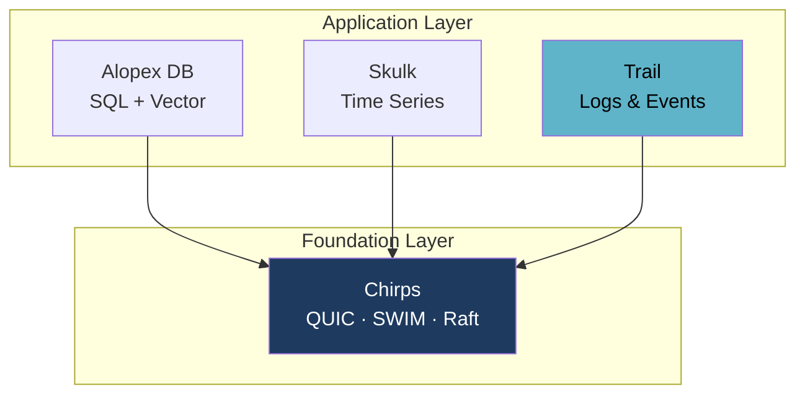

# Trail - Late-Bound Schema Log Store

**Log what you have. Define the schema later — or never.**

Trail is an append-only store for logs and events whose shape is not known in
advance. Columns are built from the attributes that actually arrive, and
persisted columnar in Parquet. A field that changes type mid-stream does not
break the pipeline; it becomes a column you can still query.

[:material-file-document-outline: Read the design](https://github.com/alopex-db/docs/blob/main/design/alopex-trail-proposal.md){ .md-button .md-button--primary }
[Skulk, the storage core it builds on](skulk.md){ .md-button }

!!! info "Design stage"

    Trail is a published design, not a released crate. It is on this site so the
    reasoning is open before the code exists — the same way Skulk's storage
    decision was published before it was built.

## The Problem

[Skulk](skulk.md) handles time-series where the shape is known up front: a
metric, its tags, and its fields. That strictness is correct for a TSDB and
wrong for logs.

Skulk enforces the following at the type level:

| Constraint | Why it blocks log ingestion |
| --- | --- |
| Timestamp is mandatory | Logs routinely arrive with missing or malformed time |
| Tags and fields are separate types | Logs have no such distinction |
| Exactly five value types | Cannot represent nested JSON or binary payloads |
| Type conflicts are rejected | A field that is `200` one day and `"timeout"` the next **stops ingestion** |
| At least one field required | Cannot represent an event with an empty payload |

The fourth row is the decisive one. In a metrics system, rejecting a type change
is a correctness guarantee. In a log system, it is an outage.

## The Approach

Trail keeps the same storage foundation as Skulk — append-only, columnar,
Parquet — and changes only the data model above it.

<div class="grid cards" markdown>

-   :material-shape-plus:{ .lg .middle } **Columns Appear On Arrival**

    ---

    An unknown attribute creates a new column, and every prior row in the
    buffer is back-filled with null. Rows missing a column get null.

    No declaration, no migration, no `ALTER TABLE`.

-   :material-call-split:{ .lg .middle } **Type Conflicts Shadow, Never Reject**

    ---

    When `status` arrives as an integer and later as a string, Trail creates
    a second physical column rather than failing.

    Reads coalesce the shadows back into one logical column.
    **Ingestion never stops.**

-   :material-file-tree:{ .lg .middle } **Schema Lives in the Manifest**

    ---

    Each file records its column set and a schema fingerprint, so a catalog
    query is answered without opening any Parquet footer — and files lacking
    a queried column are skipped entirely.

-   :material-timer-outline:{ .lg .middle } **Time Is Optional**

    ---

    Events without a usable timestamp are accepted and stamped at ingestion,
    rather than rejected at the door.

</div>

### Type shadowing

```
attrs: { status: 200 }         →  physical column  status@i64
attrs: { status: "timeout" }   →  physical column  status@str   (new)
```

Reading the logical column `status` coalesces both. Reading `status@str`
addresses one directly. The Parquet physical schema never conflicts, because
the conflict is resolved at read time instead of write time.

This is what "late-bound schema" means in practice: **type mismatch is a read
concern, not an ingestion error.**

## Relationship to Skulk

Trail is not a fork of Skulk's purpose — it is a reuse of Skulk's machinery.

The durability layer Skulk already proves in production is directly applicable:
single-writer locking, atomic Parquet publication, two-generation manifest
rotation with checksum fallback, WAL framing with torn-tail truncation, and
staged crash-recovery boundaries.

What changes is the row model, the sort order (time-first rather than tag-first),
and the treatment of type conflicts.

!!! success "The hard part already runs in production"

    Skulk builds its Arrow schema dynamically from arriving rows and back-fills
    nulls for columns that appear late. That mechanism is more general than a
    TSDB needs — and it is exactly what a late-bound schema store requires.
    Trail promotes it from an implementation detail to the central feature,
    on top of a durability layer that already survives crash-recovery testing.

## One Cluster, Three Data Shapes

Logs rarely live alone. You have metrics in one place, relational and vector
data in another, and events in a third — three clusters to size, three failure
domains to reason about, three things to scale when traffic moves.

Alopex is built so they do not have to be separate. [Chirps](chirps.md) is the
shared cluster foundation across the product family: QUIC transport, SWIM
membership, and Raft consensus, used by every product rather than reimplemented
in each. Trail is designed to sit on that same foundation.



The goal is that each product scales out and shrinks back **independently, on
shared cluster machinery** — add capacity where the load actually is, without
standing up a separate cluster for every data shape you happen to store.

!!! info "Where this stands"

    Chirps ships today with QUIC transport, SWIM gossip, and Raft storage.
    Distribution on top of it is staged per product: Alopex DB is
    cluster-aware but single-node in v0.7, Skulk plans sharding at v0.8 and
    replication at v0.9, and Trail joins the same track. **Adaptive — from
    embedded to distributed** is the family's stated goal, and each product
    reaches it on its own schedule.

## Where Trail Gets Used First

[Alopex OTel](otel.md) — the OpenTelemetry platform built on this family — puts
**Traces and Logs in Trail**, with Metrics in Skulk.

The split follows one line: metrics arrive on a schedule, spans and logs arrive
when something happens. Interval-based machinery — partitioning, downsampling,
gap-filling — is meaningful for the first and meaningless for the second.

Type shadowing then compounds the fit. OpenTelemetry attributes are typed
`AnyValue`, and across SDK versions the same key changes type routinely. A
store that rejects the conflict stops ingesting; Trail shadows it and keeps
going — the difference between staying up and going down during a deploy.

## Milestones

Each version is scoped so the one before it is usable on its own. v0.1 already
gives you durable ingestion with columns that appear on arrival.

| Version | Scope |
| --- | --- |
| v0.1 | Event model, WAL, dynamic column union, Parquet publication, manifest with column summaries, crash recovery |
| v0.2 | Type shadowing with read-time coalesce, JSON Lines and OTLP log decoders, retention |
| v0.3 | Predicate pushdown, column projection, manifest-driven file pruning |
| v0.4 | Compaction with sidecar indexes; full-text search evaluated |

## Decisions Still Open

We publish these rather than settle them quietly, because each one changes what
you get.

- **Code sharing with Skulk** — a shared crate propagates Skulk's improvements
  to Trail automatically; forking keeps each free to evolve. Current direction
  is to fork first and re-evaluate once Trail's requirements are proven.
- **Throughput target** — this determines whether rows borrow from the input
  buffer or own their data, so it is being set before the row model is fixed.
- **Query interface** — SQL, or a search-oriented DSL closer to how logs are
  actually queried.
- **Full-text search** — if it is in scope, an inverted index belongs in the
  foundation rather than bolted on later.

Have an opinion on any of these? The design document is the place to weigh in.

## Learn More

- [Full design document](https://github.com/alopex-db/docs/blob/main/design/alopex-trail-proposal.md)
- [Skulk](skulk.md) — the time-series product whose machinery Trail reuses
