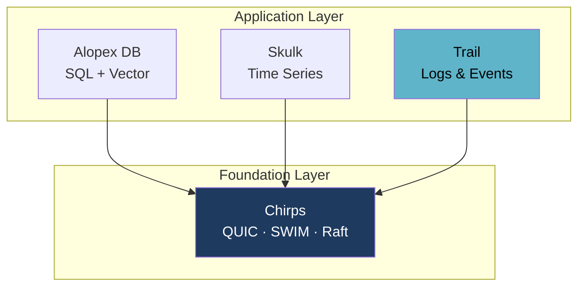

# Trail - Late-Bound Schema Log Store

**Write first. The schema binds when you read.**

Trail is an append-only store for logs and events whose shape is not known in
advance. Columns are built from the attributes that actually arrive, and
persisted columnar in Parquet. A field that changes type mid-stream does not
break the pipeline; it becomes a column you can still query.

## What "late-bound schema" means

Borrowed from *late binding* in programming languages: the binding happens as
late as possible. Here, what binds late is **the schema**.

| | Schema-on-write | **Late-bound (Trail)** |
|:--|:--|:--|
| Before writing | Declare the schema | Nothing to declare |
| At write time | Validate against the declaration; reject mismatches | Accept the shape that arrived |
| **At read time** | Read using the declared types | **Decide the types here** |

There is no schema to define up front and — this is the part that surprises
people — **no schema to define later either**. There is no `CREATE TABLE`, no
migration, no `ALTER`. A column exists because an event carrying that
attribute arrived.

What happens "late" is the *binding*: when you query `status`, that is when
Trail decides whether to hand you the integers, the strings, or both merged
into one column. Two people can query the same data and bind it differently.

You can also never think about it at all. The default read merges everything
into one logical column, so a schema is something you engage with only when you
want to.

[:material-file-document-outline: Read the design](https://github.com/alopex-db/docs/blob/main/design/alopex-trail-proposal.md){ .md-button .md-button--primary }
[Skulk, the storage core it builds on](skulk.md){ .md-button }

## The Problem

[Skulk](skulk.md) handles time-series where the shape is known up front: a
metric, its tags, and its fields. That strictness is correct for a TSDB and
wrong for logs.

Skulk enforces the following at the type level:

| Constraint | Why it blocks log ingestion |
| --- | --- |
| Timestamp is mandatory | Logs routinely arrive with missing or malformed time |
| Tags and fields are separate types | Logs have no such distinction |
| Exactly five value types | Cannot represent nested JSON or binary payloads |
| Type conflicts are rejected | A field that is `200` one day and `"timeout"` the next **stops ingestion** |
| At least one field required | Cannot represent an event with an empty payload |

The fourth row is the decisive one. In a metrics system, rejecting a type change
is a correctness guarantee. In a log system, it is an outage.

## The Approach

Trail keeps the same storage foundation as Skulk — append-only, columnar,
Parquet — and changes only the data model above it.

<div class="grid cards" markdown>

-   :material-shape-plus:{ .lg .middle } **Columns Appear On Arrival**

    ---

    An unknown attribute creates a new column, and every prior row in the
    buffer is back-filled with null. Rows missing a column get null.

    No declaration, no migration, no `ALTER TABLE`.

-   :material-call-split:{ .lg .middle } **Type Conflicts Shadow, Never Reject**

    ---

    When `status` arrives as an integer and later as a string, Trail creates
    a second physical column rather than failing.

    Reads coalesce the shadows back into one logical column.
    **Ingestion never stops.**

-   :material-file-tree:{ .lg .middle } **Schema Lives in the Manifest**

    ---

    Each file records its column set and a schema fingerprint, so a catalog
    query is answered without opening any Parquet footer — and files lacking
    a queried column are skipped entirely.

-   :material-timer-outline:{ .lg .middle } **Time Is Optional**

    ---

    Events without a usable timestamp are accepted and stamped at ingestion,
    rather than rejected at the door.

</div>

### Type shadowing

```
attrs: { status: 200 }         →  physical column  status@i64
attrs: { status: "timeout" }   →  physical column  status@str   (new)
```

The Parquet physical schema never conflicts, because both columns exist side by
side. What you get back is decided when you query — this is the binding:

```sql
SELECT status      FROM ...  -- both, merged into one column
SELECT status@i64  FROM ...  -- only the rows that arrived as integers
SELECT status@str  FROM ...  -- only the rows that arrived as strings
```

Nothing was decided at write time, and nothing needs to be decided in advance
of the query. **A type mismatch is a read-time question, not an ingestion
error.**

Primitives get their own shadow column — `@str`, `@i64`, `@f64`, `@bool`,
`@bytes` — and anything that doesn't fit, such as a nested map, falls back to
`@json`.

## Relationship to Skulk

Trail is not a fork of Skulk's purpose — it is a reuse of Skulk's machinery.

The durability layer Skulk already proves in production is directly applicable:
single-writer locking, atomic Parquet publication, two-generation manifest
rotation with checksum fallback, WAL framing with torn-tail truncation, and
staged crash-recovery boundaries.

What changes is the row model, the sort order (time-first rather than tag-first),
and the treatment of type conflicts.

!!! success "The hard part already runs in production"

    Skulk builds its Arrow schema dynamically from arriving rows and back-fills
    nulls for columns that appear late. That mechanism is more general than a
    TSDB needs — and it is exactly what a late-bound schema store requires.
    Trail promotes it from an implementation detail to the central feature,
    on top of a durability layer that already survives crash-recovery testing.

## One Cluster, Three Data Shapes

Logs rarely live alone. You have metrics in one place, relational and vector
data in another, and events in a third — three clusters to size, three failure
domains to reason about, three things to scale when traffic moves.

Alopex is built so they do not have to be separate. [Chirps](chirps.md) is the
shared cluster foundation across the product family: QUIC transport, SWIM
membership, and Raft consensus, used by every product rather than reimplemented
in each. Trail is designed to sit on that same foundation.



The goal is that each product scales out and shrinks back **independently, on
shared cluster machinery** — add capacity where the load actually is, without
standing up a separate cluster for every data shape you happen to store.

## Where Trail Gets Used First

[Alopex OTel](otel.md) — the OpenTelemetry platform built on this family — puts
**Traces and Logs in Trail**, with Metrics in Skulk.

The split follows one line: metrics arrive on a schedule, spans and logs arrive
when something happens. Interval-based machinery — partitioning, downsampling,
gap-filling — is meaningful for the first and meaningless for the second.

Type shadowing then compounds the fit. OpenTelemetry attributes are typed
`AnyValue`, and across SDK versions the same key changes type routinely. A
store that rejects the conflict stops ingesting; Trail shadows it and keeps
going — the difference between staying up and going down during a deploy.

## Keeping Data Without Keeping It Expensive

Time series get cheaper with age by downsampling. Events cannot — there is no
interval to downsample. So the question becomes: how do you keep everything
without paying full price for it?

<div class="grid cards" markdown>

-   :material-harddisk:{ .lg .middle } **Move it, don't rewrite it**

    ---

    Older data moves to cheaper storage in **the same format**. No
    recompression pass, no second write — the read path is identical, just
    a network hop further away.

-   :material-chart-box-multiple:{ .lg .middle } **Summaries sit beside data, not instead of it**

    ---

    Compaction builds mergeable sketches — exponential histograms, HLL — as
    an *additional* resolution. Generating a summary never becomes a reason
    to delete the original.

-   :material-percent:{ .lg .middle } **Sampling that still counts correctly**

    ---

    Uses OpenTelemetry's **adjusted count** from the W3C tracestate, not a
    bespoke field. Counts and sums extrapolate back to the population;
    min and max deliberately do not.

</div>

These choices were revised after reading how Tempo and SigNoz actually do it.
The design document records what changed and why.

[:octicons-arrow-right-24: Retention, sampling, and statistics in full](https://github.com/alopex-db/docs/blob/main/design/alopex-trail-proposal.md)

## Two Query Surfaces, Not One

Trail ships with a dashboard. That means the query layer has two faces, and
conflating them would compromise both.

<div class="grid cards" markdown>

-   :material-code-braces:{ .lg .middle } **Inside: an aggregation DSL**

    ---

    Built for what Trail can do — joins **across signals**, range
    aggregations, series arithmetic, and explicit type bindings like
    `status@str`.

    Chosen for expressiveness, because nothing constrains it.

-   :material-connection:{ .lg .middle } **Outside: Grafana-compatible**

    ---

    **TraceQL** for traces, **LogQL** for logs, **Prometheus query API** for
    metrics — so Grafana's built-in data sources connect with no plugin.

    Chosen for compatibility, because everything constrains it.

</div>

### Why a DSL and not SQL

A search DSL is not a weaker language. TraceQL already has `rate`,
`quantile_over_time`, `by()` grouping, series arithmetic, and `topk`:

```
({status=error} | count_over_time()) / ({} | count_over_time())
```

What TraceQL and LogQL *don't* have is a join across signals — TraceQL's
structural operators (`>>`, `>`, `~`) never leave a single trace, and SigNoz
has a join type defined in its IR but marked *not yet supported*.

That gap is where Trail's internal language goes.

### Why the compatible layer is separate

Grafana sends **the raw query string** — `GET /api/search?q={ status=error }`.
The language is the contract, so compatibility means parsing their grammar,
not just matching a protocol.

It also means TraceQL can't simply be a subset of the internal language: its
spanset semantics are a different model from joins. So they are separate front
ends that lower into one shared logical plan.

## Milestones

Each version is scoped so the one before it is usable on its own. v0.1 already
gives you durable ingestion with columns that appear on arrival.

| Version | Scope |
| --- | --- |
| v0.1 | Event model, WAL, dynamic column union, Parquet publication, manifest with column summaries, crash recovery |
| v0.2 | Type shadowing with read-time coalesce, JSON Lines and OTLP log decoders, retention |
| v0.3 | Predicate pushdown, column projection, manifest-driven pruning, **the internal DSL** — filters, type bindings, basic aggregation |
| v0.4 | Compaction with sidecar indexes, **retention tiers**, full-text search evaluated, **Python bindings** |
| v0.5 | **Statistical summaries** and sampling with adjusted-count correction |
| v0.6 | **Cross-signal joins**, series arithmetic, **TraceQL / LogQL compatibility** |

The compatible layer comes last on purpose: it lowers into the shared logical
plan, which has to settle first.

## Decisions Still Open

We publish these rather than settle them quietly, because each one changes what
you get.

- **Code sharing with Skulk** — a shared crate propagates Skulk's improvements
  to Trail automatically; forking keeps each free to evolve. Current direction
  is to fork first and re-evaluate once Trail's requirements are proven.
- **Throughput target** — this determines whether rows borrow from the input
  buffer or own their data, so it is being set before the row model is fixed.
- **Query syntax details** — the shape is settled (see above); the operator
  spelling, how you write a type binding, and the join notation are not.
- **Full-text search** — if it is in scope, an inverted index belongs in the
  foundation rather than bolted on later.
- **Sketches at compaction time** — no existing system does this, so there is
  nothing to copy and nothing to validate against.

Have an opinion on any of these? The design document is the place to weigh in.

## Learn More

- [Full design document](https://github.com/alopex-db/docs/blob/main/design/alopex-trail-proposal.md)
- [Skulk](skulk.md) — the time-series product whose machinery Trail reuses
