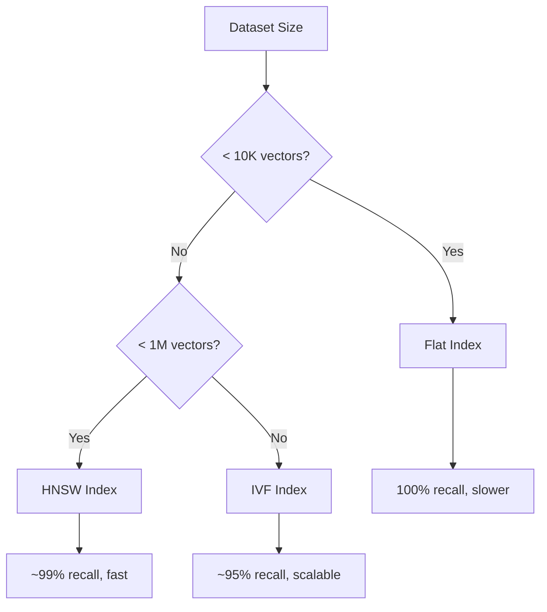

# Vector Search

[](https://crates.io/crates/alopex-embedded)
[](https://crates.io/crates/alopex-core)

Alopex DB treats vectors as first-class citizens, enabling powerful AI and machine learning applications with native ACID guarantees.

## Why Native Vectors?

Traditional approaches bolt vector search onto existing databases as an afterthought. Alopex integrates vectors into the core storage engine:

| Aspect | Bolt-on Approach | Alopex Native |
|:-------|:-----------------|:--------------|
| **Transactions** | Eventual consistency | ACID guaranteed |
| **Hybrid Queries** | Multiple round-trips | Single query |
| **Index Updates** | Background sync | Atomic with data |
| **Storage** | Separate systems | Unified engine |

## Vector Data Type

### Creating Vector Columns

```sql
-- Fixed-dimension vectors
CREATE TABLE documents (
    id UUID PRIMARY KEY,
    content TEXT,
    embedding VECTOR(1536)  -- OpenAI text-embedding-3-large
);

-- Different embedding models
CREATE TABLE images (
    id UUID PRIMARY KEY,
    path TEXT,
    clip_embedding VECTOR(512),   -- CLIP ViT-B/32
    dino_embedding VECTOR(384)    -- DINOv2
);
```

### Inserting Vectors

```sql
-- Insert with literal
INSERT INTO documents (id, content, embedding)
VALUES (
    '550e8400-e29b-41d4-a716-446655440000',
    'Hello world',
    [0.1, 0.2, 0.3, ...]  -- 1536 dimensions
);

-- Insert from application
INSERT INTO documents (id, content, embedding)
VALUES ($1, $2, $3);
```

### Vector Constraints

```sql
-- Ensure vector dimensions match
CREATE TABLE embeddings (
    id UUID PRIMARY KEY,
    vec VECTOR(384) NOT NULL,
    CONSTRAINT valid_norm CHECK (vector_norm(vec) BETWEEN 0.99 AND 1.01)
);
```

## Similarity Search

### Distance Functions

Alopex supports multiple distance metrics:

| Function | Description | Use Case |
|:---------|:------------|:---------|
| `cosine_similarity(a, b)` | Cosine similarity | Normalized embeddings |
| `cosine_distance(a, b)` | 1 - cosine_similarity | Normalized embeddings |
| `l2_distance(a, b)` | Euclidean distance | Raw embeddings |
| `inner_product(a, b)` | Dot product | Maximum inner product |

### Basic Vector Search

```sql
-- Find 10 most similar documents
SELECT id, content,
       cosine_similarity(embedding, $1) AS score
FROM documents
ORDER BY score DESC
LIMIT 10;
```

### Hybrid Search (SQL + Vector)

The killer feature—combine SQL predicates with vector similarity:

```sql
-- Semantic search with filters
SELECT id, content, cosine_similarity(embedding, $1) AS score
FROM documents
WHERE category = 'technology'
  AND created_at > '2024-01-01'
  AND language = 'en'
ORDER BY score DESC
LIMIT 10;
```

```sql
-- Multi-vector search with joins
SELECT d.id, d.content, c.name AS category,
       cosine_similarity(d.embedding, $1) AS score
FROM documents d
JOIN categories c ON d.category_id = c.id
WHERE c.active = true
ORDER BY score DESC
LIMIT 10;
```

## Vector Indexes

### Index Types

=== "HNSW (Recommended)"

    Hierarchical Navigable Small World graphs for fast approximate search:

    ```sql
    CREATE INDEX docs_embedding_idx ON documents
    USING hnsw (embedding vector_cosine_ops)
    WITH (m = 16, ef_construction = 200);
    ```

    | Parameter | Default | Description |
    |:----------|:--------|:------------|
    | `m` | 16 | Max connections per node |
    | `ef_construction` | 200 | Build-time search width |
    | `ef_search` | 100 | Query-time search width |

=== "IVF"

    Inverted File index for large datasets:

    ```sql
    CREATE INDEX docs_embedding_idx ON documents
    USING ivf (embedding vector_cosine_ops)
    WITH (lists = 1000);
    ```

    | Parameter | Default | Description |
    |:----------|:--------|:------------|
    | `lists` | 100 | Number of clusters |
    | `probes` | 10 | Clusters to search |

=== "Flat (Brute Force)"

    Exact search for small datasets or validation:

    ```sql
    CREATE INDEX docs_embedding_idx ON documents
    USING flat (embedding vector_cosine_ops);
    ```

### Index Selection



## Advanced Features

### Multi-Vector Search

Search across multiple embedding spaces:

```sql
-- Combine text and image similarity
SELECT id, title,
       0.7 * cosine_similarity(text_embedding, $1) +
       0.3 * cosine_similarity(image_embedding, $2) AS combined_score
FROM products
ORDER BY combined_score DESC
LIMIT 10;
```

### Re-ranking

Two-stage retrieval with re-ranking:

```sql
-- Stage 1: Fast approximate search
WITH candidates AS (
    SELECT id, content, embedding
    FROM documents
    ORDER BY embedding <=> $1  -- Approximate nearest neighbor
    LIMIT 100
)
-- Stage 2: Exact re-ranking
SELECT id, content,
       cosine_similarity(embedding, $1) AS score
FROM candidates
ORDER BY score DESC
LIMIT 10;
```

### Vector Arithmetic

```sql
-- Semantic operations
SELECT id, content
FROM documents
ORDER BY cosine_similarity(
    embedding,
    (SELECT embedding FROM concepts WHERE name = 'king')
    - (SELECT embedding FROM concepts WHERE name = 'man')
    + (SELECT embedding FROM concepts WHERE name = 'woman')
) DESC
LIMIT 5;
```

## Performance Tuning

### Memory Configuration

```sql
-- Set index memory budget
SET alopex.vector_index_memory = '4GB';

-- Preload index into memory
SELECT alopex_preload_index('docs_embedding_idx');
```

### Query Hints

```sql
-- Force index usage
SELECT /*+ USE_INDEX(docs_embedding_idx) */ id, content
FROM documents
ORDER BY embedding <=> $1
LIMIT 10;

-- Set search parameters per query
SELECT /*+ HNSW_EF_SEARCH(200) */ id, content
FROM documents
ORDER BY embedding <=> $1
LIMIT 10;
```

### Monitoring

```sql
-- Index statistics
SELECT * FROM alopex_vector_index_stats('docs_embedding_idx');

-- Query analysis
EXPLAIN ANALYZE
SELECT id FROM documents
ORDER BY embedding <=> $1
LIMIT 10;
```

## Best Practices

!!! tip "Normalize Your Vectors"

    For cosine similarity, normalize vectors before insertion:

    ```sql
    INSERT INTO documents (id, embedding)
    VALUES ($1, vector_normalize($2));
    ```

!!! tip "Choose the Right Dimension"

    Lower dimensions = faster search, higher dimensions = better accuracy.

    - 384: Good for most use cases (e5-small, all-MiniLM)
    - 768: High quality (e5-base, BGE)
    - 1536: Maximum quality (OpenAI text-embedding-3)

!!! warning "Index Build Time"

    HNSW indexes can take time to build for large datasets. Use `CREATE INDEX CONCURRENTLY` to avoid blocking:

    ```sql
    CREATE INDEX CONCURRENTLY docs_embedding_idx
    ON documents USING hnsw (embedding vector_cosine_ops);
    ```

## Next Steps

- [:octicons-arrow-right-24: SQL + Vector Guide](../guides/sql-vector.md) - Practical examples
- [:octicons-arrow-right-24: Architecture](architecture.md) - How vector storage works
