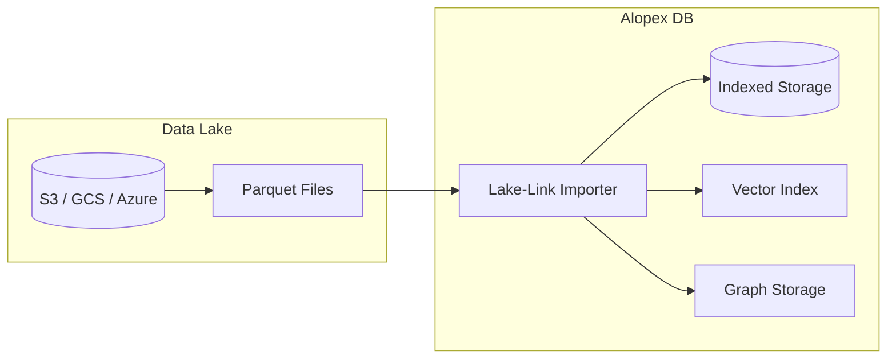

# Lake-Link Guide

Lake-Link is Alopex DB's architecture for bridging Data Lakes (S3, GCS, Azure Blob) with your AI applications. Import Parquet files directly into indexed vectors and graphs with zero ETL overhead.

## Overview



## Basic Import

### From Local Parquet

```sql
-- Simple import
COPY FROM './data/documents.parquet'
INTO documents;

-- With explicit column mapping
COPY FROM './data/documents.parquet'
INTO documents (id, title, content, embedding)
MAP COLUMNS (
    doc_id => id,
    doc_title => title,
    doc_content => content,
    vector => embedding
);
```

### From S3

```sql
-- Direct S3 import
COPY FROM 's3://my-bucket/embeddings/docs.parquet'
INTO documents
WITH (
    region = 'us-east-1',
    credentials = 'aws_profile'  -- Or use IAM role
);

-- With path pattern (multiple files)
COPY FROM 's3://my-bucket/embeddings/*.parquet'
INTO documents;
```

### From GCS

```sql
COPY FROM 'gs://my-bucket/data/vectors.parquet'
INTO documents
WITH (
    credentials = '/path/to/service-account.json'
);
```

## Vector Import

### Embedding Column Detection

Alopex automatically detects array columns that can be converted to vectors:

```sql
-- Source Parquet schema:
-- id: string
-- text: string
-- embedding: list<float>  -- Auto-detected as VECTOR

COPY FROM './embeddings.parquet'
INTO documents (id, content, embedding)
MAP COLUMNS (
    id => id,
    text => content,
    embedding => embedding::VECTOR(1536)  -- Cast to vector type
);
```

### Multiple Embedding Columns

```sql
-- Import multiple embedding spaces
COPY FROM './multi_embeddings.parquet'
INTO products
MAP COLUMNS (
    product_id => id,
    name => name,
    text_vec => text_embedding::VECTOR(384),
    image_vec => image_embedding::VECTOR(512),
    combined_vec => combined_embedding::VECTOR(1024)
);
```

## Graph Import

### Basic Graph Import

```sql
-- Create graph schema
CREATE GRAPH knowledge (
    NODE entity (
        id UUID PRIMARY KEY,
        name TEXT,
        type TEXT,
        embedding VECTOR(384)
    ),
    EDGE relates (
        source UUID REFERENCES entity(id),
        target UUID REFERENCES entity(id),
        relation TEXT,
        weight FLOAT
    )
);

-- Import nodes
COPY FROM 's3://datalake/entities.parquet'
INTO GRAPH knowledge.entity
MAP COLUMNS (
    entity_id => id,
    entity_name => name,
    entity_type => type,
    vector => embedding
);

-- Import edges
COPY FROM 's3://datalake/relations.parquet'
INTO GRAPH knowledge.relates
MAP COLUMNS (
    from_id => source,
    to_id => target,
    rel_type => relation,
    score => weight
);
```

### Auto-Generate Edges from Adjacency Lists

```sql
-- Source has adjacency list column
-- links: list<string> containing related entity IDs

COPY FROM 's3://datalake/wiki_pages.parquet'
INTO GRAPH wiki
MAP COLUMNS (
    page_id => node_id,
    title => title,
    vector => embedding,
    outgoing_links => edges  -- Auto-expand to edges
);
```

## Data Tiering

### Cold/Hot Tiering

```sql
-- Configure tiering policy
ALTER TABLE documents
SET (
    hot_storage = 'local',
    cold_storage = 's3://my-bucket/archive/',
    tier_after = INTERVAL '90 days'
);

-- Manual tier operation
ALTER TABLE documents
TIER PARTITION WHERE created_at < '2024-01-01'
TO COLD;

-- Re-hydrate from cold storage
ALTER TABLE documents
TIER PARTITION WHERE created_at BETWEEN '2023-01-01' AND '2023-06-30'
TO HOT;
```

### Query Across Tiers

```sql
-- Queries transparently access both tiers
SELECT id, content, cosine_similarity(embedding, $1) AS score
FROM documents
WHERE created_at > '2023-01-01'  -- May span hot and cold
ORDER BY score DESC
LIMIT 10;
```

## Incremental Import

### Append Mode

```sql
-- Append new data (default)
COPY FROM 's3://bucket/daily/2024-03-15/*.parquet'
INTO documents
WITH (mode = 'append');
```

### Upsert Mode

```sql
-- Update existing, insert new
COPY FROM 's3://bucket/updates/latest.parquet'
INTO documents
WITH (
    mode = 'upsert',
    key_columns = ['id']
);
```

### Partitioned Import

```sql
-- Import specific partition
COPY FROM 's3://bucket/data/year=2024/month=03/*.parquet'
INTO documents;

-- Import with partition pruning
COPY FROM 's3://bucket/data/'
INTO documents
WITH (
    partition_columns = ['year', 'month'],
    partition_filter = 'year = 2024 AND month >= 3'
);
```

## Schema Evolution

### Adding Columns

```sql
-- Add new column to existing table
ALTER TABLE documents
ADD COLUMN new_embedding VECTOR(768);

-- Import new column from Parquet
COPY FROM './new_embeddings.parquet'
INTO documents (id, new_embedding)
WITH (mode = 'update', key_columns = ['id']);
```

### Type Coercion

```sql
-- Automatic type conversion
COPY FROM './data.parquet'
INTO documents
MAP COLUMNS (
    int_id => id::UUID,              -- Integer to UUID
    float_array => embedding::VECTOR(384),  -- Array to Vector
    json_str => metadata::JSONB      -- String to JSONB
);
```

## Performance Optimization

### Parallel Import

```sql
-- Configure parallelism
COPY FROM 's3://bucket/large_dataset/*.parquet'
INTO documents
WITH (
    parallel_workers = 8,
    batch_size = 10000
);
```

### Direct Index Build

```sql
-- Build vector index during import
COPY FROM 's3://bucket/embeddings.parquet'
INTO documents
WITH (
    build_indexes = true,
    index_type = 'hnsw',
    hnsw_m = 16,
    hnsw_ef_construction = 200
);
```

### Memory Management

```sql
-- Control memory usage
SET alopex.import_memory_limit = '4GB';
SET alopex.import_spill_threshold = '2GB';
```

## Monitoring Import

### Progress Tracking

```sql
-- Check import progress
SELECT * FROM alopex_import_status
WHERE job_id = 'job_123';

-- Output:
-- job_id    | status      | files_total | files_done | rows_imported | errors
-- job_123   | in_progress | 100         | 45         | 4500000       | 0
```

### Error Handling

```sql
-- Import with error handling
COPY FROM 's3://bucket/data.parquet'
INTO documents
WITH (
    on_error = 'continue',  -- Skip bad rows
    error_table = 'import_errors',
    max_errors = 1000
);

-- Check errors
SELECT * FROM import_errors
WHERE job_id = 'job_123';
```

## Export to Data Lake

### Export to Parquet

```sql
-- Export query results
COPY (
    SELECT id, content, embedding
    FROM documents
    WHERE category = 'technology'
)
TO 's3://bucket/export/tech_docs.parquet'
WITH (
    format = 'parquet',
    compression = 'snappy'
);
```

### Partitioned Export

```sql
-- Export with partitioning
COPY documents
TO 's3://bucket/export/'
WITH (
    format = 'parquet',
    partition_by = ['category', 'DATE(created_at)']
);
```

## Best Practices

!!! tip "Use Columnar Projections"

    Only import needed columns:

    ```sql
    COPY FROM './large_file.parquet'
    INTO documents (id, embedding)  -- Only these columns
    MAP COLUMNS (doc_id => id, vector => embedding);
    ```

!!! tip "Pre-sort Data"

    Import pre-sorted data for better compression:

    ```sql
    -- Parquet files sorted by created_at
    COPY FROM './sorted_data.parquet'
    INTO documents
    WITH (preserve_sort = true);
    ```

!!! warning "Vector Dimension Mismatch"

    Ensure vector dimensions match:

    ```sql
    -- This will fail if embedding has wrong dimension
    COPY FROM './data.parquet'
    INTO documents (embedding::VECTOR(1536));

    -- Validate first
    SELECT COUNT(*), array_length(embedding, 1)
    FROM read_parquet('./data.parquet')
    GROUP BY 2;
    ```

## Next Steps

- [:octicons-arrow-right-24: SQL + Vector Guide](sql-vector.md)
- [:octicons-arrow-right-24: Architecture](../concepts/architecture.md)
