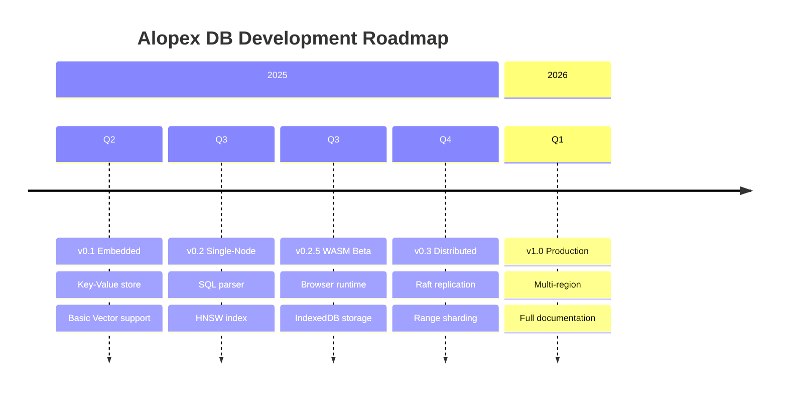

<style>
.md-typeset h1 {
  display: none;
}
</style>

<div class="hero" markdown>

# :fox_face: Alopex DB { .hero-title }

## **Silent. Adaptive. Unbreakable.** { .hero-tagline }

The unified database engine that scales from a single embedded file to a globally distributed cluster.

**Native SQL, Vector Search, and Graph capabilities** in one Rust-based engine.

[Get Started](getting-started/quickstart.md){ .md-button .md-button--primary }
[View on GitHub :fontawesome-brands-github:](https://github.com/alopex-db/alopex){ .md-button }

</div>

---

## :thinking: The Problem

Modern AI applications require multiple database technologies—creating complexity, inconsistency, and operational overhead.

<div class="grid cards" markdown>

-   :material-database-remove:{ .lg .middle } **Traditional Approach**

    ---

    - SQLite for local storage
    - Vector DB for embeddings
    - Graph DB for relationships
    - Distributed SQL for scale

    :x: **4+ systems to manage, sync, and maintain**

-   :fox_face:{ .lg .middle } **The Alopex Way**

    ---

    - One unified engine
    - Seamless mode switching
    - Single API everywhere
    - Native multi-model support

    :white_check_mark: **One engine that adapts to your workload**

</div>

---

## :star: Key Features

<div class="grid cards" markdown>

-   :dart:{ .lg .middle } **Native Vector Support**

    ---

    `VECTOR(N)` is a first-class data type with ACID transactions. Run hybrid queries combining SQL filters with vector similarity search.

-   :spider_web:{ .lg .middle } **Graph-Ready Storage**

    ---

    Optimized for Knowledge Graph storage with nodes, edges, and embeddings. Perfect for RAG applications requiring relationship traversal.

-   :bar_chart:{ .lg .middle } **Lake-Link Architecture**

    ---

    Zero-ETL Parquet import directly into indexed vectors and graphs. Cold/hot data tiering with instant re-hydration.

-   :crab:{ .lg .middle } **Pure Rust Engine**

    ---

    Memory-safe, high-performance, and portable. Custom LSM-Tree storage optimized for vector workloads.

-   :lock:{ .lg .middle } **ACID Transactions**

    ---

    Full transactional guarantees across SQL, vector, and graph operations. MVCC/OCC for concurrent access.

-   :globe_with_meridians:{ .lg .middle } **WebAssembly Ready**

    ---

    Run in the browser with IndexedDB/OPFS storage. Same API everywhere—embedded, server, or edge.

</div>

---

## :package: Three Modes, One Engine

Start small, scale infinitely—without changing your data model or application code.

| Mode | Use Case | Architecture |
|:-----|:---------|:-------------|
| :package: **Embedded** | Mobile Apps, Local RAG, Edge Devices | Single Binary / Library (like SQLite) |
| :desktop_computer: **Single-Node** | Microservices, Dev/Test Environments | Standalone Server (Postgres-compatible*) |
| :earth_americas: **Distributed** | High-Availability Production | Shared-nothing Cluster (Range Sharding + Raft) |

[:octicons-arrow-right-24: Learn more about modes](concepts/modes.md)

---

## :computer: SQL + Vector in Action

=== "Hybrid Search"

    ```sql
    -- Create a table with mixed data types
    CREATE TABLE knowledge_chunks (
        id UUID PRIMARY KEY,
        content TEXT,
        embedding VECTOR(1536), -- OpenAI compatible
        created_at TIMESTAMP
    );

    -- Hybrid Search: SQL Filter + Vector Similarity
    SELECT content,
           cosine_similarity(embedding, [0.1, 0.5, ...]) AS score
    FROM knowledge_chunks
    WHERE created_at > '2024-01-01'
    ORDER BY score DESC
    LIMIT 5;
    ```

=== "Lake-Link Import"

    ```sql
    -- Turn raw Parquet data into a queryable Knowledge Graph
    COPY FROM 's3://datalake/wiki_dump.parquet'
    INTO GRAPH wiki_graph
    MAP COLUMNS (
        id => node_id,
        vector_col => embedding,
        links => edges  -- Auto-generate graph edges
    );
    ```

[:octicons-arrow-right-24: View SQL + Vector guide](guides/sql-vector.md)

---

## :construction: Roadmap



[:octicons-arrow-right-24: View detailed roadmap](roadmap.md)

---

## :handshake: Join the Pack

Alopex DB is open-source under the **Apache 2.0 License**.

We welcome contributions from engineers passionate about Rust, Distributed Systems, and Vector Search.

[Contributing Guide](contributing.md){ .md-button }
[GitHub Discussions :fontawesome-brands-github:](https://github.com/alopex-db/alopex/discussions){ .md-button }

---

<div class="footer-tagline" markdown>
Built with :crab: Rust and :heart: by the Alopex DB Team
</div>
