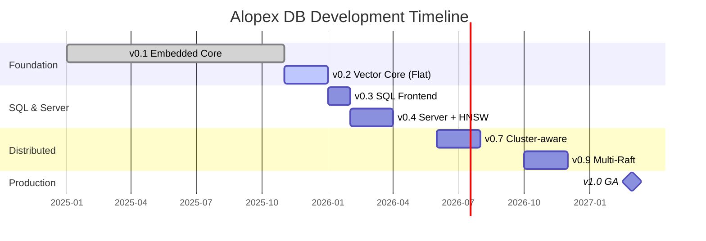

<style>
.md-typeset h1 {
  display: none;
}
</style>

<div class="hero" markdown>

# :fox_face: Alopex DB { .hero-title }

## **Silent. Adaptive. Unbreakable.** { .hero-tagline }

The unified database engine that scales from a single embedded file to a globally distributed cluster.

**Native SQL, Vector Search, and Graph capabilities** in one Rust-based engine.

[Get Started](getting-started/quickstart.md){ .md-button .md-button--primary }
[View on GitHub :fontawesome-brands-github:](https://github.com/alopex-db/alopex){ .md-button }

</div>

---

## :rocket: Current Status

!!! success "v0.1 Embedded KV Core — Complete"

    Alopex DB v0.1 is ready! The embedded foundation with ACID transactions, WAL durability, and MVCC isolation is complete. Start building today with our Key-Value API.

---

## :thinking: The Problem

Modern AI applications require multiple database technologies—creating complexity, inconsistency, and operational overhead.

<div class="grid cards" markdown>

-   :material-database-remove:{ .lg .middle } **Traditional Approach**

    ---

    - SQLite for local storage
    - Vector DB for embeddings
    - Graph DB for relationships
    - Distributed SQL for scale

    :x: **4+ systems to manage, sync, and maintain**

-   :fox_face:{ .lg .middle } **The Alopex Way**

    ---

    - One unified engine
    - Seamless topology migration
    - Single API everywhere
    - Native multi-model support

    :white_check_mark: **One engine that adapts to your scale**

</div>

---

## :star: Key Features

<div class="grid cards" markdown>

-   :dart:{ .lg .middle } **Native Vector Support**

    ---

    `VECTOR(N)` is a first-class data type with ACID transactions. Run hybrid queries combining SQL filters with vector similarity search.

-   :spider_web:{ .lg .middle } **Graph-Ready Storage**

    ---

    Optimized for Knowledge Graph storage with nodes, edges, and embeddings. Perfect for RAG applications requiring relationship traversal.

-   :bar_chart:{ .lg .middle } **Lake-Link Architecture**

    ---

    Zero-ETL Parquet import directly into indexed vectors and graphs. Cold/hot data tiering with instant re-hydration.

-   :crab:{ .lg .middle } **Pure Rust Engine**

    ---

    Memory-safe, high-performance, and portable. Custom LSM-Tree storage optimized for vector workloads.

-   :lock:{ .lg .middle } **ACID Transactions**

    ---

    Full transactional guarantees across SQL, vector, and graph operations. MVCC with Snapshot Isolation for concurrent access.

-   :satellite:{ .lg .middle } **Chirps Mesh Network**

    ---

    QUIC-based cluster communication with SWIM protocol for membership. Three message profiles for Raft, gossip, and event streaming.

</div>

---

## :package: Any Scale, One Engine

Start small, scale infinitely—without changing your data model or application code.

| Mode | Use Case | Architecture |
|:-----|:---------|:-------------|
| :globe_with_meridians: **WASM Viewer** | Browser Data Exploration | Read-only viewer with IndexedDB caching |
| :package: **Embedded** | Mobile Apps, Local RAG, Edge Devices | Single Binary / Library (like SQLite) |
| :desktop_computer: **Single-Node** | Microservices, Dev/Test Environments | Standalone Server (Postgres-compatible*) |
| :arrows_counterclockwise: **Replicated** | High Availability, Read-heavy Workloads | Primary-Replica with automatic failover |
| :earth_americas: **Distributed** | Large-Scale Production | Multi-Raft Cluster (Range Sharding) |

[:octicons-arrow-right-24: Learn more about deployment modes](concepts/modes.md)

---

## :computer: SQL + Vector in Action

=== "Hybrid Search"

    ```sql
    -- Create a table with mixed data types
    CREATE TABLE knowledge_chunks (
        id UUID PRIMARY KEY,
        content TEXT,
        embedding VECTOR(1536), -- OpenAI compatible
        created_at TIMESTAMP
    );

    -- Hybrid Search: SQL Filter + Vector Similarity
    SELECT content,
           cosine_similarity(embedding, [0.1, 0.5, ...]) AS score
    FROM knowledge_chunks
    WHERE created_at > '2024-01-01'
    ORDER BY score DESC
    LIMIT 5;
    ```

=== "Lake-Link Import"

    ```sql
    -- Turn raw Parquet data into a queryable Knowledge Graph
    COPY FROM 's3://datalake/wiki_dump.parquet'
    INTO GRAPH wiki_graph
    MAP COLUMNS (
        id => node_id,
        vector_col => embedding,
        links => edges  -- Auto-generate graph edges
    );
    ```

[:octicons-arrow-right-24: View SQL + Vector guide](guides/sql-vector.md)

---

## :construction: Roadmap



### What's Complete

| Version | Features | Status |
|:--------|:---------|:------:|
| **v0.1** | Embedded KV, WAL, MVCC, Transactions | :white_check_mark: Complete |
| **Chirps v0.3** | Gossip, SWIM, Membership API | :white_check_mark: Complete |

### What's Next

| Version | Features | Target |
|:--------|:---------|:-------|
| **v0.2** | Vector Type, Flat Search, Columnar Compression | Jan 2026 |
| **v0.3** | SQL Parser, DDL/DML, Embedded SQL | Feb 2026 |
| **v0.4** | Server Mode, REST/gRPC, HNSW Index | Apr 2026 |

[:octicons-arrow-right-24: View detailed roadmap](roadmap.md)

---

## :link: Chirps — Cluster Foundation

Alopex Chirps is the control plane for distributed Alopex DB clusters.

<div class="grid cards" markdown>

-   :satellite_antenna:{ .lg .middle } **SWIM Protocol**

    ---

    Failure detection via ping/ack/ping-req with configurable timeouts. Scalable membership management.

-   :zap:{ .lg .middle } **QUIC Transport**

    ---

    TLS 1.3, 0-RTT resumption, multiplexed streams. Priority channels for Raft consensus.

-   :envelope:{ .lg .middle } **Message Profiles**

    ---

    Control (Raft), Ephemeral (Gossip), Durable (Event Streams). Route by reliability needs.

</div>

[:octicons-arrow-right-24: Learn about Chirps architecture](concepts/chirps.md)

---

## :handshake: Join the Pack

Alopex DB is open-source under the **Apache 2.0 License**.

We welcome contributions from engineers passionate about Rust, Distributed Systems, and Vector Search.

[Contributing Guide](contributing.md){ .md-button }
[GitHub Discussions :fontawesome-brands-github:](https://github.com/alopex-db/alopex/discussions){ .md-button }

---

<div class="footer-tagline" markdown>
Built with :crab: Rust and :heart: by the Alopex DB Team
</div>
