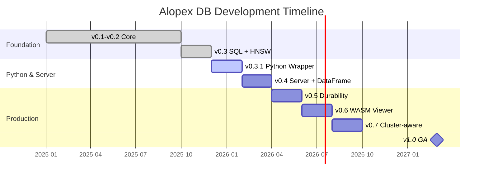

<style>
.md-typeset h1 {
  display: none;
}
</style>

<div class="hero" markdown>

# :fox_face: Alopex DB { .hero-title }

## **Silent. Adaptive. Unbreakable.** { .hero-tagline }

The unified database engine that scales from a single embedded file to a globally distributed cluster.

**Native SQL, Vector Search, and HNSW indexing** in one Rust-based engine.

[Get Started](getting-started/quickstart.md){ .md-button .md-button--primary }
[View on GitHub :fontawesome-brands-github:](https://github.com/alopex-db/alopex){ .md-button }

</div>

---

## :rocket: Current Status

!!! success "v0.3 SQL Frontend + HNSW — Complete & Published"

    Alopex DB v0.3 is **published on crates.io**! Full SQL support with Vector SQL, HNSW indexing, and Embedded Integration are ready. Start building AI applications today.

    ```bash
    cargo add alopex-embedded alopex-sql
    ```

    [:simple-rust: alopex-embedded](https://crates.io/crates/alopex-embedded){ .md-button .md-button--primary }
    [:simple-rust: alopex-sql](https://crates.io/crates/alopex-sql){ .md-button }
    [:simple-rust: alopex-core](https://crates.io/crates/alopex-core){ .md-button }
    [:simple-rust: alopex-chirps](https://crates.io/crates/alopex-chirps){ .md-button }

---

## :thinking: The Problem

Modern AI applications require multiple database technologies—creating complexity, inconsistency, and operational overhead.

<div class="grid cards" markdown>

-   :material-database-remove:{ .lg .middle } **Traditional Approach**

    ---

    - SQLite for local storage
    - Vector DB for embeddings
    - Graph DB for relationships
    - Distributed SQL for scale

    :x: **4+ systems to manage, sync, and maintain**

-   :fox_face:{ .lg .middle } **The Alopex Way**

    ---

    - One unified engine
    - Seamless topology migration
    - Single API everywhere
    - Native multi-model support

    :white_check_mark: **One engine that adapts to your scale**

</div>

---

## :star: Key Features

<div class="grid cards" markdown>

-   :dart:{ .lg .middle } **Native Vector + HNSW**

    ---

    `VECTOR(N)` is a first-class data type with ACID transactions. HNSW indexing for high-performance similarity search with hybrid SQL queries.

-   :zap:{ .lg .middle } **SQL Frontend**

    ---

    Full SQL support with DDL/DML, `vector_similarity()` function, and Top-K optimization. Published on **crates.io**.

-   :bar_chart:{ .lg .middle } **Columnar Storage**

    ---

    Optimized columnar segments with compression, statistics, and predicate pushdown for analytical workloads.

-   :crab:{ .lg .middle } **Pure Rust Engine**

    ---

    Memory-safe, high-performance, and portable. Custom LSM-Tree storage optimized for vector workloads.

-   :lock:{ .lg .middle } **ACID Transactions**

    ---

    Full transactional guarantees across SQL, vector, and KV operations. MVCC with Snapshot Isolation for concurrent access.

-   :satellite:{ .lg .middle } **Chirps Mesh Network**

    ---

    QUIC-based cluster communication with SWIM protocol for membership. Raft-ready transport with priority streams.

</div>

---

## :package: Any Scale, One Engine

Start small, scale infinitely—without changing your data model or application code.

| Mode | Use Case | Architecture |
|:-----|:---------|:-------------|
| :globe_with_meridians: **WASM Viewer** | Browser Data Exploration | Read-only viewer with IndexedDB caching |
| :package: **Embedded** | Mobile Apps, Local RAG, Edge Devices | Single Binary / Library (like SQLite) |
| :desktop_computer: **Single-Node** | Microservices, Dev/Test Environments | Standalone Server (HTTP/gRPC) |
| :arrows_counterclockwise: **Replicated** | High Availability, Read-heavy Workloads | Primary-Replica with automatic failover |
| :earth_americas: **Distributed** | Large-Scale Production | Multi-Raft Cluster (Range Sharding) |

[:octicons-arrow-right-24: Learn more about deployment modes](concepts/modes.md)

---

## :computer: SQL + Vector in Action

=== "Hybrid Search"

    ```sql
    -- Create a table with vector column
    CREATE TABLE knowledge_chunks (
        id INTEGER PRIMARY KEY,
        content TEXT,
        embedding VECTOR(1536)
    );

    -- Hybrid Search: SQL Filter + Vector Similarity
    SELECT id, content,
           vector_similarity(embedding, ?) AS score
    FROM knowledge_chunks
    ORDER BY score DESC
    LIMIT 5;
    ```

=== "HNSW Index"

    ```sql
    -- Create HNSW index for fast similarity search
    CREATE INDEX idx_embedding ON knowledge_chunks
    USING HNSW (embedding)
    WITH (m = 16, ef_construction = 200);

    -- Search with HNSW acceleration
    SELECT id, content
    FROM knowledge_chunks
    ORDER BY vector_similarity(embedding, ?) DESC
    LIMIT 10;
    ```

=== "Embedded Rust API"

    ```rust
    use alopex_embedded::Database;

    let db = Database::open("./my_data")?;

    // Execute SQL
    let results = db.execute_sql(
        "SELECT * FROM docs WHERE vector_similarity(embedding, ?) > 0.8",
        &[query_vector]
    )?;

    // HNSW search
    let similar = db.search_hnsw("docs", &query_vector, 10)?;
    ```

[:octicons-arrow-right-24: View SQL + Vector guide](guides/sql-vector.md)

---

## :construction: Roadmap



### What's Complete

| Version | Features | Status |
|:--------|:---------|:------:|
| **v0.1-v0.2** | Embedded KV, WAL, MVCC, Vector (Flat), Columnar | :white_check_mark: Complete |
| **v0.3** | SQL Frontend, HNSW Index, Embedded Integration | :white_check_mark: **crates.io Published** |
| **Chirps v0.5** | Gossip, SWIM, Membership, Raft Consensus API | :white_check_mark: Complete |

### What's Next

| Version | Features | Target |
|:--------|:---------|:-------|
| **v0.3.1** | Python Wrapper (alopex-py), CLI | Q1 2026 |
| **v0.4** | Server Mode, DataFrame API | Q2 2026 |
| **v0.5** | Durability, JOIN Support | Q2 2026 |

[:octicons-arrow-right-24: View detailed roadmap](roadmap.md)

---

## :snake: Python Support (Coming Soon)

=== "Database API"

    ```python
    import alopex

    # Open database
    db = alopex.Database.open("./my_data")

    # Execute SQL
    results = db.execute_sql(
        "SELECT * FROM docs WHERE category = ?",
        ["science"]
    )

    # Vector search
    similar = db.search_hnsw("docs", query_embedding, k=10)
    ```

=== "DataFrame API"

    ```python
    import alopex

    # Polars-compatible DataFrame API
    df = alopex.read_parquet("data.parquet")

    result = (
        df.lazy()
        .filter(alopex.col("score") > 0.5)
        .select(["id", "content", "embedding"])
        .collect()
    )
    ```

[:octicons-arrow-right-24: Python Guide](guides/python.md) *(Coming in v0.3.1)*

---

## :link: Chirps — Cluster Foundation

[](https://crates.io/crates/alopex-chirps)

Alopex Chirps is the control plane for distributed Alopex DB clusters.

<div class="grid cards" markdown>

-   :satellite_antenna:{ .lg .middle } **SWIM Protocol**

    ---

    Failure detection via ping/ack/ping-req with configurable timeouts. Scalable membership management.

-   :zap:{ .lg .middle } **QUIC Transport**

    ---

    TLS 1.3, 0-RTT resumption, multiplexed streams. Priority channels for Raft consensus.

-   :envelope:{ .lg .middle } **Raft Consensus**

    ---

    Raft-ready transport with StateMachine/RaftStorage traits. WAL-based persistent storage.

</div>

[:octicons-arrow-right-24: Learn about Chirps architecture](concepts/chirps.md)

---

## :handshake: Join the Pack

Alopex DB is open-source under the **Apache 2.0 License**.

We welcome contributions from engineers passionate about Rust, Distributed Systems, and Vector Search.

[Contributing Guide](contributing.md){ .md-button }
[GitHub Discussions :fontawesome-brands-github:](https://github.com/alopex-db/alopex/discussions){ .md-button }

---

<div class="footer-tagline" markdown>
Built with :crab: Rust and :heart: by the Alopex DB Team
</div>
