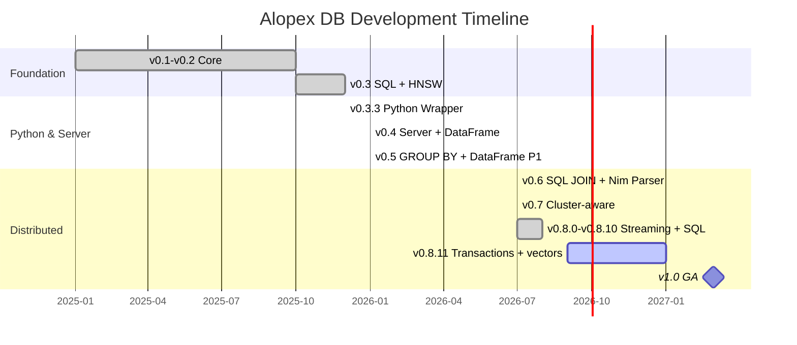

<style>
.md-typeset h1 {
  display: none;
}
</style>

<div class="hero" markdown>

# :fox_face: Alopex DB { .hero-title }

## **Silent. Adaptive. Unbreakable.** { .hero-tagline }

The unified database engine that scales from a single embedded file to a globally distributed cluster.

**Native SQL, Vector Search, and HNSW indexing** in one Rust-based engine.

[Get Started](getting-started/quickstart.md){ .md-button .md-button--primary }
[View on GitHub :fontawesome-brands-github:](https://github.com/alopex-db/alopex){ .md-button }

</div>

---

## :computer: CLI Defaults

On a TTY, the CLI launches the TUI by default; use `--batch` or `--output` to
force batch output. In the results TUI, press `a` to open the admin console
when available. The status bar emphasizes **Connection/Focus/Action** and
**Ops** so you can see the current target and primary actions at a glance. The
admin console uses a rainfrog-style layout (left resource tree, right detail
input, right-bottom status/preview) with `h/l` focus switching.

## :rocket: Current Status

[:octicons-tag-24: ](https://github.com/alopex-db/alopex/releases/latest)

!!! success "Latest release published on crates.io, PyPI, and GitHub"

    The current Alopex DB release adds exact `DECIMAL`/`NUMERIC`, native
    `DATE`/`TIME`/`INTERVAL`, `JSON`/`JSONB`, nested `ARRAY`/`MAP`/`STRUCT`
    values, and local full-text search on top of the portable SQL function set,
    bounded KV key search, and matching embedded, server, Rust, and Python
    surfaces. The badge above reads the latest GitHub release automatically;
    see the linked release for its exact version and notes.

    ```bash
    # Rust
    cargo add alopex-embedded alopex-sql alopex-server alopex-cluster

    # Python
    pip install alopex
    ```

    [:simple-rust: alopex-embedded](https://crates.io/crates/alopex-embedded){ .md-button .md-button--primary }
    [:simple-rust: alopex-sql](https://crates.io/crates/alopex-sql){ .md-button }
    [:simple-rust: alopex-server](https://crates.io/crates/alopex-server){ .md-button }
    [:simple-rust: alopex-cluster](https://crates.io/crates/alopex-cluster){ .md-button }
    [:simple-rust: alopex-chirps](https://crates.io/crates/alopex-chirps){ .md-button }
    [:material-download: CLI Binaries](https://github.com/alopex-db/alopex/releases){ .md-button }
    [:material-history: Family Release History](releases.md){ .md-button }

---

## :thinking: The Problem

Modern AI applications require multiple database technologies—creating complexity, inconsistency, and operational overhead.

<div class="grid cards" markdown>

-   :material-database-remove:{ .lg .middle } **Traditional Approach**

    ---

    - SQLite for local storage
    - Vector DB for embeddings
    - Graph DB for relationships
    - Distributed SQL for scale

    :x: **4+ systems to manage, sync, and maintain**

-   :fox_face:{ .lg .middle } **The Alopex Way**

    ---

    - One unified engine
    - Seamless topology migration
    - Single API everywhere
    - Native multi-model support

    :white_check_mark: **One engine that adapts to your scale**

</div>

---

## :star: Key Features

<div class="grid cards" markdown>

-   :dart:{ .lg .middle } **Native Vector + HNSW**

    ---

    `VECTOR(N)` is a first-class data type with ACID transactions. HNSW indexing for high-performance similarity search with hybrid SQL queries.

-   :zap:{ .lg .middle } **SQL Frontend**

    ---

    Full SQL support with DDL/DML, JOIN & subqueries, `vector_similarity()` function, and Top-K optimization. Published on **crates.io**.

-   :bar_chart:{ .lg .middle } **Columnar Storage**

    ---

    Optimized columnar segments with compression, statistics, and predicate pushdown for analytical workloads.

-   :crab:{ .lg .middle } **Pure Rust Engine**

    ---

    Memory-safe, high-performance, and portable. Custom LSM-Tree storage optimized for vector workloads.

-   :lock:{ .lg .middle } **ACID Transactions**

    ---

    Full transactional guarantees across SQL, vector, and KV operations. MVCC with Snapshot Isolation for concurrent access.

-   :satellite:{ .lg .middle } **Chirps Mesh Network**

    ---

    QUIC-based cluster communication with SWIM protocol for membership. Raft-ready transport with priority streams.

-   :material-code-json:{ .lg .middle } **More Than Scalars**

    ---

    Exact `DECIMAL`, native `DATE`/`TIME`/`INTERVAL`, `JSON`/`JSONB` with path operators, nested `ARRAY`/`MAP`/`STRUCT`, and deterministic full-text search — one engine, no extra service.

</div>

---

## :package: Any Scale, One Engine

Start small, scale infinitely—without changing your data model or application code.

| Mode | Use Case | Architecture |
|:-----|:---------|:-------------|
| :globe_with_meridians: **WASM Viewer** | Browser Data Exploration | Read-only viewer with IndexedDB caching |
| :package: **Embedded** | Mobile Apps, Local RAG, Edge Devices | Single Binary / Library (like SQLite) |
| :desktop_computer: **Single-Node** | Microservices, Dev/Test Environments | Standalone Server (HTTP/gRPC) |
| :arrows_counterclockwise: **Replicated** | High Availability, Read-heavy Workloads | Primary-Replica with automatic failover |
| :earth_americas: **Distributed** | Large-Scale Production | Multi-Raft Cluster (Range Sharding) |

[:octicons-arrow-right-24: Learn more about deployment modes](concepts/modes.md)

---

<a id="alopex-enterprise"></a>

## Alopex Enterprise — Commercial Feature Package

Alopex Enterprise is a commercial feature package built on the Alopex DB OSS foundation.

It is not a support tier or a support add-on. It adds enterprise capabilities in four areas:

- **Security Suite** — data protection, identity, policy, classification, revocation, and re-encryption
- **Unified Query Model & Enterprise Search** — SQL, AQL, PromQL, full-text, structured, vector, and aggregation workloads
- **Observe** — SLOs, error budgets, burn rates, operational decisions, and automation
- **Unified Infrastructure** — configuration, service discovery, internal DNS, and higher-level platform services

The package is currently in architecture design and technical validation. It is not generally available.

[Discuss an Enterprise use case](https://asopi.tech/en/services/alopex-enterprise?utm_source=alopex_db_docs&utm_medium=documentation&utm_campaign=enterprise_package_20260804&utm_content=docs_enterprise_section_en){ .md-button .md-button--primary data-analytics-event="docs_enterprise_cta_click" }

---

## :computer: SQL + Vector in Action

=== "Hybrid Search"

    ```sql
    -- Create a table with vector column
    CREATE TABLE knowledge_chunks (
        id INTEGER PRIMARY KEY,
        content TEXT,
        embedding VECTOR(1536)
    );

    -- Hybrid Search: SQL Filter + Vector Similarity
    SELECT id, content,
           vector_similarity(embedding, ?) AS score
    FROM knowledge_chunks
    ORDER BY score DESC
    LIMIT 5;
    ```

=== "HNSW Index"

    ```sql
    -- Create HNSW index for fast similarity search
    CREATE INDEX idx_embedding ON knowledge_chunks
    USING HNSW (embedding)
    WITH (m = 16, ef_construction = 200);

    -- Search with HNSW acceleration
    SELECT id, content
    FROM knowledge_chunks
    ORDER BY vector_similarity(embedding, ?) DESC
    LIMIT 10;
    ```

=== "JSON + Full-Text"

    ```sql
    -- Native JSON with path operators
    CREATE TABLE documents (
        id INTEGER PRIMARY KEY,
        body JSONB,
        text_body TEXT
    );

    SELECT body -> 'author' ->> 'name' AS author,
           body #>> '{tags,0}'         AS first_tag
    FROM documents;

    -- Deterministic full-text search, index optional
    CREATE INDEX documents_fts ON documents(text_body) USING FTS;

    SELECT row_id, rank, headline
    FROM FTS_SEARCH('documents', 'text_body', 'vector search');
    ```

=== "Embedded Rust API"

    ```rust
    use alopex_embedded::Database;

    let db = Database::open("./my_data")?;

    // Execute SQL
    let results = db.execute_sql(
        "SELECT * FROM docs WHERE vector_similarity(embedding, ?) > 0.8",
        &[query_vector]
    )?;

    // HNSW search
    let similar = db.search_hnsw("docs", &query_vector, 10)?;
    ```

[:octicons-arrow-right-24: View SQL + Vector guide](guides/sql-vector.md)

---

## :construction: Roadmap


```mermaid
gantt
    title Alopex DB Development Timeline
    dateFormat  YYYY-MM
    axisFormat  %Y-%m

    section Foundation
    v0.1-v0.2 Core          :done, 2025-01, 2025-10
    v0.3 SQL + HNSW         :done, 2025-10, 2025-12

    section Python & Server
    v0.3.3 Python Wrapper   :done, 2025-12, 2025-12
    v0.4 Server + DataFrame :done, 2026-01, 2026-01
    v0.5 GROUP BY + DataFrame P1 :done, 2026-01, 2026-01

    section Distributed
    v0.6 SQL JOIN + Nim Parser :done, 2026-07, 2026-07
    v0.7 Cluster-aware      :done, 2026-07, 2026-07
    v0.8.0-v0.8.10 Streaming + SQL :done, 2026-07, 2026-08
    v0.8.11 Transactions + vectors :active, 2026-09, 2027-01
    v1.0 GA                 :milestone, 2027-03, 0d
```

### What's Complete

| Version | Features | Status |
|:--------|:---------|:------:|
| **v0.1-v0.2** | Embedded KV, WAL, MVCC, Vector (Flat), Columnar | :white_check_mark: Complete |
| **v0.3** | SQL Frontend, HNSW Index, Embedded Integration | :white_check_mark: **crates.io Published** |
| **v0.3.3** | Python Wrapper (alopex-py), CLI | :white_check_mark: **PyPI Published** |
| **v0.4.0** | Server Mode, DataFrame API, Async/Stream | :white_check_mark: **crates.io Published** |
| **v0.5.0** | GROUP BY/Aggregation, DataFrame P1 (JOIN/sort/null) | :white_check_mark: **crates.io Published** |
| **v0.6.0** | SQL JOIN & Subqueries, Nim FFI SQL Parser | :white_check_mark: **crates.io Published** |
| **v0.7.x** | alopex-cluster, Mode-Parity Suite, gRPC Cluster Admin | :white_check_mark: **v0.7.6 Published** |
| **v0.8.0–v0.8.6** | Streaming surfaces, parser contracts, SQL correctness | :white_check_mark: **v0.8.6 Published** |
| **v0.8.7–v0.8.9** | Window/CTE closure, portable relational grammar and functions, KV glob/regex search | :white_check_mark: **v0.8.9 Published** |
| **v0.8.10** | DECIMAL/NUMERIC, DATE/TIME/INTERVAL, JSON/JSONB, ARRAY/MAP/STRUCT, full-text search | :white_check_mark: **v0.8.10 Published** |
| **Chirps v0.5** | Gossip, SWIM, Membership, Raft Consensus API | :white_check_mark: Complete |

### What's Next

| Version | Features | Status |
|:--------|:---------|:-------|
| **v0.8.11** | Transaction control, introspection, schema evolution, constraints, advanced DML, and HNSW correctness | Active, strict sequence |
| **v0.9** | Distributed capability classification and parity | Frozen until v0.8.11 ships |
| **v1.0** | Federation, optimizer, general availability | Planned |

[:octicons-arrow-right-24: View detailed roadmap](roadmap.md)

---

## :snake: Python Support (Available Now)

=== "Database API"

    ```python
    import alopex

    # Open database
    db = alopex.Database.open("./my_data")

    # Execute SQL
    results = db.execute_sql(
        "SELECT * FROM docs WHERE category = ?",
        ["science"]
    )

    # Vector search
    similar = db.search_hnsw("docs", query_embedding, k=10)
    ```

=== "DataFrame API"

    ```python
    import alopex

    # Polars-compatible DataFrame API
    df = alopex.read_parquet("data.parquet")

    result = (
        df.lazy()
        .filter(alopex.col("score") > 0.5)
        .select(["id", "content", "embedding"])
        .collect()
    )
    ```

[:octicons-arrow-right-24: Python Guide](guides/python.md)

---

## :link: Chirps — Cluster Foundation

[](https://crates.io/crates/alopex-chirps)

Alopex Chirps is the control plane for distributed Alopex DB clusters.

<div class="grid cards" markdown>

-   :satellite:{ .lg .middle } **SWIM Protocol**

    ---

    Failure detection via ping/ack/ping-req with configurable timeouts. Scalable membership management.

-   :zap:{ .lg .middle } **QUIC Transport**

    ---

    TLS 1.3, 0-RTT resumption, multiplexed streams. Priority channels for Raft consensus.

-   :envelope:{ .lg .middle } **Raft Consensus**

    ---

    Raft-ready transport with StateMachine/RaftStorage traits. WAL-based persistent storage.

</div>

[:octicons-arrow-right-24: Learn about Chirps architecture](concepts/chirps.md)

---

## :chart_with_upwards_trend: Skulk — Time-Series Companion

[](https://crates.io/crates/alopex-skulk)

Alopex Skulk is the time-series member of the family — an embedded storage and
ingest core for monitoring, IoT, and observability workloads. v0.3.0 replaced
the storage engine with Arrow + Parquet columnar in a 3.7 MB pure-Rust binary,
and **v0.4.0 added an embedded PromQL and SQL-TS query engine** that runs
without an HTTP server.

<div class="grid cards" markdown>

-   :package:{ .lg .middle } **Columnar Compression**

    ---

    Parquet with pure-Rust BROTLI — **7.1× smaller** than the previous Gorilla
    format on repeated-value workloads. No C toolchain, no `*-sys` crate.

-   :inbox_tray:{ .lg .middle } **Three Ingest Protocols**

    ---

    InfluxDB Line Protocol, Prometheus Remote Write, and JSON — point your
    existing agents at it without changing what they emit.

-   :shield:{ .lg .middle } **Durable by Default**

    ---

    Writes are acknowledged only after the WAL. Atomic file publication,
    torn-tail recovery, hourly partitions, and persisted retention policies.

</div>

Query execution (PromQL, SQL-TS) shipped in v0.4.0 with Arrow result streams
and predicate pruning; HTTP query serving is planned for v0.6.

[:octicons-arrow-right-24: Learn about Skulk](concepts/skulk.md) ·
[:octicons-arrow-right-24: Quick start](getting-started/skulk.md)

---

## :page_facing_up: Trail — For Logs, Audit Trails, and Events

**Write first. The schema binds when you read.**

Application logs, audit trails, webhook payloads — the things your system emits
when something happens. They arrive with fields nobody declared, sometimes
without a usable timestamp, and occasionally with a field that was an integer
last week and a string today.

Nobody updates a log line. Alopex DB is transactional — built for rows you
change, and strict about types because of it. Skulk is append-only like Trail,
but built for numeric series on a schedule. Logs are neither, and **that gap is
what Trail is for** — the newest design in the family.

<div class="grid cards" markdown>

-   :heavy_plus_sign:{ .lg .middle } **Columns Appear On Arrival**

    ---

    A new attribute creates a column; earlier rows read back as null.
    No `ALTER TABLE`, no migration, no coordination.

-   :twisted_rightwards_arrows:{ .lg .middle } **Type Changes Don't Stop Ingestion**

    ---

    When `status` goes from `200` to `"upstream_timeout"`, both are stored and
    reads coalesce them. Your pipeline does not fail at 3am.

-   :building_construction:{ .lg .middle } **Proven Foundation**

    ---

    Reuses the durability machinery already running in Skulk — WAL recovery,
    atomic publication, manifest rotation, single-writer locking.

</div>

Trail is **being designed in the open**. The API is not frozen, so what you
need can still change it.

[:octicons-arrow-right-24: See the preview](getting-started/trail.md) ·
[:octicons-arrow-right-24: Read the concept](concepts/trail.md)

---

## :telescope: Alopex OTel — Storage and Dashboards, One Product

**OpenTelemetry from embedded to cluster.**

Observing one application normally means deploying a Collector, Prometheus,
Tempo, Loki, and Grafana — five systems, three storage engines, three query
languages. Alopex OTel is one system: **ingestion, storage, and the dashboard
ship together**, and that whole thing runs from a single embedded process to a
distributed cluster.

<div class="grid cards" markdown>

-   :material-view-dashboard:{ .lg .middle } **The Dashboard Ships With It**

    ---

    No second server to deploy, no data source to point at anything. It reads
    its own storage — so even an embedded deployment comes with a UI.

-   :material-resize:{ .lg .middle } **Same Screen at Every Size**

    ---

    A dashboard built on your laptop works on a twenty-node cluster, and the
    reverse. The screen, API, and query language don't change with scale.

-   :material-timeline-clock:{ .lg .middle } **Time Series or Events**

    ---

    Metrics arrive on a schedule, so they go to **Skulk**. Spans and logs
    arrive when something happens, so they go to **Trail**. Right storage per
    signal — presented as one database.

-   :material-open-in-new:{ .lg .middle } **Not a Walled Garden**

    ---

    Speaks the Prometheus query API, so Grafana's built-in data source
    connects with no plugin — and existing Prometheus dashboards just work.

</div>

Alopex OTel is a **published design**. The metrics path builds on what Skulk
ships today; traces and logs follow Trail.

[:octicons-arrow-right-24: Read the concept](concepts/otel.md)

---

## :art: Alopex Data UI — One Interface for Data Apps

**One interface, wherever the data moves.** Alopex Data UI is the newest member of the family: a consistent UI model for data applications. Adapters translate schema, queries, filters, selections, and editable records into one **DataSource contract**, so forms, grids, charts, graphs, and maps evolve as one coherent system — whether data arrives from Alopex DB, DuckDB, an API, or a file.

Currently in early development — the concept and component model are published on the project site.

[Visit Alopex Data UI :octicons-arrow-up-right-24:](https://alopex-db.github.io/alopex-ui-pages/){ .md-button .md-button--primary }
[View on GitHub :fontawesome-brands-github:](https://github.com/alopex-db/alopex-ui){ .md-button }

---

## :handshake: Join the Pack

Alopex DB is open-source under the **Apache 2.0 License**.

We welcome contributions from engineers passionate about Rust, Distributed Systems, and Vector Search.

[Contributing Guide](contributing.md){ .md-button }
[GitHub Discussions :fontawesome-brands-github:](https://github.com/alopex-db/alopex/discussions){ .md-button }

---

<a id="sponsor-early-access"></a>

## :handshake: Sponsor Alopex OSS — Follow the Work Earlier

GitHub Sponsors funds continued open-source development across AlopexDB, jv-lang, GraphRAG, and related tools. Higher tiers also let sponsors follow selected work before it becomes public.

- **$3 / month — OSS Support** — support ongoing development, updates, and future releases
- **$12 / month — Early Access** — see experiments, design drafts, internal notes, and prototypes for AlopexDB, jv-lang, GraphRAG, and more long before public release
- **$99 / month — Enterprise-focused Early Access** — follow enterprise-focused enhancements across the asopitech ecosystem and explore pre-release capabilities aimed at security and deployment

Sponsorship does not include an Alopex Enterprise product license, SLA, or commercial support. The current benefits and eligibility rules are defined on GitHub Sponsors and may change as the work progresses.

[Compare sponsor tiers](https://github.com/sponsors/asopitech?metadata_source=alopex_db_docs&metadata_campaign=sponsor_early_access&metadata_content=docs_sponsor_section_en){ .md-button .md-button--primary data-analytics-event="docs_sponsor_early_access_click" }

---

<div class="footer-tagline" markdown>
Built with :crab: Rust and :heart: by the Alopex DB Team
</div>
