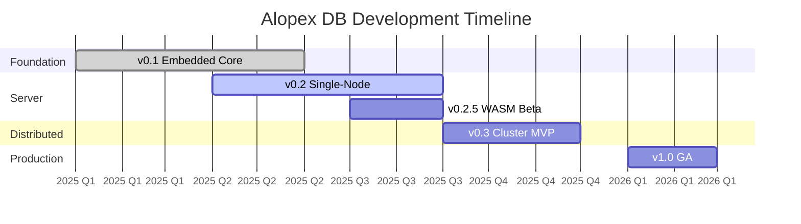

# Roadmap

This roadmap outlines the planned development of Alopex DB from the current pre-alpha state to production readiness.

## Current Status

!!! info "Pre-Alpha (v0.1)"

    Alopex DB is currently in **pre-alpha** stage. Core embedded functionality is being developed and tested. Not recommended for production use.

## Timeline



---

## v0.1 — Embedded Foundation { #v01 }

**Status**: :material-progress-check: In Progress
**Target**: Q2 2025

The foundation release focusing on embedded mode with basic vector support.

### Features

- [x] LSM-Tree storage engine
- [x] Write-Ahead Log (WAL)
- [x] Key-Value API
- [x] Basic transactions (single-writer)
- [x] Flat vector search (brute force)
- [ ] Vector persistence
- [ ] Crash recovery
- [ ] Basic benchmarks

### Demos Available

```bash
# Key-Value demo
./examples/embedded-kv/demo.sh

# Vector search demo
./examples/embedded-vector/demo_vector.sh
```

---

## v0.2 — Single-Node Server { #v02 }

**Status**: :material-calendar: Planned
**Target**: Q3 2025

Standalone server with SQL interface and advanced vector indexing.

### Features

- [ ] SQL parser (based on sqlparser-rs)
- [ ] Query planner and optimizer
- [ ] Basic query executor
- [ ] **HNSW vector index**
- [ ] HTTP REST API
- [ ] gRPC API
- [ ] Postgres wire protocol (basic)
- [ ] Parquet reader (Lake-Link Phase 1)
- [ ] Connection pooling
- [ ] Configuration system

### SQL Support

```sql
-- Target SQL features
CREATE TABLE, DROP TABLE
INSERT, UPDATE, DELETE
SELECT with WHERE, ORDER BY, LIMIT
JOIN (inner, left, right)
Aggregate functions (COUNT, SUM, AVG)
Vector operations (cosine_similarity, l2_distance)
```

---

## v0.2.5 — WebAssembly Beta { #v025 }

**Status**: :material-calendar: Planned
**Target**: Q3 2025

Browser runtime for edge and offline-first applications.

### Features

- [ ] WASM compilation target
- [ ] IndexedDB storage backend
- [ ] OPFS (Origin Private File System) support
- [ ] wasm-bindgen JavaScript bindings
- [ ] TypeScript type definitions
- [ ] npm package
- [ ] Example React/Vue components

### Usage Preview

```typescript
import { AlopexDB } from '@alopex-db/wasm';

const db = await AlopexDB.open('my-database');
await db.execute(`
  CREATE TABLE notes (
    id TEXT PRIMARY KEY,
    content TEXT,
    embedding VECTOR(384)
  )
`);
```

---

## v0.3 — Distributed MVP { #v03 }

**Status**: :material-calendar: Planned
**Target**: Q4 2025

Minimum viable distributed cluster with Raft consensus.

### Features

- [ ] **Raft consensus** (based on raft-rs)
- [ ] Range-based sharding
- [ ] Leader election
- [ ] Log replication
- [ ] Snapshot and recovery
- [ ] **Chirps mesh networking** (QUIC/SWIM)
- [ ] Cluster management CLI
- [ ] Basic monitoring (Prometheus metrics)
- [ ] Multi-node transactions (2PC)

### Cluster Architecture

```
┌─────────────────────────────────────────────────┐
│                   Clients                       │
└─────────────────────┬───────────────────────────┘
                      │
┌─────────────────────┴───────────────────────────┐
│              Load Balancer / Router             │
└─────────────────────┬───────────────────────────┘
                      │
        ┌─────────────┼─────────────┐
        │             │             │
   ┌────┴────┐   ┌────┴────┐   ┌────┴────┐
   │ Node 1  │   │ Node 2  │   │ Node 3  │
   │ (Range  │   │ (Range  │   │ (Range  │
   │  A-M)   │   │  M-Z)   │   │ Replica)│
   └─────────┘   └─────────┘   └─────────┘
```

---

## v1.0 — Production Ready { #v10 }

**Status**: :material-calendar: Planned
**Target**: Q1 2026

General availability release with production-grade features.

### Features

- [ ] Multi-region support
- [ ] Global transaction coordinator
- [ ] Automatic rebalancing
- [ ] Online schema changes
- [ ] Backup and restore
- [ ] Point-in-time recovery
- [ ] Full Lake-Link (S3, GCS, Azure)
- [ ] Data tiering (hot/cold)
- [ ] Advanced monitoring and alerting
- [ ] Performance tuning guide
- [ ] Security hardening
- [ ] SOC 2 compliance preparation

### Documentation

- [ ] Complete API reference
- [ ] Operations guide
- [ ] Performance tuning guide
- [ ] Security best practices
- [ ] Migration guides

---

## Future Considerations { #future }

Features being considered for post-1.0 releases:

### v1.1+

- [ ] Full-text search integration
- [ ] Time-series optimizations
- [ ] Materialized views
- [ ] Stored procedures
- [ ] Triggers
- [ ] Foreign data wrappers

### v2.0

- [ ] Multi-tenancy
- [ ] Serverless mode
- [ ] Auto-scaling
- [ ] Machine learning integration
- [ ] Query result caching

---

## Contributing

We welcome contributions! The best areas to contribute right now:

| Area | Priority | Difficulty |
|:-----|:---------|:-----------|
| Documentation | High | Easy |
| Test coverage | High | Medium |
| Benchmarks | Medium | Medium |
| SQL parser extensions | Medium | Hard |
| Storage optimizations | Low | Hard |

[:octicons-arrow-right-24: Contributing Guide](contributing.md)

---

## Changelog

### Latest Changes

- **2025-03**: Initial embedded KV demo
- **2025-02**: Project structure and design docs
- **2025-01**: Repository created

For detailed changes, see the [GitHub Releases](https://github.com/alopex-db/alopex/releases).
