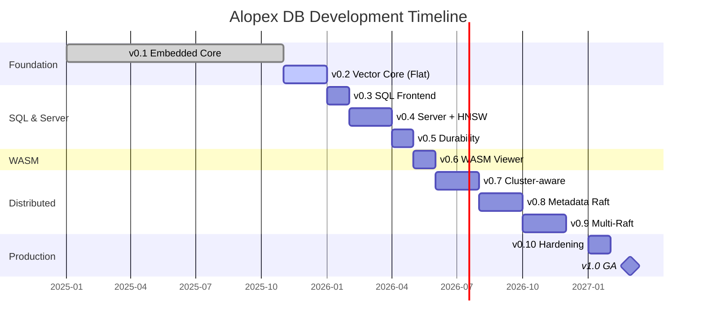

# Roadmap

This roadmap outlines the planned development of Alopex DB from the current alpha state to production readiness.

## Current Status

!!! success "v0.1 Complete (November 2025)"

    Alopex DB v0.1 **Embedded KV Core** is complete. Core embedded functionality with transactions, WAL, and columnar storage foundations are ready. Chirps v0.3 (cluster messaging) is also complete.

## Timeline



---

## v0.1 — Embedded KV Core { #v01 }

**Status**: :material-check-all: Complete
**Released**: November 2025

The foundation release with embedded KV storage, transactions, and columnar foundations.

### Completed Features

- [x] LSM-Tree storage engine
- [x] Write-Ahead Log (WAL) with crash recovery
- [x] Key-Value API (`open`/`put`/`get`/`delete`)
- [x] Transactions (`begin`/`commit`/`rollback`)
- [x] MVCC with Snapshot Isolation
- [x] Concurrent access (multi-thread safe)
- [x] Columnar segment layout design
- [x] Streaming read/write with backpressure
- [x] Large value (BLOB) chunked storage

### Acceptance Criteria Met

| Criterion | Status |
|:----------|:------:|
| DB open with defaults | :white_check_mark: |
| Transaction consistency | :white_check_mark: |
| WAL durability | :white_check_mark: |
| Rollback correctness | :white_check_mark: |
| Read-only transaction errors | :white_check_mark: |
| Crash recovery via WAL | :white_check_mark: |
| 2-thread concurrency | :white_check_mark: |
| Streaming O(chunk) memory | :white_check_mark: |

---

## v0.2 — Vector Core (Flat Search) { #v02 }

**Status**: :material-progress-clock: In Progress
**Target**: January 2026

Adding vector type and flat (brute-force) similarity search.

### Features

- [ ] Vector type (`VECTOR(dimension)`)
- [ ] **Flat search** (cosine, L2, inner product)
- [ ] Vector upsert/search API
- [ ] Metadata filtering with vectors
- [ ] Columnar compression implementation
- [ ] KV + Vector unified transactions

### Acceptance Criteria

- Top-K precision validation
- KV + Vector same-transaction consistency
- Benchmark baseline established
- Columnar compression roundtrip verified

---

## v0.3 — Local SQL Frontend { #v03 }

**Status**: :material-calendar: Planned
**Target**: February 2026

SQL parser and execution for embedded mode.

### Features

- [ ] SQL parser (based on `sqlparser-rs`)
- [ ] DDL: `CREATE TABLE`, `DROP TABLE`
- [ ] DML: `SELECT`, `INSERT`, `UPDATE`, `DELETE`
- [ ] SQL → Core mapping
- [ ] Embedded SQL + Vector interface

### SQL Preview

```sql
CREATE TABLE documents (
    id TEXT PRIMARY KEY,
    content TEXT,
    embedding VECTOR(384)
);

SELECT id, content, cosine_similarity(embedding, ?) as score
FROM documents
ORDER BY score DESC
LIMIT 10;
```

---

## v0.4 — Single-Node Server + HNSW { #v04 }

**Status**: :material-calendar: Planned
**Target**: April 2026

Standalone server with network APIs and HNSW indexing.

### Features

- [ ] `alopex-server` binary
- [ ] HTTP REST API
- [ ] gRPC API
- [ ] **HNSW vector index**
- [ ] `alopex-cli` client
- [ ] Basic authentication
- [ ] Connection pooling

---

## v0.5 — Durability & Reliability { #v05 }

**Status**: :material-calendar: Planned
**Target**: May 2026

Enhanced crash recovery and observability.

### Features

- [ ] WAL/crash recovery hardening
- [ ] Backup and restore
- [ ] Prometheus metrics
- [ ] Structured logging

---

## v0.6 — WASM Edition (Read-Only Viewer) { #v06 }

**Status**: :material-calendar: Planned
**Target**: June 2026

Browser-based read-only viewer for database snapshots.

### Features

- [ ] `wasm32-unknown-unknown` target
- [ ] Pre-built SSTable loader
- [ ] IndexedDB caching
- [ ] SQL SELECT only
- [ ] Vector Search (Flat only)
- [ ] npm package (`@alopex-db/wasm`)

### Limitations

| Feature | Supported |
|:--------|:---------:|
| SELECT queries | :white_check_mark: |
| INSERT/UPDATE/DELETE | :x: |
| Transactions | :x: |
| HNSW search | :x: |

### Usage Preview

```typescript
import { AlopexViewer } from '@alopex-db/wasm';

const viewer = await AlopexViewer.loadSnapshot('/data/snapshot.alopex');
const results = await viewer.query('SELECT * FROM products LIMIT 10');
```

---

## v0.7 — Cluster-Aware Alopex { #v07 }

**Status**: :material-calendar: Planned
**Target**: August 2026

**Depends on**: Chirps v0.3 (complete)

First cluster integration using Chirps for membership.

### Features

- [ ] `alopex-cluster` module
- [ ] Chirps membership integration
- [ ] Node discovery and events
- [ ] Logical sharding design
- [ ] Control/Ephemeral profiles only

!!! warning "Limitation"

    Durable profile not available (Chirps IggyBackend not yet implemented)

---

## v0.8 — Distributed Metadata & Raft { #v08 }

**Status**: :material-calendar: Planned
**Target**: October 2026

**Depends on**: Chirps v0.4 (Raft-ready transport)

Raft consensus for metadata and single data range.

### Features

- [ ] **Metadata Raft Group** (`raft-rs`)
- [ ] Chirps priority streams for Raft
- [ ] Single Data Range Raft (PoC)
- [ ] Shard/range metadata management
- [ ] Control profile for Raft messages

---

## v0.9 — Multi-Raft + CRDT { #v09 }

**Status**: :material-calendar: Planned
**Target**: December 2026

**Depends on**: Chirps v0.7+ (IggyBackend)

Full distributed capabilities with Multi-Raft and CRDT.

### Features

- [ ] **Multi-Raft** (range partitioning)
- [ ] **CRDT** (Counter, Set for eventual consistency)
- [ ] Changefeed via Durable profile
- [ ] 3-5 node clusters
- [ ] Distributed transactions
- [ ] Cluster monitor CLI

### Consistency Modes

```sql
-- Strong consistency (Raft)
CREATE TABLE orders (...) WITH (consistency = 'strong');

-- Eventual consistency (CRDT Counter)
CREATE TABLE metrics (...) WITH (consistency = 'eventual', crdt_type = 'counter');
```

---

## v0.10 — Hardening & Freeze { #v010 }

**Status**: :material-calendar: Planned
**Target**: February 2027

Stability testing and API freeze.

### Goals

- [ ] Single-node regression suite
- [ ] Cluster consistency tests
- [ ] Partition/recovery tests
- [ ] Configuration freeze
- [ ] API stability guarantee

---

## v1.0 — Production Ready { #v10 }

**Status**: :material-calendar: Planned
**Target**: Q1 2027

General availability release.

### Features

- [ ] 3-10 node production support
- [ ] Rolling upgrades
- [ ] Backup/restore procedures
- [ ] Complete documentation
- [ ] Tutorials and best practices
- [ ] API/ABI compatibility tests

---

## Chirps Roadmap { #chirps }

Alopex Chirps (cluster messaging layer) has its own development track:

| Version | Status | Features |
|:--------|:-------|:---------|
| v0.1-v0.3 | :white_check_mark: Complete | Gossip, SWIM, Membership API |
| v0.4 | :material-calendar: Planned | Raft-ready transport, priority streams |
| v0.5 | :material-calendar: Planned | Performance optimization |
| v0.6 | :material-calendar: Planned | Observability, admin API |
| v0.7+ | :material-calendar: Planned | IggyBackend, Durable profile |

---

## Future Considerations { #future }

Features being considered for post-1.0 releases:

### v1.1+

- [ ] Full-text search integration
- [ ] Time-series optimizations
- [ ] Materialized views
- [ ] Graph queries

### v2.0

- [ ] Multi-tenancy
- [ ] Serverless mode
- [ ] Auto-scaling
- [ ] ML integration

---

## Contributing

We welcome contributions! Priority areas:

| Area | Priority | Difficulty |
|:-----|:---------|:-----------|
| Documentation | High | Easy |
| Test coverage | High | Medium |
| Benchmarks | Medium | Medium |
| Vector search optimizations | Medium | Hard |
| SQL parser extensions | Medium | Hard |

[:octicons-arrow-right-24: Contributing Guide](contributing.md)

---

## Changelog

### Recent Updates

- **2025-11**: v0.1 Embedded KV Core complete
- **2025-11**: Chirps v0.3 complete (Gossip, SWIM, Membership)
- **2025-11**: Columnar storage design finalized
- **2025-03**: Initial embedded KV demo
- **2025-01**: Repository created

For detailed changes, see the [GitHub Releases](https://github.com/alopex-db/alopex/releases).
