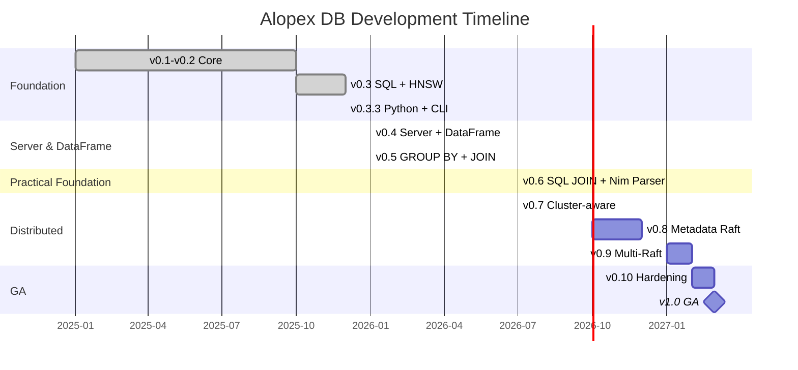

# Roadmap

This roadmap outlines the planned development of Alopex DB from the current state to production readiness.

## Current Status

!!! success "v0.7.6 Released — gRPC Cluster Administration (July 18, 2026)"

    **Alopex DB v0.7.6** is the latest release. The v0.7 series delivered the **alopex-cluster** crate (cluster-aware foundation), a **mode-parity verification suite**, and **gRPC cluster administration**. All workspace crates (core / sql / embedded / server / dataframe / cluster / cli) are published on crates.io at **v0.7.6**, with matching Python wheels on PyPI.

    ```bash
    # Rust
    cargo add alopex-embedded alopex-sql alopex-server alopex-dataframe alopex-cluster

    # Python
    pip install alopex
    ```

    Prebuilt CLI binaries for Linux / macOS (x86_64, aarch64) / Windows are attached to every [GitHub Release](https://github.com/alopex-db/alopex/releases).

!!! success "v0.6.0 Released — SQL JOIN/Subquery + Nim FFI Parser (July 7, 2026)"

    **Alopex DB v0.6.0** replaced the Rust SQL parser with a **Nim FFI parser** (MessagePack protocol) and added **SQL JOIN and subquery support**. Since v0.6.0 all workspace crates share a single aligned version.

## Timeline


```mermaid
gantt
    title Alopex DB Development Timeline
    dateFormat  YYYY-MM
    axisFormat  %Y-%m

    section Foundation
    v0.1-v0.2 Core          :done, 2025-01, 2025-10
    v0.3 SQL + HNSW         :done, 2025-10, 2025-12
    v0.3.3 Python + CLI     :done, 2025-12, 2025-12

    section Server & DataFrame
    v0.4 Server + DataFrame :done, 2026-01, 2026-01
    v0.5 GROUP BY + JOIN    :done, 2026-01, 2026-01

    section Practical Foundation
    v0.6 SQL JOIN + Nim Parser :done, 2026-07, 2026-07

    section Distributed
    v0.7 Cluster-aware      :done, 2026-07, 2026-07
    v0.8 Metadata Raft      :2026-10, 2026-12
    v0.9 Multi-Raft         :2027-01, 2027-02

    section GA
    v0.10 Hardening         :2027-02, 2027-03
    v1.0 GA                 :milestone, 2027-03, 0d
```

---

## Published Crates

The following crates are available on **crates.io**:

| Crate | Version | Description |
|:------|:--------|:------------|
| [](https://crates.io/crates/alopex-embedded) | v0.7.6 | Embedded database API |
| [](https://crates.io/crates/alopex-sql) | v0.7.6 | SQL parser, planner, executor |
| [](https://crates.io/crates/alopex-core) | v0.7.6 | Core storage engine |
| [](https://crates.io/crates/alopex-server) | v0.7.6 | HTTP/gRPC server |
| [](https://crates.io/crates/alopex-dataframe) | v0.7.6 | Polars-compatible DataFrame API |
| [](https://crates.io/crates/alopex-cluster) | v0.7.6 | Cluster-aware distributed mode |
| [](https://crates.io/crates/alopex-cli) | v0.7.6 | CLI with TUI / admin console |
| [](https://crates.io/crates/alopex-chirps) | v0.5.1 | Cluster messaging layer |
| [](https://crates.io/crates/alopex-skulk) | v0.2.0 | Time-series database on Alopex Core |

---

## Version Compatibility Matrix

| Alopex DB | [alopex-core](https://crates.io/crates/alopex-core) | [alopex-dataframe](https://crates.io/crates/alopex-dataframe) | [alopex-sql](https://crates.io/crates/alopex-sql) | [alopex-embedded](https://crates.io/crates/alopex-embedded) | [alopex-py](https://pypi.org/project/alopex/) | [Chirps](https://crates.io/crates/alopex-chirps) |
|:----------|:------------|:-----------------|:-----------|:----------------|:----------|:-------|
| **v0.3** | v0.3.0 | - | v0.3.0 | v0.3.0 | - | v0.5.0 |
| **v0.3.3** | v0.3.3 | - | v0.3.0 | v0.3.3 | **v0.3.3** | v0.5.0 |
| **v0.4.0** | **v0.4.0** | **v0.1.0** | **v0.4.0** | **v0.4.0** | **v0.4.0** | v0.5.0 |
| **v0.4.2** | v0.4.2 | v0.1.0 | v0.4.2 | v0.4.2 | v0.4.0 | v0.5.0 |
| **v0.5.0** | **v0.5.0** | **v0.2.0** | **v0.5.0** | **v0.5.0** | v0.4.0 | **v0.5.1** |
| **v0.6.0** | **v0.6.0** | **v0.6.0** | **v0.6.0** | **v0.6.0** | **v0.6.0** | v0.5.1 |
| **v0.7.6** | **v0.7.6** | **v0.7.6** | **v0.7.6** | **v0.7.6** | **v0.7.6** | v0.5.1 |
| v1.0 | v1.0 | v1.0 | v1.0 | v1.0 | v1.0 | v0.9 |

!!! note "Aligned Versioning Since v0.6.0"
    Up to v0.5.x, alopex-py and alopex-dataframe followed their own versioning schemes. Since **v0.6.0**, all workspace crates and the Python package share a single aligned version per release.

---

## Phase 1: Foundation (v0.1 - v0.2) { #phase1 }

**Status**: :material-check-all: Complete

### v0.1 — Embedded KV Core

- [x] LSM-Tree storage engine
- [x] Write-Ahead Log (WAL) with crash recovery
- [x] Key-Value API (`open`/`put`/`get`/`delete`)
- [x] Transactions (`begin`/`commit`/`rollback`)
- [x] MVCC with Snapshot Isolation

### v0.2 — Vector Core + Columnar

- [x] Vector type (`VECTOR(dimension)`)
- [x] Flat search (cosine, L2, inner product)
- [x] Columnar segment storage with compression
- [x] In-memory mode support
- [x] Vector delete/compaction

---

## Phase 2: SQL & HNSW (v0.3) { #phase2 }

**Status**: :material-check-all: Complete — **crates.io Published**

### v0.3 — SQL Frontend + HNSW Index

The first public release on crates.io with full SQL support and HNSW indexing.

#### Completed Features

- [x] SQL Parser (DDL: CREATE/DROP TABLE/INDEX, DML: SELECT/INSERT/UPDATE/DELETE)
- [x] Query Planner with Catalog and LogicalPlan
- [x] SQL Executor (iterator-based execution)
- [x] `vector_similarity()` function with Top-K optimization
- [x] **HNSW Index** for high-performance similarity search
- [x] Columnar COPY/Bulk Load (Parquet/CSV → ColumnarSegment)
- [x] Embedded Integration (`Database::execute_sql`, `Transaction::execute_sql`)

#### SQL Examples

```sql
-- Create table with vector column
CREATE TABLE documents (
    id INTEGER PRIMARY KEY,
    content TEXT,
    embedding VECTOR(1536)
);

-- Insert with vector
INSERT INTO documents (id, content, embedding)
VALUES (1, 'Hello world', [0.1, 0.2, ...]);

-- Hybrid search with vector similarity
SELECT id, content, vector_similarity(embedding, ?) AS score
FROM documents
ORDER BY score DESC
LIMIT 10;

-- Create HNSW index
CREATE INDEX idx_emb ON documents USING HNSW (embedding);
```

---

## Phase 3: Python & Server (v0.3.3 - v0.4) { #phase3 }

### v0.3.3 — Python Wrapper (alopex-py) { #v033 }

**Status**: :material-check-all: Complete — **PyPI Published**
**Released**: December 2025

Python bindings via PyO3 for the embedded database.

#### Features

- [x] PyO3 module structure with error handling
- [x] `Database` / `Transaction` bindings
- [x] SQL API bindings (`execute_sql`, `QueryResult`)
- [x] Type stubs (`.pyi` files) for IDE support
- [x] CI/CD with maturin + pytest + TestPyPI verification
- [ ] Vector/HNSW API bindings — *planned for v0.3.4*
- [ ] NumPy integration (zero-copy arrays) — *planned for v0.3.5*

#### Preview

```python
import alopex

# Open database
db = alopex.Database.open("./my_data")

# Execute SQL
results = db.execute_sql(
    "SELECT * FROM docs WHERE vector_similarity(embedding, ?) > 0.8",
    [query_embedding]
)

# HNSW search
similar = db.search_hnsw("docs", query_embedding, k=10)
for doc_id, score in similar:
    print(f"{doc_id}: {score:.4f}")
```

### v0.4.0 — Server Mode + DataFrame { #v04 }

**Status**: :material-check-all: Complete — **crates.io Published**
**Released**: January 2026

Standalone server and Polars-compatible DataFrame API foundation.

#### Server Features

- [x] `alopex-server` binary with HTTP/gRPC API
- [x] SQL API (DDL/DML/SELECT with streaming)
- [x] Vector API (HNSW/Flat search)
- [x] Session Manager with TLS support
- [x] Observability (metrics, tracing)
- [x] Runtime-agnostic async facade with tokio adapter

#### DataFrame Features (alopex-dataframe v0.1.0)

- [x] `DataFrame` / `LazyFrame` / `Expr` types
- [x] I/O: `read_csv`, `read_parquet`, `scan_*` variants
- [x] Operations: `select`, `filter`, `with_columns`
- [x] Aggregations: `group_by`, `agg`, `sum`, `mean`, etc.
- [x] Lazy evaluation with query optimization
- [x] Predicate/Projection Pushdown

#### DataFrame Preview

```rust
use alopex_dataframe::{DataFrame, col, lit};

let df = DataFrame::read_parquet("data.parquet")?;

let result = df
    .lazy()
    .filter(col("score").gt(lit(0.5)))
    .select([col("id"), col("content")])
    .collect()?;
```

---

## Phase 4: GROUP BY, DataFrame P1, Practical Foundation (v0.5 - v0.6) { #phase4 }

### v0.5 — GROUP BY + DataFrame P1 { #v05 }

**Status**: :material-check-all: Complete — **crates.io Published**
**Released**: January 2026

- [x] GROUP BY / Aggregation (alopex-sql v0.5.0)
- [x] DataFrame P1: JOIN (inner, left, right, full, semi, anti)
- [x] DataFrame P1: sort / head / tail / unique
- [x] DataFrame P1: fill_null / drop_nulls / null_count
- [x] Server API extensions (alopex-server v0.5.0)
- [ ] WAL/Crash recovery hardening — *planned for v0.5.x*
- [ ] Performance benchmarks — *planned for v0.5.x*

### v0.6 — SQL JOIN/Subquery + Nim FFI Parser { #v06 }

**Status**: :material-check-all: Complete — **crates.io Published**
**Released**: July 7, 2026

The SQL frontend was re-architected: the Rust SQL parser was replaced with a **Nim FFI parser** communicating over MessagePack, and JOIN/subquery support landed.

- [x] SQL JOIN support (alopex-sql v0.6)
- [x] SQL Subquery support
- [x] Nim FFI SQL parser (MessagePack protocol) — parser shared libraries ship with each release
- [x] Workspace version alignment across all crates and alopex-py

Carried forward toward v1.0: DataFrame P2 (cast / pivot / unpivot / window functions), embedded durability hardening, and server operation hardening.

WASM/web runtime support is deferred and will be re-evaluated after v1.0 based on adoption and product priorities.

---

## Phase 5: Distributed (v0.7 - v0.9) { #phase5 }

### v0.7 — Cluster-Aware { #v07 }

**Status**: :material-check-all: Complete — **crates.io Published**
**Released**: July 14–18, 2026 (v0.7.0 → v0.7.6)

- [x] `alopex-cluster` module published on crates.io
- [x] Mode-parity verification suite (v0.7.1)
- [x] gRPC cluster administration (v0.7.6)
- [x] Release packaging hardening (rpath propagation, Nim parser vendoring)

### v0.8 — Metadata Raft { #v08 }

**Status**: :material-calendar: Planned
**Target**: Q4 2026
**Depends on**: Chirps v0.6

- [ ] Metadata Raft Group
- [ ] MultiRaftManager integration
- [ ] Shard/range metadata management

### v0.9 — Multi-Raft + CRDT { #v09 }

**Status**: :material-calendar: Planned
**Target**: Q1 2027
**Depends on**: Chirps v0.7

- [ ] Multi-Raft (range partitioning)
- [ ] CRDT (Counter, Set for eventual consistency)
- [ ] Changefeed via Durable profile
- [ ] Distributed transactions

---

## Phase 6: Production (v0.10 - v1.0) { #phase6 }

### v0.10 — Hardening { #v010 }

**Status**: :material-calendar: Planned
**Target**: Q1 2027

- [ ] Single-node regression suite
- [ ] Cluster consistency tests
- [ ] Partition/recovery tests
- [ ] Configuration freeze
- [ ] API stability guarantee

### v1.0 — General Availability { #v10 }

**Status**: :material-calendar: Planned
**Target**: Q1 2027

- [ ] 3-10 node production support
- [ ] Rolling upgrades
- [ ] Complete documentation
- [ ] API/ABI compatibility tests
- [ ] Federation support

---

## Chirps Roadmap { #chirps }

Alopex Chirps (cluster messaging layer) has its own development track:

| Version | Status | Features |
|:--------|:-------|:---------|
| v0.1-v0.3 | :white_check_mark: Complete | Gossip, SWIM, Membership API |
| v0.4 | :white_check_mark: Complete | Raft-ready transport, QoS streams |
| v0.5 | :white_check_mark: Complete | Raft Consensus API, WalRaftStorage |
| v0.5.1 | :white_check_mark: Complete | File Transfer API |
| v0.6 | :material-calendar: Planned | Multi-Raft, TSO, Observability |
| v0.7+ | :material-calendar: Planned | IggyBackend, Durable profile |

---

## Alopex Skulk Roadmap { #skulk }

Alopex Skulk (the time-series database of the family, built on Alopex Core) is versioned independently:

| Version | Status | Notes |
|:--------|:-------|:------|
| v0.1.0 | :white_check_mark: Released (Dec 18, 2025) | Initial public release |
| v0.2.0 | :white_check_mark: Released (Dec 23, 2025) — **crates.io Published** | Current release |

Skulk's feature set — Gorilla compression, automatic TTL/downsampling, PromQL & SQL-TS queries — is described in [Skulk concepts](concepts/skulk.md).

---

## alopex-dataframe Roadmap { #dataframe }

Polars-compatible DataFrame engine in pure Rust. Since v0.6.0 the crate is versioned with the workspace (currently **v0.7.6**); the remaining feature phases below are tracked by phase name.

| Phase | Features | Status |
|:------|:---------|:-------|
| DF-0 | DataFrame/Series types, Arrow integration, CSV/Parquet I/O | :white_check_mark: Complete |
| DF-1 | JOIN (all types), sort/head/tail/unique, fill_null/drop_nulls | :white_check_mark: Complete |
| DF-2 | cast, pivot/unpivot, window functions (over, rolling, shift, rank) | :material-calendar: Planned |
| DF-3 | str.* namespace, dt.* namespace, list.* + explode/implode | :material-calendar: Planned |
| DF-4 | Streaming execution, CSE optimization, concat | :material-calendar: Planned |

---

## alopex-py Roadmap { #python }

Python bindings with NumPy and DataFrame support. Up to v0.4.0 alopex-py followed its own versioning scheme; since **v0.6.0** it is released in lockstep with the Rust workspace (currently **v0.7.6** on PyPI, wheels attached to every release).

| Version | Phase | Features | Status |
|:--------|:------|:---------|:-------|
| **v0.3.3** | Phase 1 | Database/Transaction/SQL basic API | :white_check_mark: PyPI Published |
| **v0.3.5** | Phase 1+ | NumPy integration (zero-copy arrays + GIL release) | :white_check_mark: PyPI Published |
| **v0.4.0** | Phase 1+ | Catalog API (Polars Unity Catalog compatible) | :white_check_mark: PyPI Published |
| **v0.6.0–v0.7.6** | Aligned | Workspace-aligned releases (SQL JOIN/subquery, cluster-aware engine) | :white_check_mark: PyPI Published |
| Phase 2 | — | DataFrame API MVP via alopex-dataframe | :material-calendar: Planned |
| Phase 3 | — | DataFrame namespaces (str/dt/list) | :material-calendar: Planned |
| GA | v1.0 | Polars-compatible DataFrame + API stabilization | :material-calendar: Planned |

---

## Contributing

We welcome contributions! Priority areas:

| Area | Priority | Difficulty |
|:-----|:---------|:-----------|
| Documentation | High | Easy |
| Test coverage | High | Medium |
| Python bindings | High | Medium |
| DataFrame operations | Medium | Medium |
| SQL parser extensions | Medium | Hard |
| Vector search optimizations | Medium | Hard |

[:octicons-arrow-right-24: Contributing Guide](contributing.md)

---

## Changelog

### Recent Updates

- **2026-07-22**: **Alopex Enterprise** entered the design phase — commercial middleware on the Alopex OSS foundation (Security Suite, Unified Query Model, Observe/SRE, Infrastructure packages)
- **2026-07-22**: **Alopex Data UI** development started — [concept site](https://alopex-db.github.io/alopex-ui-pages/) published (a consistent UI model for data applications on one DataSource contract)
- **2026-07-18**: **v0.7.6 released** — **gRPC cluster administration**; CLI binaries and Python wheels attached to the release
- **2026-07-15 〜 07-18**: v0.7.1–v0.7.5 — mode-parity verification suite, release packaging fixes (rpath propagation, Nim parser vendoring)
- **2026-07-14**: **v0.7.0 released** — cluster-aware release; **alopex-cluster** published on crates.io
- **2026-07-07**: **v0.6.0 released** — **SQL JOIN/Subquery** support; Rust SQL parser replaced with **Nim FFI parser** (MessagePack); workspace versions aligned across all crates and alopex-py
- **2026-01-29**: **v0.5.0 released** — GROUP BY/Aggregation, DataFrame P1 (JOIN/sort/null), Server API extensions **published on crates.io**
- **2026-01-24**: alopex-cli v0.4.2 **released** — TUI default, Admin TUI, security fixes, SELECT literal support
- **2026-01-14**: v0.4.0 Server + DataFrame **published on crates.io**
- **2026-01-01**: alopex-chirps v0.5.1 **released** — File Transfer API
- **2025-12-27**: v0.3.3 alopex-py **published on PyPI**
- **2025-12-23**: alopex-skulk v0.2.0 **released** — time-series database on Alopex Core, **published on crates.io**
- **2025-12-18**: alopex-skulk v0.1.0 **released** — initial public release
- **2025-12**: v0.3 SQL Frontend + HNSW **published on crates.io**
- **2025-11**: HNSW index implementation complete
- **2025-10**: alopex-sql Parser/Planner/Executor complete
- **2025-09**: Columnar-based Vector Store complete
- **2025-08**: LSM-Tree file mode complete
- **2025-06**: In-memory mode complete
- **2025-01**: Project started

For detailed changes, see the [GitHub Releases](https://github.com/alopex-db/alopex/releases).
