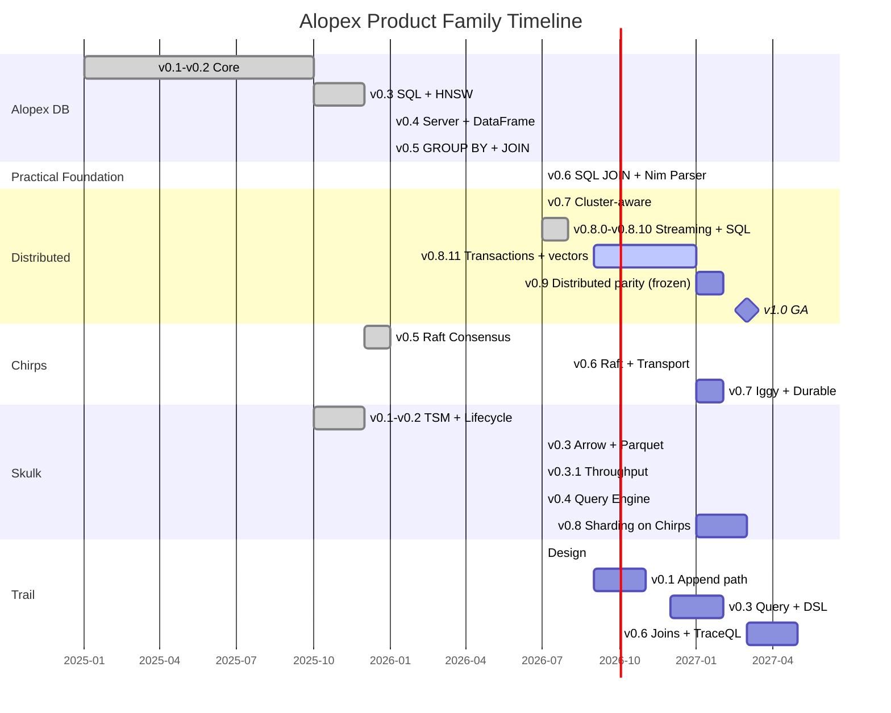

# Roadmap

This roadmap outlines the planned development of Alopex DB from the current state to production readiness.

## Current Status

[:octicons-tag-24: ](https://github.com/alopex-db/alopex/releases/latest)

!!! success "Latest Alopex DB release published and verified"

    The current release adds exact `DECIMAL`/`NUMERIC`, native
    `DATE`/`TIME`/`INTERVAL`, `JSON`/`JSONB`, nested `ARRAY`/`MAP`/`STRUCT`
    values, and deterministic full-text search on top of the portable SQL
    function set and bounded KV key search, with matching embedded/server
    behavior across the published Rust and Python packages. The badge above
    reads the latest GitHub release automatically; use its release notes for
    the exact version scope.

    ```bash
    # Rust
    cargo add alopex-embedded alopex-sql alopex-server alopex-dataframe alopex-cluster

    # Python
    pip install alopex
    ```

    Prebuilt CLI binaries for Linux / macOS (x86_64, aarch64) / Windows are attached to every [GitHub Release](https://github.com/alopex-db/alopex/releases).

!!! warning "v0.8 release train active; v0.9 frozen"

    v0.8.7 through v0.8.10 are published. Development and publication continue
    through **v0.8.11**. v0.9 development and release operations are
    frozen until every release in that train is published and verified. The
    Nim parser contract number is ABI metadata, not a separate release series.

!!! success "v0.6.0 Released — SQL JOIN/Subquery + Nim FFI Parser (July 7, 2026)"

    **Alopex DB v0.6.0** replaced the Rust SQL parser with a **Nim FFI parser** (MessagePack protocol) and added **SQL JOIN and subquery support**. Since v0.6.0 all workspace crates share a single aligned version.

!!! success "Alopex Skulk v0.4.0 Released — Embedded PromQL + SQL-TS (July 31, 2026)"

    Skulk now includes an HTTP-independent **embedded query engine** for PromQL, SQL-TS, and logical plans, with Arrow result streams, predicate pruning, bounded metadata enumeration, and out-of-order admission policy. Its v0.3 WAL, manifest, and Parquet formats remain readable.

    ```bash
    cargo add alopex-skulk
    ```

    [Skulk roadmap](#skulk) · [What changed and why](concepts/skulk.md)

!!! info "Alopex Trail — in design, ready to start"

    A log and event store with **late-bound schema** — nothing to declare
    before writing, nothing to define afterwards; column types bind at read
    time. Reuses Skulk's append-only machinery. The design is open before the
    code exists, so the API can still change based on what you need.

    [Trail roadmap](#trail) · [Read the concept](concepts/trail.md)

## Timeline


```mermaid
gantt
    title Alopex Product Family Timeline
    dateFormat  YYYY-MM
    axisFormat  %Y-%m

    section Alopex DB
    v0.1-v0.2 Core          :done, 2025-01, 2025-10
    v0.3 SQL + HNSW         :done, 2025-10, 2025-12
    v0.4 Server + DataFrame :done, 2026-01, 2026-01
    v0.5 GROUP BY + JOIN    :done, 2026-01, 2026-01

    section Practical Foundation
    v0.6 SQL JOIN + Nim Parser :done, 2026-07, 2026-07

    section Distributed
    v0.7 Cluster-aware      :done, 2026-07, 2026-07
    v0.8.0-v0.8.10 Streaming + SQL :done, 2026-07, 2026-08
    v0.8.11 Transactions + vectors :active, 2026-09, 2027-01
    v0.9 Distributed parity (frozen) :2027-01, 2027-02
    v1.0 GA                 :milestone, 2027-03, 0d

    section Chirps
    v0.5 Raft Consensus     :done, 2025-12, 2026-01
    v0.6 Raft + Transport   :done, 2026-08, 2026-08
    v0.7 Iggy + Durable     :2027-01, 2027-02

    section Skulk
    v0.1-v0.2 TSM + Lifecycle :done, 2025-10, 2025-12
    v0.3 Arrow + Parquet    :done, 2026-07, 2026-07
    v0.3.1 Throughput       :done, 2026-07, 2026-07
    v0.4 Query Engine       :done, 2026-07, 2026-07
    v0.8 Sharding on Chirps :2027-01, 2027-03

    section Trail
    Design                  :done, 2026-07, 2026-07
    v0.1 Append path        :2026-09, 2026-11
    v0.3 Query + DSL        :2026-12, 2027-02
    v0.6 Joins + TraceQL    :2027-03, 2027-05
```

---

## Published Crates

The following crates are available on **crates.io**:

| Crate | Version | Description |
|:------|:--------|:------------|
| [](https://crates.io/crates/alopex-embedded) | latest | Embedded database API |
| [](https://crates.io/crates/alopex-sql) | latest | SQL parser, planner, executor |
| [](https://crates.io/crates/alopex-core) | latest | Core storage engine |
| [](https://crates.io/crates/alopex-server) | latest | HTTP/gRPC server |
| [](https://crates.io/crates/alopex-dataframe) | latest | Polars-compatible DataFrame API |
| [](https://crates.io/crates/alopex-cluster) | latest | Cluster-aware distributed mode |
| [](https://crates.io/crates/alopex-cli) | latest | CLI with TUI / admin console |
| [](https://crates.io/crates/alopex-chirps) | v0.6.3 | Cluster messaging layer |
| [](https://crates.io/crates/alopex-skulk) | v0.4.0 | Time-series storage and ingest core |

!!! note "Independent version series"

    [Skulk](concepts/skulk.md) and [Chirps](concepts/chirps.md) are separate
    repositories with their own release cadence. They do not track the Alopex DB
    version number. Their badges above resolve each latest release independently.

---

## Version Compatibility Matrix

| Alopex DB | [alopex-core](https://crates.io/crates/alopex-core) | [alopex-dataframe](https://crates.io/crates/alopex-dataframe) | [alopex-sql](https://crates.io/crates/alopex-sql) | [alopex-embedded](https://crates.io/crates/alopex-embedded) | [alopex-py](https://pypi.org/project/alopex/) | [Chirps](https://crates.io/crates/alopex-chirps) |
|:----------|:------------|:-----------------|:-----------|:----------------|:----------|:-------|
| **v0.3** | v0.3.0 | - | v0.3.0 | v0.3.0 | - | v0.5.0 |
| **v0.3.3** | v0.3.3 | - | v0.3.0 | v0.3.3 | **v0.3.3** | v0.5.0 |
| **v0.4.0** | **v0.4.0** | **v0.1.0** | **v0.4.0** | **v0.4.0** | **v0.4.0** | v0.5.0 |
| **v0.4.2** | v0.4.2 | v0.1.0 | v0.4.2 | v0.4.2 | v0.4.0 | v0.5.0 |
| **v0.5.0** | **v0.5.0** | **v0.2.0** | **v0.5.0** | **v0.5.0** | v0.4.0 | **v0.5.1** |
| **v0.6.0** | **v0.6.0** | **v0.6.0** | **v0.6.0** | **v0.6.0** | **v0.6.0** | v0.5.1 |
| **v0.7.6** | **v0.7.6** | **v0.7.6** | **v0.7.6** | **v0.7.6** | **v0.7.6** | v0.5.1 |
| **v0.8.6** | **v0.8.6** | **v0.8.6** | **v0.8.6** | **v0.8.6** | **v0.8.6** | **v0.5.2** |
| **v0.8.9** | **v0.8.9** | **v0.8.9** | **v0.8.9** | **v0.8.9** | **v0.8.9** | **v0.5.2** |
| **v0.8.10** | **v0.8.10** | **v0.8.10** | **v0.8.10** | **v0.8.10** | **v0.8.10** | **v0.5.2** |
| v1.0 | v1.0 | v1.0 | v1.0 | v1.0 | v1.0 | v0.9 |

!!! note "Aligned Versioning Since v0.6.0"
    Up to v0.5.x, alopex-py and alopex-dataframe followed their own versioning schemes. Since **v0.6.0**, all workspace crates and the Python package share a single aligned version per release.

!!! note "Skulk is not in this matrix"
    Skulk does not depend on `alopex-core` or `alopex-sql`, so it does not track
    the Alopex DB version. It meets the family at the Chirps layer: sharding at
    Skulk v0.8 (Chirps membership) and replication at v0.9 (Chirps Raft). See
    [Skulk Roadmap](#skulk).

---

## Phase 1: Foundation (v0.1 - v0.2) { #phase1 }

**Status**: :material-check-all: Complete

### v0.1 — Embedded KV Core

- [x] LSM-Tree storage engine
- [x] Write-Ahead Log (WAL) with crash recovery
- [x] Key-Value API (`open`/`put`/`get`/`delete`)
- [x] Transactions (`begin`/`commit`/`rollback`)
- [x] MVCC with Snapshot Isolation

### v0.2 — Vector Core + Columnar

- [x] Vector type (`VECTOR(dimension)`)
- [x] Flat search (cosine, L2, inner product)
- [x] Columnar segment storage with compression
- [x] In-memory mode support
- [x] Vector delete/compaction

---

## Phase 2: SQL & HNSW (v0.3) { #phase2 }

**Status**: :material-check-all: Complete — **crates.io Published**

### v0.3 — SQL Frontend + HNSW Index

The first public release on crates.io with full SQL support and HNSW indexing.

#### Completed Features

- [x] SQL Parser (DDL: CREATE/DROP TABLE/INDEX, DML: SELECT/INSERT/UPDATE/DELETE)
- [x] Query Planner with Catalog and LogicalPlan
- [x] SQL Executor (iterator-based execution)
- [x] `vector_similarity()` function with Top-K optimization
- [x] **HNSW Index** for high-performance similarity search
- [x] Columnar COPY/Bulk Load (Parquet/CSV → ColumnarSegment)
- [x] Embedded Integration (`Database::execute_sql`, `Transaction::execute_sql`)

#### SQL Examples

```sql
-- Create table with vector column
CREATE TABLE documents (
    id INTEGER PRIMARY KEY,
    content TEXT,
    embedding VECTOR(1536)
);

-- Insert with vector
INSERT INTO documents (id, content, embedding)
VALUES (1, 'Hello world', [0.1, 0.2, ...]);

-- Hybrid search with vector similarity
SELECT id, content, vector_similarity(embedding, ?) AS score
FROM documents
ORDER BY score DESC
LIMIT 10;

-- Create HNSW index
CREATE INDEX idx_emb ON documents USING HNSW (embedding);
```

---

## Phase 3: Python & Server (v0.3.3 - v0.4) { #phase3 }

### v0.3.3 — Python Wrapper (alopex-py) { #v033 }

**Status**: :material-check-all: Complete — **PyPI Published**
**Released**: December 2025

Python bindings via PyO3 for the embedded database.

#### Features

- [x] PyO3 module structure with error handling
- [x] `Database` / `Transaction` bindings
- [x] SQL API bindings (`execute_sql`, `QueryResult`)
- [x] Type stubs (`.pyi` files) for IDE support
- [x] CI/CD with maturin + pytest + TestPyPI verification
- [ ] Vector/HNSW API bindings — *planned for v0.3.4*
- [ ] NumPy integration (zero-copy arrays) — *planned for v0.3.5*

#### Preview

```python
import alopex

# Open database
db = alopex.Database.open("./my_data")

# Execute SQL
results = db.execute_sql(
    "SELECT * FROM docs WHERE vector_similarity(embedding, ?) > 0.8",
    [query_embedding]
)

# HNSW search
similar = db.search_hnsw("docs", query_embedding, k=10)
for doc_id, score in similar:
    print(f"{doc_id}: {score:.4f}")
```

### v0.4.0 — Server Mode + DataFrame { #v04 }

**Status**: :material-check-all: Complete — **crates.io Published**
**Released**: January 2026

Standalone server and Polars-compatible DataFrame API foundation.

#### Server Features

- [x] `alopex-server` binary with HTTP/gRPC API
- [x] SQL API (DDL/DML/SELECT with streaming)
- [x] Vector API (HNSW/Flat search)
- [x] Session Manager with TLS support
- [x] Observability (metrics, tracing)
- [x] Runtime-agnostic async facade with tokio adapter

#### DataFrame Features (alopex-dataframe v0.1.0)

- [x] `DataFrame` / `LazyFrame` / `Expr` types
- [x] I/O: `read_csv`, `read_parquet`, `scan_*` variants
- [x] Operations: `select`, `filter`, `with_columns`
- [x] Aggregations: `group_by`, `agg`, `sum`, `mean`, etc.
- [x] Lazy evaluation with query optimization
- [x] Predicate/Projection Pushdown

#### DataFrame Preview

```rust
use alopex_dataframe::{DataFrame, col, lit};

let df = DataFrame::read_parquet("data.parquet")?;

let result = df
    .lazy()
    .filter(col("score").gt(lit(0.5)))
    .select([col("id"), col("content")])
    .collect()?;
```

---

## Phase 4: GROUP BY, DataFrame P1, Practical Foundation (v0.5 - v0.6) { #phase4 }

### v0.5 — GROUP BY + DataFrame P1 { #v05 }

**Status**: :material-check-all: Complete — **crates.io Published**
**Released**: January 2026

- [x] GROUP BY / Aggregation (alopex-sql v0.5.0)
- [x] DataFrame P1: JOIN (inner, left, right, full, semi, anti)
- [x] DataFrame P1: sort / head / tail / unique
- [x] DataFrame P1: fill_null / drop_nulls / null_count
- [x] Server API extensions (alopex-server v0.5.0)
- [ ] WAL/Crash recovery hardening — *planned for v0.5.x*
- [ ] Performance benchmarks — *planned for v0.5.x*

### v0.6 — SQL JOIN/Subquery + Nim FFI Parser { #v06 }

**Status**: :material-check-all: Complete — **crates.io Published**
**Released**: July 7, 2026

The SQL frontend was re-architected: the Rust SQL parser was replaced with a **Nim FFI parser** communicating over MessagePack, and JOIN/subquery support landed.

- [x] SQL JOIN support (alopex-sql v0.6)
- [x] SQL Subquery support
- [x] Nim FFI SQL parser (MessagePack protocol) — parser shared libraries ship with each release
- [x] Workspace version alignment across all crates and alopex-py

Carried forward toward v1.0: DataFrame P2 (cast / pivot / unpivot / window functions), embedded durability hardening, and server operation hardening.

WASM/web runtime support is deferred and will be re-evaluated after v1.0 based on adoption and product priorities.

---

## Phase 5: Distributed (v0.7 - v0.9) { #phase5 }

### v0.7 — Cluster-Aware { #v07 }

**Status**: :material-check-all: Complete — **crates.io Published**
**Released**: July 14–18, 2026 (v0.7.0 → v0.7.6)

- [x] `alopex-cluster` module published on crates.io
- [x] Mode-parity verification suite (v0.7.1)
- [x] gRPC cluster administration (v0.7.6)
- [x] Release packaging hardening (rpath propagation, Nim parser vendoring)

### v0.8 — Single-Node Compatibility Closure { #v08 }

**Status**: :material-progress-wrench: Active — **v0.8.10 published; v0.8.11 remains**
**Released so far**: July 23–August 28, 2026
**Uses**: Chirps v0.5.2 (the standalone Chirps release series is currently v0.6.3)

- [x] Cluster metadata, lifecycle, routing diagnostics, and authenticated distributed-read contracts
- [x] Multi-statement and streaming SQL across HTTP, gRPC, and CLI
- [x] Bounded/incremental CSV and Parquet DataFrame streaming
- [x] Sync/async Python local APIs, SQL streams, transactions, and DataFrame bindings
- [x] PromQL and SQL-TS parser contracts (Nim ABI 0.2.0)
- [x] SQL correctness and name-resolution hardening (v0.8.2–v0.8.3)
- [x] Parser contract 0.4.0 and release-asset hardening (v0.8.4–v0.8.5)
- [x] Alias, `REAL`, `CASE`, set operations, CTE, and basic window contracts (v0.8.6)
- [x] Recursive CTE and window correctness closure (v0.8.7)
- [x] Portable relational grammar, single-file convergence, and Python server client (v0.8.8)
- [x] Portable SQL functions and bounded KV glob/regex search (v0.8.9)
- [x] Exact `DECIMAL`, native temporal, `JSON`/`JSONB`, nested, and full-text types (v0.8.10)
- [ ] SQL application and administration surface — transaction control, parameters, introspection, schema evolution, constraints, advanced DML, `COPY`, and identity/sequences (v0.8.11)
- [ ] HNSW correctness, recall, and latency closure with published conformance evidence (v0.8.11)

Remote execution, distributed transactions, and client/connection-pool APIs remain outside the v0.8 supported scope.

### v0.9 — Distributed Capability and Parity { #v09 }

**Status**: :material-snowflake: Frozen until v0.8.11 is published and verified
**Depends on**: Chirps v0.7

- [ ] Multi-Raft (range partitioning)
- [ ] CRDT (Counter, Set for eventual consistency)
- [ ] Changefeed via Durable profile
- [ ] Distributed transactions

---

## Phase 6: Production (v0.10 - v1.0) { #phase6 }

### v0.10 — Hardening { #v010 }

**Status**: :material-calendar: Planned
**Target**: Q1 2027

- [ ] Single-node regression suite
- [ ] Cluster consistency tests
- [ ] Partition/recovery tests
- [ ] Configuration freeze
- [ ] API stability guarantee

### v1.0 — General Availability { #v10 }

**Status**: :material-calendar: Planned
**Target**: Q1 2027

- [ ] 3-10 node production support
- [ ] Rolling upgrades
- [ ] Complete documentation
- [ ] API/ABI compatibility tests
- [ ] Federation support

---

## Chirps Roadmap { #chirps }

Alopex Chirps (cluster messaging layer) has its own development track:

| Version | Status | Features |
|:--------|:-------|:---------|
| v0.1-v0.3 | :white_check_mark: Complete | Gossip, SWIM, Membership API |
| v0.4 | :white_check_mark: Complete | Raft-ready transport, QoS streams |
| v0.5 | :white_check_mark: Complete | Raft Consensus API, WalRaftStorage |
| v0.5.1 | :white_check_mark: Complete | File Transfer API |
| **v0.6.1** | :white_check_mark: Released (Aug 9, 2026) | Raft storage/node APIs, observability, hardened QUIC/SWIM and resumable file transfer |
| **v0.6.2** | :white_check_mark: Released (Aug 11, 2026) | Production QUIC per-connection memory bounds |
| **v0.6.3** | :white_check_mark: **Released (Aug 11, 2026)** | **Memory-contract and mTLS conformance** |
| v0.7 | :material-calendar: Planned | IggyBackend, Durable profile |
| v0.8+ | :material-calendar: Planned | Federation profile, cross-cluster mTLS |

!!! note "Durable profile"

    `MessageProfile::Durable` is defined in the API today but is rejected at
    runtime until the Iggy backend lands in **v0.7**. `MessageBackend` and
    `MessageProfile` themselves shipped early, in v0.4/v0.5.

---

## Skulk Roadmap { #skulk }

[Alopex Skulk](concepts/skulk.md) is the time-series storage and ingest core.
It has its own repository and version series.

| Version | Status | Features |
|:--------|:-------|:---------|
| v0.1.0 | :white_check_mark: Released (Dec 18, 2025) | TSM storage, Gorilla compression, WAL, MemTable |
| v0.2.0 | :white_check_mark: Released (Dec 23, 2025) | Retention/TTL, time partitions, TSM compaction |
| **v0.3.0** | :white_check_mark: **Released (Jul 28, 2026)** | **Arrow + Parquet wide columnar storage, durability, three ingest decoders** |
| v0.3.1 | :white_check_mark: Released (Jul 29, 2026) | Durable ingest throughput fix (~3–4×), unchanged on-disk format |
| **v0.4.0** | :white_check_mark: **Released (Jul 31, 2026)** | **Embedded PromQL/SQL-TS query engine, Arrow streams, pruning, out-of-order policy** |
| v0.5 | :material-calendar: Planned | Downsampling, continuous queries, **Python bindings** |
| v0.6 | :material-calendar: Planned | HTTP server, Prometheus-compatible endpoints |
| v0.7 | :material-calendar: Planned | Alerting |
| v0.8 | :material-calendar: Planned | Sharding via Chirps membership |
| v0.9 | :material-calendar: Planned | Shard Raft groups via Chirps Raft API |
| v1.0 | :material-calendar: Planned | Stable |

!!! info "v0.3.0 scorecard"

    Compression (7.1× smaller than the v0.2 Gorilla baseline on repeated
    values), footprint (3.7 MB, zero C dependencies), and durability all meet
    their targets. Ingest throughput and p99 latency do not — those targets were
    left unchanged rather than relaxed, and v0.3.1 addresses them.

---

## Trail Roadmap { #trail }

[Alopex Trail](concepts/trail.md) is a proposed log and event store with
late-bound schema, reusing Skulk's append-only storage machinery. It is a
published design; implementation has not started.

| Version | Status | Features |
|:--------|:-------|:---------|
| v0.1 | :material-pencil-ruler: In design | Event model, WAL, dynamic column union, Parquet publication, manifest with column summaries, crash recovery |
| v0.2 | :material-pencil-ruler: In design | Type shadowing with read-time coalesce, JSON Lines and OTLP decoders, retention |
| v0.3 | :material-pencil-ruler: In design | Predicate pushdown, column projection, manifest-driven pruning, **the internal aggregation DSL** |
| v0.4 | :material-pencil-ruler: In design | Compaction with sidecar indexes, retention tiers, full-text search evaluated; **Python bindings** |
| v0.5 | :material-pencil-ruler: In design | Statistical summaries and sampling with adjusted-count correction |
| v0.6 | :material-pencil-ruler: In design | **Cross-signal joins**, series arithmetic, **TraceQL / LogQL compatibility** |

Trail's WAL and ingest design can now build on the stabilized Skulk v0.3.1
write path and the v0.4 query contracts. The storage, manifest, and locking
pieces remain independently reusable.

---

## Python Across the Family { #python-family }

Every engine in the family is reachable from Python, built the same way:
**PyO3 with abi3 wheels on PyPI**, results handed to pandas or Polars over
Arrow.

`alopex-otel` is the different one: it doesn't just read storage from Python,
it **embeds the whole observability platform in a Python process** — receiver,
pipeline, storage, and dashboard — so a desktop app or a notebook can be
observed without deploying anything.

| Package | Engine | Status |
|:--------|:-------|:-------|
| [`alopex`](https://pypi.org/project/alopex/) | Alopex DB — SQL, vector, DataFrame |  |
| `alopex-skulk` | Skulk — time-series | :material-calendar: Skulk v0.5 |
| `alopex-trail` | Trail — logs and events | :material-pencil-ruler: Trail v0.4 |
| `alopex-otel` | **OTel — instrumentation, embedded platform, cross-signal queries** | :material-pencil-ruler: OTel M1 |

Every engine holds data as Arrow internally, so query results cross into
pandas or Polars without a conversion step.

!!! tip "Late-bound schema suits Python"

    Trail's columns are discovered at read time rather than declared up front —
    the same way a DataFrame behaves. Shadowed type variants coalesce into one
    logical column by default, with `status@str` available when you want a
    specific physical column.

---

## alopex-dataframe Roadmap { #dataframe }

Polars-compatible DataFrame engine in pure Rust. Since v0.6.0 the crate is versioned with the workspace; the remaining feature phases below are tracked by phase name.

| Phase | Features | Status |
|:------|:---------|:-------|
| DF-0 | DataFrame/Series types, Arrow integration, CSV/Parquet I/O | :white_check_mark: Complete |
| DF-1 | JOIN (all types), sort/head/tail/unique, fill_null/drop_nulls | :white_check_mark: Complete |
| DF-2 | cast, pivot/unpivot, window functions (over, rolling, shift, rank) | :material-calendar: Planned |
| DF-3 | str.* namespace, dt.* namespace, list.* + explode/implode | :material-calendar: Planned |
| DF-4 | Bounded CSV/Parquet streaming, expressions, projection, concat | :white_check_mark: v0.8 baseline shipped; further optimization planned |

---

## alopex-py Roadmap { #python }

Python bindings with NumPy and DataFrame support. Up to v0.4.0 alopex-py followed its own versioning scheme; since **v0.6.0** it is released in lockstep with the Rust workspace, with wheels attached to every release.

| Version | Phase | Features | Status |
|:--------|:------|:---------|:-------|
| **v0.3.3** | Phase 1 | Database/Transaction/SQL basic API | :white_check_mark: PyPI Published |
| **v0.3.5** | Phase 1+ | NumPy integration (zero-copy arrays + GIL release) | :white_check_mark: PyPI Published |
| **v0.4.0** | Phase 1+ | Catalog API (Polars Unity Catalog compatible) | :white_check_mark: PyPI Published |
| **v0.6.0–v0.8.10** | Aligned | Workspace-aligned releases (SQL, cluster-aware streaming, vectors, DataFrame, server client) | :white_check_mark: PyPI Published |
| Phase 2 | — | DataFrame API MVP via alopex-dataframe | :material-calendar: Planned |
| Phase 3 | — | DataFrame namespaces (str/dt/list) | :material-calendar: Planned |
| GA | v1.0 | Polars-compatible DataFrame + API stabilization | :material-calendar: Planned |

---

## Contributing

We welcome contributions! Priority areas:

| Area | Priority | Difficulty |
|:-----|:---------|:-----------|
| Documentation | High | Easy |
| Test coverage | High | Medium |
| Python bindings | High | Medium |
| DataFrame operations | Medium | Medium |
| SQL parser extensions | Medium | Hard |
| Vector search optimizations | Medium | Hard |

[:octicons-arrow-right-24: Contributing Guide](contributing.md)

---

## Changelog

### Recent Updates

- **2026-08-28**: **Alopex DB v0.8.10 released** — exact `DECIMAL`/`NUMERIC`, native `DATE`/`TIME`/`INTERVAL`, `JSON`/`JSONB`, nested `ARRAY`/`MAP`/`STRUCT`, and deterministic full-text search
- **2026-08-26**: **Alopex DB v0.8.9 released** — portable SQL functions and bounded KV byte-glob/regex key search
- **2026-08-26**: **Alopex DB v0.8.8 released** — portable relational grammar, single-file convergence, process locking, and Python server client
- **2026-08-18**: **Alopex DB v0.8.7 released** — recursive CTEs and window correctness closure
- **2026-08-17**: **Alopex DB v0.8.6 released** — alias resolution, `REAL`, `CASE`, set operations, CTEs, and basic window functions
- **2026-08-15**: **Alopex DB v0.8.5 released** — public-surface, security, package-parity, and release-verifier hardening
- **2026-08-10**: **Alopex DB v0.8.4 released** — parser contract `0.4.0` and target-qualified native parser assets
- **2026-08-11**: **alopex-chirps v0.6.3 released** — restored memory-contract and mTLS conformance after v0.6.2 bounded production QUIC memory
- **2026-08-09**: alopex-chirps v0.6.1 released — Raft APIs and hardened QUIC/SWIM/file-transfer release contract
- **2026-08-03**: **Alopex DB v0.8.3 released** — SQL JOIN/name-resolution correctness and performance fixes
- **2026-08-01**: Alopex DB v0.8.2 — SQL correctness fixes across timestamps, numeric types, casts, subqueries, and JOINs
- **2026-07-31**: **Alopex Skulk v0.4.0 released** — embedded PromQL/SQL-TS query engine and Arrow result streams
- **2026-07-29**: Alopex Skulk v0.3.1 — durable ingest throughput improvement with unchanged on-disk format
- **2026-07-23**: Alopex DB v0.8.0 released — cluster-aware streaming across server, CLI, DataFrame, and Python surfaces
- **2026-07-22**: **Alopex Enterprise** entered the design phase — commercial middleware on the Alopex OSS foundation (Security Suite, Unified Query Model, Observe/SRE, Infrastructure packages)
- **2026-07-22**: **Alopex Data UI** development started — [concept site](https://alopex-db.github.io/alopex-ui-pages/) published (a consistent UI model for data applications on one DataSource contract)
- **2026-07-18**: **v0.7.6 released** — **gRPC cluster administration**; CLI binaries and Python wheels attached to the release
- **2026-07-15 〜 07-18**: v0.7.1–v0.7.5 — mode-parity verification suite, release packaging fixes (rpath propagation, Nim parser vendoring)
- **2026-07-14**: **v0.7.0 released** — cluster-aware release; **alopex-cluster** published on crates.io
- **2026-07-07**: **v0.6.0 released** — **SQL JOIN/Subquery** support; Rust SQL parser replaced with **Nim FFI parser** (MessagePack); workspace versions aligned across all crates and alopex-py
- **2026-01-29**: **v0.5.0 released** — GROUP BY/Aggregation, DataFrame P1 (JOIN/sort/null), Server API extensions **published on crates.io**
- **2026-01-24**: alopex-cli v0.4.2 **released** — TUI default, Admin TUI, security fixes, SELECT literal support
- **2026-01-14**: v0.4.0 Server + DataFrame **published on crates.io**
- **2026-01-01**: alopex-chirps v0.5.1 **released** — File Transfer API
- **2025-12-27**: v0.3.3 alopex-py **published on PyPI**
- **2025-12-23**: alopex-skulk v0.2.0 **released** — time-series database on Alopex Core, **published on crates.io**
- **2025-12-18**: alopex-skulk v0.1.0 **released** — initial public release
- **2025-12**: v0.3 SQL Frontend + HNSW **published on crates.io**
- **2025-11**: HNSW index implementation complete
- **2025-10**: alopex-sql Parser/Planner/Executor complete
- **2025-09**: Columnar-based Vector Store complete
- **2025-08**: LSM-Tree file mode complete
- **2025-06**: In-memory mode complete
- **2025-01**: Project started

For detailed changes across the family, see the [Release History](releases.md).
