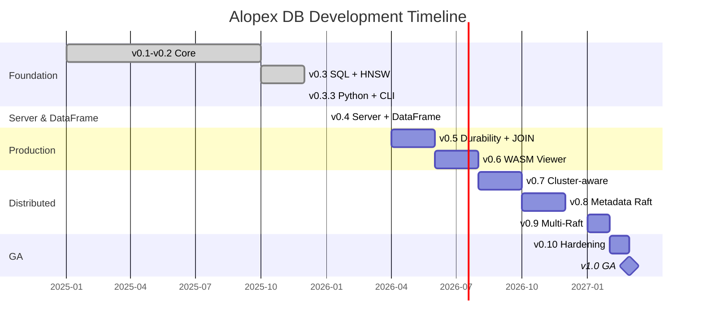

# Roadmap

This roadmap outlines the planned development of Alopex DB from the current state to production readiness.

## Current Status

!!! success "v0.4.0 Complete — Published on crates.io & PyPI (January 2026)"

    Alopex DB v0.4.0 with **Server Mode + Async/Stream + DataFrame** is complete. HTTP/gRPC API, runtime-agnostic async facade, streaming SELECT, and Polars-compatible DataFrame foundation are ready for use.

    ```bash
    # Rust
    cargo add alopex-embedded alopex-sql alopex-server

    # Python
    pip install alopex
    ```

## Timeline



---

## Published Crates

The following crates are available on **crates.io**:

| Crate | Version | Description |
|:------|:--------|:------------|
| [](https://crates.io/crates/alopex-embedded) | v0.4.0 | Embedded database API |
| [](https://crates.io/crates/alopex-sql) | v0.4.0 | SQL parser, planner, executor |
| [](https://crates.io/crates/alopex-core) | v0.4.0 | Core storage engine |
| [](https://crates.io/crates/alopex-server) | v0.4.0 | HTTP/gRPC server |
| [](https://crates.io/crates/alopex-chirps) | v0.5.0 | Cluster messaging layer |

---

## Version Compatibility Matrix

| Alopex DB | [alopex-core](https://crates.io/crates/alopex-core) | alopex-dataframe | [alopex-sql](https://crates.io/crates/alopex-sql) | [alopex-embedded](https://crates.io/crates/alopex-embedded) | [alopex-py](https://pypi.org/project/alopex/) | [Chirps](https://crates.io/crates/alopex-chirps) |
|:----------|:------------|:-----------------|:-----------|:----------------|:----------|:-------|
| **v0.3** | v0.3.0 | - | v0.3.0 | v0.3.0 | - | v0.5.0 |
| **v0.3.3** | v0.3.3 | - | v0.3.0 | v0.3.3 | **v0.3.3** | v0.5.0 |
| **v0.4.0** | **v0.4.0** | **v0.1.0** | **v0.4.0** | **v0.4.0** | **v0.4.0** | v0.5.0 |
| v0.5 | v0.5 | v0.2.0 | v0.5 | v0.5 | - | v0.5.0 |
| v0.6 | v0.6 | v0.3.0 | v0.6 | v0.6 | - | v0.5.0 |
| v0.7 | v0.7 | v0.4.0 | v0.7+ | v0.7 | - | v0.5+ |
| v1.0 | v1.0 | v1.0 | v1.0 | v1.0 | - | v0.8 |

!!! note "alopex-py Independent Versioning"
    alopex-py follows its own versioning scheme independent of the Rust workspace. See [alopex-py Roadmap](#python) for details.

---

## Phase 1: Foundation (v0.1 - v0.2) { #phase1 }

**Status**: :material-check-all: Complete

### v0.1 — Embedded KV Core

- [x] LSM-Tree storage engine
- [x] Write-Ahead Log (WAL) with crash recovery
- [x] Key-Value API (`open`/`put`/`get`/`delete`)
- [x] Transactions (`begin`/`commit`/`rollback`)
- [x] MVCC with Snapshot Isolation

### v0.2 — Vector Core + Columnar

- [x] Vector type (`VECTOR(dimension)`)
- [x] Flat search (cosine, L2, inner product)
- [x] Columnar segment storage with compression
- [x] In-memory mode support
- [x] Vector delete/compaction

---

## Phase 2: SQL & HNSW (v0.3) { #phase2 }

**Status**: :material-check-all: Complete — **crates.io Published**

### v0.3 — SQL Frontend + HNSW Index

The first public release on crates.io with full SQL support and HNSW indexing.

#### Completed Features

- [x] SQL Parser (DDL: CREATE/DROP TABLE/INDEX, DML: SELECT/INSERT/UPDATE/DELETE)
- [x] Query Planner with Catalog and LogicalPlan
- [x] SQL Executor (iterator-based execution)
- [x] `vector_similarity()` function with Top-K optimization
- [x] **HNSW Index** for high-performance similarity search
- [x] Columnar COPY/Bulk Load (Parquet/CSV → ColumnarSegment)
- [x] Embedded Integration (`Database::execute_sql`, `Transaction::execute_sql`)

#### SQL Examples

```sql
-- Create table with vector column
CREATE TABLE documents (
    id INTEGER PRIMARY KEY,
    content TEXT,
    embedding VECTOR(1536)
);

-- Insert with vector
INSERT INTO documents (id, content, embedding)
VALUES (1, 'Hello world', [0.1, 0.2, ...]);

-- Hybrid search with vector similarity
SELECT id, content, vector_similarity(embedding, ?) AS score
FROM documents
ORDER BY score DESC
LIMIT 10;

-- Create HNSW index
CREATE INDEX idx_emb ON documents USING HNSW (embedding);
```

---

## Phase 3: Python & Server (v0.3.3 - v0.4) { #phase3 }

### v0.3.3 — Python Wrapper (alopex-py) { #v033 }

**Status**: :material-check-all: Complete — **PyPI Published**
**Released**: December 2025

Python bindings via PyO3 for the embedded database.

#### Features

- [x] PyO3 module structure with error handling
- [x] `Database` / `Transaction` bindings
- [x] SQL API bindings (`execute_sql`, `QueryResult`)
- [x] Type stubs (`.pyi` files) for IDE support
- [x] CI/CD with maturin + pytest + TestPyPI verification
- [ ] Vector/HNSW API bindings — *planned for v0.3.4*
- [ ] NumPy integration (zero-copy arrays) — *planned for v0.3.5*

#### Preview

```python
import alopex

# Open database
db = alopex.Database.open("./my_data")

# Execute SQL
results = db.execute_sql(
    "SELECT * FROM docs WHERE vector_similarity(embedding, ?) > 0.8",
    [query_embedding]
)

# HNSW search
similar = db.search_hnsw("docs", query_embedding, k=10)
for doc_id, score in similar:
    print(f"{doc_id}: {score:.4f}")
```

### v0.4.0 — Server Mode + DataFrame { #v04 }

**Status**: :material-check-all: Complete — **crates.io Published**
**Released**: January 2026

Standalone server and Polars-compatible DataFrame API foundation.

#### Server Features

- [x] `alopex-server` binary with HTTP/gRPC API
- [x] SQL API (DDL/DML/SELECT with streaming)
- [x] Vector API (HNSW/Flat search)
- [x] Session Manager with TLS support
- [x] Observability (metrics, tracing)
- [x] Runtime-agnostic async facade with tokio adapter

#### DataFrame Features (alopex-dataframe v0.1.0)

- [x] `DataFrame` / `LazyFrame` / `Expr` types
- [x] I/O: `read_csv`, `read_parquet`, `scan_*` variants
- [x] Operations: `select`, `filter`, `with_columns`
- [x] Aggregations: `group_by`, `agg`, `sum`, `mean`, etc.
- [x] Lazy evaluation with query optimization
- [x] Predicate/Projection Pushdown

#### DataFrame Preview

```rust
use alopex_dataframe::{DataFrame, col, lit};

let df = DataFrame::read_parquet("data.parquet")?;

let result = df
    .lazy()
    .filter(col("score").gt(lit(0.5)))
    .select([col("id"), col("content")])
    .collect()?;
```

---

## Phase 4: Durability & WASM (v0.5 - v0.6) { #phase4 }

### v0.5 — Durability + JOIN { #v05 }

**Status**: :material-calendar: Planned
**Target**: Q2 2026

- [ ] WAL/Crash recovery hardening
- [ ] Backup and restore
- [ ] JOIN support (inner, left, right, full)
- [ ] GROUP BY / Aggregation
- [ ] Prometheus metrics
- [ ] Structured logging

### v0.6 — WASM Viewer { #v06 }

**Status**: :material-calendar: Planned
**Target**: Q3 2026

Browser-based read-only viewer for database snapshots.

- [ ] `wasm32-unknown-unknown` target
- [ ] Pre-built SSTable loader
- [ ] IndexedDB caching
- [ ] SQL SELECT only
- [ ] Vector Search (Flat only)
- [ ] npm package (`@alopex-db/wasm`)

```typescript
import { AlopexViewer } from '@alopex-db/wasm';

const viewer = await AlopexViewer.loadSnapshot('/data/snapshot.alopex');
const results = await viewer.query('SELECT * FROM products LIMIT 10');
```

---

## Phase 5: Distributed (v0.7 - v0.9) { #phase5 }

### v0.7 — Cluster-Aware { #v07 }

**Status**: :material-calendar: Planned
**Target**: Q4 2026
**Depends on**: Chirps v0.3

- [ ] `alopex-cluster` module
- [ ] Chirps membership integration
- [ ] Node discovery and events
- [ ] Logical sharding design

### v0.8 — Metadata Raft { #v08 }

**Status**: :material-calendar: Planned
**Target**: Q4 2026
**Depends on**: Chirps v0.6

- [ ] Metadata Raft Group
- [ ] MultiRaftManager integration
- [ ] Shard/range metadata management

### v0.9 — Multi-Raft + CRDT { #v09 }

**Status**: :material-calendar: Planned
**Target**: Q1 2027
**Depends on**: Chirps v0.7

- [ ] Multi-Raft (range partitioning)
- [ ] CRDT (Counter, Set for eventual consistency)
- [ ] Changefeed via Durable profile
- [ ] Distributed transactions

---

## Phase 6: Production (v0.10 - v1.0) { #phase6 }

### v0.10 — Hardening { #v010 }

**Status**: :material-calendar: Planned
**Target**: Q1 2027

- [ ] Single-node regression suite
- [ ] Cluster consistency tests
- [ ] Partition/recovery tests
- [ ] Configuration freeze
- [ ] API stability guarantee

### v1.0 — General Availability { #v10 }

**Status**: :material-calendar: Planned
**Target**: Q1 2027

- [ ] 3-10 node production support
- [ ] Rolling upgrades
- [ ] Complete documentation
- [ ] API/ABI compatibility tests
- [ ] Federation support

---

## Chirps Roadmap { #chirps }

Alopex Chirps (cluster messaging layer) has its own development track:

| Version | Status | Features |
|:--------|:-------|:---------|
| v0.1-v0.3 | :white_check_mark: Complete | Gossip, SWIM, Membership API |
| v0.4 | :white_check_mark: Complete | Raft-ready transport, QoS streams |
| v0.5 | :white_check_mark: Complete | Raft Consensus API, WalRaftStorage |
| v0.5.1 | :material-calendar: Planned | File Transfer API |
| v0.6 | :material-calendar: Planned | Multi-Raft, TSO, Observability |
| v0.7+ | :material-calendar: Planned | IggyBackend, Durable profile |

---

## alopex-dataframe Roadmap { #dataframe }

Polars-compatible DataFrame engine in pure Rust:

| Version | Phase | Features |
|:--------|:------|:---------|
| v0.1.0 | DF-0 | DataFrame/Series types, Arrow integration |
| v0.2.0 | DF-1 | CSV/Parquet I/O, select/filter/group_by, LazyFrame |
| v0.3.0 | DF-2 | JOIN, sort, fill_null, Predicate Pushdown |
| v0.4.0 | DF-3 | Window functions, pivot/unpivot, str/dt namespaces |

---

## alopex-py Roadmap { #python }

Python bindings with NumPy and DataFrame support. alopex-py follows its own versioning scheme independent of the Rust workspace.

| Version | Phase | Features | Status |
|:--------|:------|:---------|:-------|
| **v0.3.3** | Phase 1 | Database/Transaction/SQL basic API | :white_check_mark: PyPI Published |
| v0.3.4 | Phase 1+ | Vector/HNSW API extensions | :material-calendar: Planned |
| v0.3.5 | Phase 1+ | NumPy integration (zero-copy arrays) | :material-calendar: Planned |
| v0.4.0 | Phase 1+ | Catalog API (Polars Unity Catalog compatible) | :material-calendar: Planned |
| v0.5.0 | Phase 2 | DataFrame API MVP (via alopex-dataframe) | :material-calendar: Planned |
| v0.6.0 | Phase 2 | DataFrame extended features | :material-calendar: Planned |
| v0.7.0 | Phase 3 | Client API (Server connection) | :material-calendar: Planned |

---

## Contributing

We welcome contributions! Priority areas:

| Area | Priority | Difficulty |
|:-----|:---------|:-----------|
| Documentation | High | Easy |
| Test coverage | High | Medium |
| Python bindings | High | Medium |
| DataFrame operations | Medium | Medium |
| SQL parser extensions | Medium | Hard |
| Vector search optimizations | Medium | Hard |

[:octicons-arrow-right-24: Contributing Guide](contributing.md)

---

## Changelog

### Recent Updates

- **2026-01-14**: v0.4.0 Server + DataFrame **published on crates.io**
- **2025-12-27**: v0.3.3 alopex-py **published on PyPI**
- **2025-12**: v0.3 SQL Frontend + HNSW **published on crates.io**
- **2025-11**: HNSW index implementation complete
- **2025-10**: alopex-sql Parser/Planner/Executor complete
- **2025-09**: Columnar-based Vector Store complete
- **2025-08**: LSM-Tree file mode complete
- **2025-06**: In-memory mode complete
- **2025-01**: Project started

For detailed changes, see the [GitHub Releases](https://github.com/alopex-db/alopex/releases).
